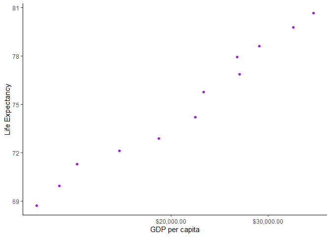
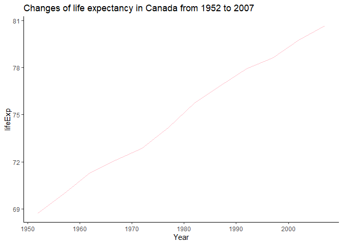
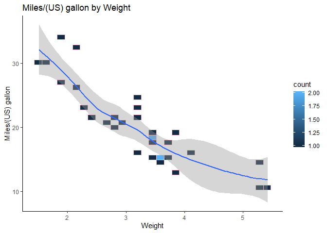

<!---The following chunk allows errors when knitting--->


#### Lading packages for the analysis

```r
library(gapminder)
library (tidyverse)
```

## Exercise 1: Basic `dplyr`: Use `dplyr` functions to achieve the following.

#### 1.1 Use `filter()` to *subset* the `gapminder` data to three selected countries in the 1970’s.

* Selected countries: Afghanistan, Albania, and Algeria

<table>
 <thead>
  <tr>
   <th style="text-align:center;"> country </th>
   <th style="text-align:center;"> continent </th>
   <th style="text-align:center;"> year </th>
   <th style="text-align:center;"> lifeExp </th>
   <th style="text-align:center;"> pop </th>
   <th style="text-align:center;"> gdpPercap </th>
  </tr>
 </thead>
<tbody>
  <tr>
   <td style="text-align:center;"> Afghanistan </td>
   <td style="text-align:center;"> Asia </td>
   <td style="text-align:center;"> 1972 </td>
   <td style="text-align:center;"> 36.088 </td>
   <td style="text-align:center;"> 13079460 </td>
   <td style="text-align:center;"> 739.9811 </td>
  </tr>
  <tr>
   <td style="text-align:center;"> Afghanistan </td>
   <td style="text-align:center;"> Asia </td>
   <td style="text-align:center;"> 1977 </td>
   <td style="text-align:center;"> 38.438 </td>
   <td style="text-align:center;"> 14880372 </td>
   <td style="text-align:center;"> 786.1134 </td>
  </tr>
  <tr>
   <td style="text-align:center;"> Albania </td>
   <td style="text-align:center;"> Europe </td>
   <td style="text-align:center;"> 1972 </td>
   <td style="text-align:center;"> 67.690 </td>
   <td style="text-align:center;"> 2263554 </td>
   <td style="text-align:center;"> 3313.4222 </td>
  </tr>
  <tr>
   <td style="text-align:center;"> Albania </td>
   <td style="text-align:center;"> Europe </td>
   <td style="text-align:center;"> 1977 </td>
   <td style="text-align:center;"> 68.930 </td>
   <td style="text-align:center;"> 2509048 </td>
   <td style="text-align:center;"> 3533.0039 </td>
  </tr>
  <tr>
   <td style="text-align:center;"> Algeria </td>
   <td style="text-align:center;"> Africa </td>
   <td style="text-align:center;"> 1972 </td>
   <td style="text-align:center;"> 54.518 </td>
   <td style="text-align:center;"> 14760787 </td>
   <td style="text-align:center;"> 4182.6638 </td>
  </tr>
  <tr>
   <td style="text-align:center;"> Algeria </td>
   <td style="text-align:center;"> Africa </td>
   <td style="text-align:center;"> 1977 </td>
   <td style="text-align:center;"> 58.014 </td>
   <td style="text-align:center;"> 17152804 </td>
   <td style="text-align:center;"> 4910.4168 </td>
  </tr>
</tbody>
</table>

#### 1.2 Use the pipe operator `%>%` to select “country” and “gdpPercap” from the filtered dataset in 1.1

<table>
 <thead>
  <tr>
   <th style="text-align:center;"> country </th>
   <th style="text-align:center;"> gdpPercap </th>
  </tr>
 </thead>
<tbody>
  <tr>
   <td style="text-align:center;"> Afghanistan </td>
   <td style="text-align:center;"> 739.9811 </td>
  </tr>
  <tr>
   <td style="text-align:center;"> Afghanistan </td>
   <td style="text-align:center;"> 786.1134 </td>
  </tr>
  <tr>
   <td style="text-align:center;"> Albania </td>
   <td style="text-align:center;"> 3313.4222 </td>
  </tr>
  <tr>
   <td style="text-align:center;"> Albania </td>
   <td style="text-align:center;"> 3533.0039 </td>
  </tr>
  <tr>
   <td style="text-align:center;"> Algeria </td>
   <td style="text-align:center;"> 4182.6638 </td>
  </tr>
  <tr>
   <td style="text-align:center;"> Algeria </td>
   <td style="text-align:center;"> 4910.4168 </td>
  </tr>
</tbody>
</table>

#### 1.3 Filter `gapminder` to all entries that have experienced a drop in life expectancy.


```r
gapminder %>%
  arrange(year) %>% 
  group_by(country) %>% 
  mutate(diff_LifeExp = lifeExp - lag(lifeExp)) %>% 
  filter(diff_LifeExp < 0) %>% 
  arrange(country) %>%
  knitr::kable(format = 'html', align = 'c')
```

<table>
 <thead>
  <tr>
   <th style="text-align:center;"> country </th>
   <th style="text-align:center;"> continent </th>
   <th style="text-align:center;"> year </th>
   <th style="text-align:center;"> lifeExp </th>
   <th style="text-align:center;"> pop </th>
   <th style="text-align:center;"> gdpPercap </th>
   <th style="text-align:center;"> diff_LifeExp </th>
  </tr>
 </thead>
<tbody>
  <tr>
   <td style="text-align:center;"> Albania </td>
   <td style="text-align:center;"> Europe </td>
   <td style="text-align:center;"> 1992 </td>
   <td style="text-align:center;"> 71.58100 </td>
   <td style="text-align:center;"> 3326498 </td>
   <td style="text-align:center;"> 2497.4379 </td>
   <td style="text-align:center;"> -0.4190 </td>
  </tr>
  <tr>
   <td style="text-align:center;"> Angola </td>
   <td style="text-align:center;"> Africa </td>
   <td style="text-align:center;"> 1987 </td>
   <td style="text-align:center;"> 39.90600 </td>
   <td style="text-align:center;"> 7874230 </td>
   <td style="text-align:center;"> 2430.2083 </td>
   <td style="text-align:center;"> -0.0360 </td>
  </tr>
  <tr>
   <td style="text-align:center;"> Benin </td>
   <td style="text-align:center;"> Africa </td>
   <td style="text-align:center;"> 2002 </td>
   <td style="text-align:center;"> 54.40600 </td>
   <td style="text-align:center;"> 7026113 </td>
   <td style="text-align:center;"> 1372.8779 </td>
   <td style="text-align:center;"> -0.3710 </td>
  </tr>
  <tr>
   <td style="text-align:center;"> Botswana </td>
   <td style="text-align:center;"> Africa </td>
   <td style="text-align:center;"> 1992 </td>
   <td style="text-align:center;"> 62.74500 </td>
   <td style="text-align:center;"> 1342614 </td>
   <td style="text-align:center;"> 7954.1116 </td>
   <td style="text-align:center;"> -0.8770 </td>
  </tr>
  <tr>
   <td style="text-align:center;"> Botswana </td>
   <td style="text-align:center;"> Africa </td>
   <td style="text-align:center;"> 1997 </td>
   <td style="text-align:center;"> 52.55600 </td>
   <td style="text-align:center;"> 1536536 </td>
   <td style="text-align:center;"> 8647.1423 </td>
   <td style="text-align:center;"> -10.1890 </td>
  </tr>
  <tr>
   <td style="text-align:center;"> Botswana </td>
   <td style="text-align:center;"> Africa </td>
   <td style="text-align:center;"> 2002 </td>
   <td style="text-align:center;"> 46.63400 </td>
   <td style="text-align:center;"> 1630347 </td>
   <td style="text-align:center;"> 11003.6051 </td>
   <td style="text-align:center;"> -5.9220 </td>
  </tr>
  <tr>
   <td style="text-align:center;"> Bulgaria </td>
   <td style="text-align:center;"> Europe </td>
   <td style="text-align:center;"> 1977 </td>
   <td style="text-align:center;"> 70.81000 </td>
   <td style="text-align:center;"> 8797022 </td>
   <td style="text-align:center;"> 7612.2404 </td>
   <td style="text-align:center;"> -0.0900 </td>
  </tr>
  <tr>
   <td style="text-align:center;"> Bulgaria </td>
   <td style="text-align:center;"> Europe </td>
   <td style="text-align:center;"> 1992 </td>
   <td style="text-align:center;"> 71.19000 </td>
   <td style="text-align:center;"> 8658506 </td>
   <td style="text-align:center;"> 6302.6234 </td>
   <td style="text-align:center;"> -0.1500 </td>
  </tr>
  <tr>
   <td style="text-align:center;"> Bulgaria </td>
   <td style="text-align:center;"> Europe </td>
   <td style="text-align:center;"> 1997 </td>
   <td style="text-align:center;"> 70.32000 </td>
   <td style="text-align:center;"> 8066057 </td>
   <td style="text-align:center;"> 5970.3888 </td>
   <td style="text-align:center;"> -0.8700 </td>
  </tr>
  <tr>
   <td style="text-align:center;"> Burundi </td>
   <td style="text-align:center;"> Africa </td>
   <td style="text-align:center;"> 1992 </td>
   <td style="text-align:center;"> 44.73600 </td>
   <td style="text-align:center;"> 5809236 </td>
   <td style="text-align:center;"> 631.6999 </td>
   <td style="text-align:center;"> -3.4750 </td>
  </tr>
  <tr>
   <td style="text-align:center;"> Cambodia </td>
   <td style="text-align:center;"> Asia </td>
   <td style="text-align:center;"> 1972 </td>
   <td style="text-align:center;"> 40.31700 </td>
   <td style="text-align:center;"> 7450606 </td>
   <td style="text-align:center;"> 421.6240 </td>
   <td style="text-align:center;"> -5.0980 </td>
  </tr>
  <tr>
   <td style="text-align:center;"> Cambodia </td>
   <td style="text-align:center;"> Asia </td>
   <td style="text-align:center;"> 1977 </td>
   <td style="text-align:center;"> 31.22000 </td>
   <td style="text-align:center;"> 6978607 </td>
   <td style="text-align:center;"> 524.9722 </td>
   <td style="text-align:center;"> -9.0970 </td>
  </tr>
  <tr>
   <td style="text-align:center;"> Cameroon </td>
   <td style="text-align:center;"> Africa </td>
   <td style="text-align:center;"> 1992 </td>
   <td style="text-align:center;"> 54.31400 </td>
   <td style="text-align:center;"> 12467171 </td>
   <td style="text-align:center;"> 1793.1633 </td>
   <td style="text-align:center;"> -0.6710 </td>
  </tr>
  <tr>
   <td style="text-align:center;"> Cameroon </td>
   <td style="text-align:center;"> Africa </td>
   <td style="text-align:center;"> 1997 </td>
   <td style="text-align:center;"> 52.19900 </td>
   <td style="text-align:center;"> 14195809 </td>
   <td style="text-align:center;"> 1694.3375 </td>
   <td style="text-align:center;"> -2.1150 </td>
  </tr>
  <tr>
   <td style="text-align:center;"> Cameroon </td>
   <td style="text-align:center;"> Africa </td>
   <td style="text-align:center;"> 2002 </td>
   <td style="text-align:center;"> 49.85600 </td>
   <td style="text-align:center;"> 15929988 </td>
   <td style="text-align:center;"> 1934.0114 </td>
   <td style="text-align:center;"> -2.3430 </td>
  </tr>
  <tr>
   <td style="text-align:center;"> Central African Republic </td>
   <td style="text-align:center;"> Africa </td>
   <td style="text-align:center;"> 1992 </td>
   <td style="text-align:center;"> 49.39600 </td>
   <td style="text-align:center;"> 3265124 </td>
   <td style="text-align:center;"> 747.9055 </td>
   <td style="text-align:center;"> -1.0890 </td>
  </tr>
  <tr>
   <td style="text-align:center;"> Central African Republic </td>
   <td style="text-align:center;"> Africa </td>
   <td style="text-align:center;"> 1997 </td>
   <td style="text-align:center;"> 46.06600 </td>
   <td style="text-align:center;"> 3696513 </td>
   <td style="text-align:center;"> 740.5063 </td>
   <td style="text-align:center;"> -3.3300 </td>
  </tr>
  <tr>
   <td style="text-align:center;"> Central African Republic </td>
   <td style="text-align:center;"> Africa </td>
   <td style="text-align:center;"> 2002 </td>
   <td style="text-align:center;"> 43.30800 </td>
   <td style="text-align:center;"> 4048013 </td>
   <td style="text-align:center;"> 738.6906 </td>
   <td style="text-align:center;"> -2.7580 </td>
  </tr>
  <tr>
   <td style="text-align:center;"> Chad </td>
   <td style="text-align:center;"> Africa </td>
   <td style="text-align:center;"> 1997 </td>
   <td style="text-align:center;"> 51.57300 </td>
   <td style="text-align:center;"> 7562011 </td>
   <td style="text-align:center;"> 1004.9614 </td>
   <td style="text-align:center;"> -0.1510 </td>
  </tr>
  <tr>
   <td style="text-align:center;"> Chad </td>
   <td style="text-align:center;"> Africa </td>
   <td style="text-align:center;"> 2002 </td>
   <td style="text-align:center;"> 50.52500 </td>
   <td style="text-align:center;"> 8835739 </td>
   <td style="text-align:center;"> 1156.1819 </td>
   <td style="text-align:center;"> -1.0480 </td>
  </tr>
  <tr>
   <td style="text-align:center;"> China </td>
   <td style="text-align:center;"> Asia </td>
   <td style="text-align:center;"> 1962 </td>
   <td style="text-align:center;"> 44.50136 </td>
   <td style="text-align:center;"> 665770000 </td>
   <td style="text-align:center;"> 487.6740 </td>
   <td style="text-align:center;"> -6.0476 </td>
  </tr>
  <tr>
   <td style="text-align:center;"> Congo, Dem. Rep. </td>
   <td style="text-align:center;"> Africa </td>
   <td style="text-align:center;"> 1982 </td>
   <td style="text-align:center;"> 47.78400 </td>
   <td style="text-align:center;"> 30646495 </td>
   <td style="text-align:center;"> 673.7478 </td>
   <td style="text-align:center;"> -0.0200 </td>
  </tr>
  <tr>
   <td style="text-align:center;"> Congo, Dem. Rep. </td>
   <td style="text-align:center;"> Africa </td>
   <td style="text-align:center;"> 1987 </td>
   <td style="text-align:center;"> 47.41200 </td>
   <td style="text-align:center;"> 35481645 </td>
   <td style="text-align:center;"> 672.7748 </td>
   <td style="text-align:center;"> -0.3720 </td>
  </tr>
  <tr>
   <td style="text-align:center;"> Congo, Dem. Rep. </td>
   <td style="text-align:center;"> Africa </td>
   <td style="text-align:center;"> 1992 </td>
   <td style="text-align:center;"> 45.54800 </td>
   <td style="text-align:center;"> 41672143 </td>
   <td style="text-align:center;"> 457.7192 </td>
   <td style="text-align:center;"> -1.8640 </td>
  </tr>
  <tr>
   <td style="text-align:center;"> Congo, Dem. Rep. </td>
   <td style="text-align:center;"> Africa </td>
   <td style="text-align:center;"> 1997 </td>
   <td style="text-align:center;"> 42.58700 </td>
   <td style="text-align:center;"> 47798986 </td>
   <td style="text-align:center;"> 312.1884 </td>
   <td style="text-align:center;"> -2.9610 </td>
  </tr>
  <tr>
   <td style="text-align:center;"> Congo, Rep. </td>
   <td style="text-align:center;"> Africa </td>
   <td style="text-align:center;"> 1992 </td>
   <td style="text-align:center;"> 56.43300 </td>
   <td style="text-align:center;"> 2409073 </td>
   <td style="text-align:center;"> 4016.2395 </td>
   <td style="text-align:center;"> -1.0370 </td>
  </tr>
  <tr>
   <td style="text-align:center;"> Congo, Rep. </td>
   <td style="text-align:center;"> Africa </td>
   <td style="text-align:center;"> 1997 </td>
   <td style="text-align:center;"> 52.96200 </td>
   <td style="text-align:center;"> 2800947 </td>
   <td style="text-align:center;"> 3484.1644 </td>
   <td style="text-align:center;"> -3.4710 </td>
  </tr>
  <tr>
   <td style="text-align:center;"> Cote d'Ivoire </td>
   <td style="text-align:center;"> Africa </td>
   <td style="text-align:center;"> 1992 </td>
   <td style="text-align:center;"> 52.04400 </td>
   <td style="text-align:center;"> 12772596 </td>
   <td style="text-align:center;"> 1648.0738 </td>
   <td style="text-align:center;"> -2.6110 </td>
  </tr>
  <tr>
   <td style="text-align:center;"> Cote d'Ivoire </td>
   <td style="text-align:center;"> Africa </td>
   <td style="text-align:center;"> 1997 </td>
   <td style="text-align:center;"> 47.99100 </td>
   <td style="text-align:center;"> 14625967 </td>
   <td style="text-align:center;"> 1786.2654 </td>
   <td style="text-align:center;"> -4.0530 </td>
  </tr>
  <tr>
   <td style="text-align:center;"> Cote d'Ivoire </td>
   <td style="text-align:center;"> Africa </td>
   <td style="text-align:center;"> 2002 </td>
   <td style="text-align:center;"> 46.83200 </td>
   <td style="text-align:center;"> 16252726 </td>
   <td style="text-align:center;"> 1648.8008 </td>
   <td style="text-align:center;"> -1.1590 </td>
  </tr>
  <tr>
   <td style="text-align:center;"> Croatia </td>
   <td style="text-align:center;"> Europe </td>
   <td style="text-align:center;"> 1982 </td>
   <td style="text-align:center;"> 70.46000 </td>
   <td style="text-align:center;"> 4413368 </td>
   <td style="text-align:center;"> 13221.8218 </td>
   <td style="text-align:center;"> -0.1800 </td>
  </tr>
  <tr>
   <td style="text-align:center;"> Czech Republic </td>
   <td style="text-align:center;"> Europe </td>
   <td style="text-align:center;"> 1972 </td>
   <td style="text-align:center;"> 70.29000 </td>
   <td style="text-align:center;"> 9862158 </td>
   <td style="text-align:center;"> 13108.4536 </td>
   <td style="text-align:center;"> -0.0900 </td>
  </tr>
  <tr>
   <td style="text-align:center;"> Denmark </td>
   <td style="text-align:center;"> Europe </td>
   <td style="text-align:center;"> 1982 </td>
   <td style="text-align:center;"> 74.63000 </td>
   <td style="text-align:center;"> 5117810 </td>
   <td style="text-align:center;"> 21688.0405 </td>
   <td style="text-align:center;"> -0.0600 </td>
  </tr>
  <tr>
   <td style="text-align:center;"> El Salvador </td>
   <td style="text-align:center;"> Americas </td>
   <td style="text-align:center;"> 1977 </td>
   <td style="text-align:center;"> 56.69600 </td>
   <td style="text-align:center;"> 4282586 </td>
   <td style="text-align:center;"> 5138.9224 </td>
   <td style="text-align:center;"> -1.5110 </td>
  </tr>
  <tr>
   <td style="text-align:center;"> El Salvador </td>
   <td style="text-align:center;"> Americas </td>
   <td style="text-align:center;"> 1982 </td>
   <td style="text-align:center;"> 56.60400 </td>
   <td style="text-align:center;"> 4474873 </td>
   <td style="text-align:center;"> 4098.3442 </td>
   <td style="text-align:center;"> -0.0920 </td>
  </tr>
  <tr>
   <td style="text-align:center;"> Eritrea </td>
   <td style="text-align:center;"> Africa </td>
   <td style="text-align:center;"> 1982 </td>
   <td style="text-align:center;"> 43.89000 </td>
   <td style="text-align:center;"> 2637297 </td>
   <td style="text-align:center;"> 524.8758 </td>
   <td style="text-align:center;"> -0.6450 </td>
  </tr>
  <tr>
   <td style="text-align:center;"> Gabon </td>
   <td style="text-align:center;"> Africa </td>
   <td style="text-align:center;"> 1997 </td>
   <td style="text-align:center;"> 60.46100 </td>
   <td style="text-align:center;"> 1126189 </td>
   <td style="text-align:center;"> 14722.8419 </td>
   <td style="text-align:center;"> -0.9050 </td>
  </tr>
  <tr>
   <td style="text-align:center;"> Gabon </td>
   <td style="text-align:center;"> Africa </td>
   <td style="text-align:center;"> 2002 </td>
   <td style="text-align:center;"> 56.76100 </td>
   <td style="text-align:center;"> 1299304 </td>
   <td style="text-align:center;"> 12521.7139 </td>
   <td style="text-align:center;"> -3.7000 </td>
  </tr>
  <tr>
   <td style="text-align:center;"> Gabon </td>
   <td style="text-align:center;"> Africa </td>
   <td style="text-align:center;"> 2007 </td>
   <td style="text-align:center;"> 56.73500 </td>
   <td style="text-align:center;"> 1454867 </td>
   <td style="text-align:center;"> 13206.4845 </td>
   <td style="text-align:center;"> -0.0260 </td>
  </tr>
  <tr>
   <td style="text-align:center;"> Ghana </td>
   <td style="text-align:center;"> Africa </td>
   <td style="text-align:center;"> 2002 </td>
   <td style="text-align:center;"> 58.45300 </td>
   <td style="text-align:center;"> 20550751 </td>
   <td style="text-align:center;"> 1111.9846 </td>
   <td style="text-align:center;"> -0.1030 </td>
  </tr>
  <tr>
   <td style="text-align:center;"> Hungary </td>
   <td style="text-align:center;"> Europe </td>
   <td style="text-align:center;"> 1982 </td>
   <td style="text-align:center;"> 69.39000 </td>
   <td style="text-align:center;"> 10705535 </td>
   <td style="text-align:center;"> 12545.9907 </td>
   <td style="text-align:center;"> -0.5600 </td>
  </tr>
  <tr>
   <td style="text-align:center;"> Hungary </td>
   <td style="text-align:center;"> Europe </td>
   <td style="text-align:center;"> 1992 </td>
   <td style="text-align:center;"> 69.17000 </td>
   <td style="text-align:center;"> 10348684 </td>
   <td style="text-align:center;"> 10535.6285 </td>
   <td style="text-align:center;"> -0.4100 </td>
  </tr>
  <tr>
   <td style="text-align:center;"> Iraq </td>
   <td style="text-align:center;"> Asia </td>
   <td style="text-align:center;"> 1992 </td>
   <td style="text-align:center;"> 59.46100 </td>
   <td style="text-align:center;"> 17861905 </td>
   <td style="text-align:center;"> 3745.6407 </td>
   <td style="text-align:center;"> -5.5830 </td>
  </tr>
  <tr>
   <td style="text-align:center;"> Iraq </td>
   <td style="text-align:center;"> Asia </td>
   <td style="text-align:center;"> 1997 </td>
   <td style="text-align:center;"> 58.81100 </td>
   <td style="text-align:center;"> 20775703 </td>
   <td style="text-align:center;"> 3076.2398 </td>
   <td style="text-align:center;"> -0.6500 </td>
  </tr>
  <tr>
   <td style="text-align:center;"> Iraq </td>
   <td style="text-align:center;"> Asia </td>
   <td style="text-align:center;"> 2002 </td>
   <td style="text-align:center;"> 57.04600 </td>
   <td style="text-align:center;"> 24001816 </td>
   <td style="text-align:center;"> 4390.7173 </td>
   <td style="text-align:center;"> -1.7650 </td>
  </tr>
  <tr>
   <td style="text-align:center;"> Jamaica </td>
   <td style="text-align:center;"> Americas </td>
   <td style="text-align:center;"> 1992 </td>
   <td style="text-align:center;"> 71.76600 </td>
   <td style="text-align:center;"> 2378618 </td>
   <td style="text-align:center;"> 7404.9237 </td>
   <td style="text-align:center;"> -0.0040 </td>
  </tr>
  <tr>
   <td style="text-align:center;"> Jamaica </td>
   <td style="text-align:center;"> Americas </td>
   <td style="text-align:center;"> 2002 </td>
   <td style="text-align:center;"> 72.04700 </td>
   <td style="text-align:center;"> 2664659 </td>
   <td style="text-align:center;"> 6994.7749 </td>
   <td style="text-align:center;"> -0.2150 </td>
  </tr>
  <tr>
   <td style="text-align:center;"> Kenya </td>
   <td style="text-align:center;"> Africa </td>
   <td style="text-align:center;"> 1992 </td>
   <td style="text-align:center;"> 59.28500 </td>
   <td style="text-align:center;"> 25020539 </td>
   <td style="text-align:center;"> 1341.9217 </td>
   <td style="text-align:center;"> -0.0540 </td>
  </tr>
  <tr>
   <td style="text-align:center;"> Kenya </td>
   <td style="text-align:center;"> Africa </td>
   <td style="text-align:center;"> 1997 </td>
   <td style="text-align:center;"> 54.40700 </td>
   <td style="text-align:center;"> 28263827 </td>
   <td style="text-align:center;"> 1360.4850 </td>
   <td style="text-align:center;"> -4.8780 </td>
  </tr>
  <tr>
   <td style="text-align:center;"> Kenya </td>
   <td style="text-align:center;"> Africa </td>
   <td style="text-align:center;"> 2002 </td>
   <td style="text-align:center;"> 50.99200 </td>
   <td style="text-align:center;"> 31386842 </td>
   <td style="text-align:center;"> 1287.5147 </td>
   <td style="text-align:center;"> -3.4150 </td>
  </tr>
  <tr>
   <td style="text-align:center;"> Korea, Dem. Rep. </td>
   <td style="text-align:center;"> Asia </td>
   <td style="text-align:center;"> 1992 </td>
   <td style="text-align:center;"> 69.97800 </td>
   <td style="text-align:center;"> 20711375 </td>
   <td style="text-align:center;"> 3726.0635 </td>
   <td style="text-align:center;"> -0.6690 </td>
  </tr>
  <tr>
   <td style="text-align:center;"> Korea, Dem. Rep. </td>
   <td style="text-align:center;"> Asia </td>
   <td style="text-align:center;"> 1997 </td>
   <td style="text-align:center;"> 67.72700 </td>
   <td style="text-align:center;"> 21585105 </td>
   <td style="text-align:center;"> 1690.7568 </td>
   <td style="text-align:center;"> -2.2510 </td>
  </tr>
  <tr>
   <td style="text-align:center;"> Korea, Dem. Rep. </td>
   <td style="text-align:center;"> Asia </td>
   <td style="text-align:center;"> 2002 </td>
   <td style="text-align:center;"> 66.66200 </td>
   <td style="text-align:center;"> 22215365 </td>
   <td style="text-align:center;"> 1646.7582 </td>
   <td style="text-align:center;"> -1.0650 </td>
  </tr>
  <tr>
   <td style="text-align:center;"> Lesotho </td>
   <td style="text-align:center;"> Africa </td>
   <td style="text-align:center;"> 1997 </td>
   <td style="text-align:center;"> 55.55800 </td>
   <td style="text-align:center;"> 1982823 </td>
   <td style="text-align:center;"> 1186.1480 </td>
   <td style="text-align:center;"> -4.1270 </td>
  </tr>
  <tr>
   <td style="text-align:center;"> Lesotho </td>
   <td style="text-align:center;"> Africa </td>
   <td style="text-align:center;"> 2002 </td>
   <td style="text-align:center;"> 44.59300 </td>
   <td style="text-align:center;"> 2046772 </td>
   <td style="text-align:center;"> 1275.1846 </td>
   <td style="text-align:center;"> -10.9650 </td>
  </tr>
  <tr>
   <td style="text-align:center;"> Lesotho </td>
   <td style="text-align:center;"> Africa </td>
   <td style="text-align:center;"> 2007 </td>
   <td style="text-align:center;"> 42.59200 </td>
   <td style="text-align:center;"> 2012649 </td>
   <td style="text-align:center;"> 1569.3314 </td>
   <td style="text-align:center;"> -2.0010 </td>
  </tr>
  <tr>
   <td style="text-align:center;"> Liberia </td>
   <td style="text-align:center;"> Africa </td>
   <td style="text-align:center;"> 1992 </td>
   <td style="text-align:center;"> 40.80200 </td>
   <td style="text-align:center;"> 1912974 </td>
   <td style="text-align:center;"> 636.6229 </td>
   <td style="text-align:center;"> -5.2250 </td>
  </tr>
  <tr>
   <td style="text-align:center;"> Malawi </td>
   <td style="text-align:center;"> Africa </td>
   <td style="text-align:center;"> 1997 </td>
   <td style="text-align:center;"> 47.49500 </td>
   <td style="text-align:center;"> 10419991 </td>
   <td style="text-align:center;"> 692.2758 </td>
   <td style="text-align:center;"> -1.9250 </td>
  </tr>
  <tr>
   <td style="text-align:center;"> Malawi </td>
   <td style="text-align:center;"> Africa </td>
   <td style="text-align:center;"> 2002 </td>
   <td style="text-align:center;"> 45.00900 </td>
   <td style="text-align:center;"> 11824495 </td>
   <td style="text-align:center;"> 665.4231 </td>
   <td style="text-align:center;"> -2.4860 </td>
  </tr>
  <tr>
   <td style="text-align:center;"> Montenegro </td>
   <td style="text-align:center;"> Europe </td>
   <td style="text-align:center;"> 2002 </td>
   <td style="text-align:center;"> 73.98100 </td>
   <td style="text-align:center;"> 720230 </td>
   <td style="text-align:center;"> 6557.1943 </td>
   <td style="text-align:center;"> -1.4640 </td>
  </tr>
  <tr>
   <td style="text-align:center;"> Mozambique </td>
   <td style="text-align:center;"> Africa </td>
   <td style="text-align:center;"> 2002 </td>
   <td style="text-align:center;"> 44.02600 </td>
   <td style="text-align:center;"> 18473780 </td>
   <td style="text-align:center;"> 633.6179 </td>
   <td style="text-align:center;"> -2.3180 </td>
  </tr>
  <tr>
   <td style="text-align:center;"> Mozambique </td>
   <td style="text-align:center;"> Africa </td>
   <td style="text-align:center;"> 2007 </td>
   <td style="text-align:center;"> 42.08200 </td>
   <td style="text-align:center;"> 19951656 </td>
   <td style="text-align:center;"> 823.6856 </td>
   <td style="text-align:center;"> -1.9440 </td>
  </tr>
  <tr>
   <td style="text-align:center;"> Myanmar </td>
   <td style="text-align:center;"> Asia </td>
   <td style="text-align:center;"> 2002 </td>
   <td style="text-align:center;"> 59.90800 </td>
   <td style="text-align:center;"> 45598081 </td>
   <td style="text-align:center;"> 611.0000 </td>
   <td style="text-align:center;"> -0.4200 </td>
  </tr>
  <tr>
   <td style="text-align:center;"> Namibia </td>
   <td style="text-align:center;"> Africa </td>
   <td style="text-align:center;"> 1997 </td>
   <td style="text-align:center;"> 58.90900 </td>
   <td style="text-align:center;"> 1774766 </td>
   <td style="text-align:center;"> 3899.5243 </td>
   <td style="text-align:center;"> -3.0900 </td>
  </tr>
  <tr>
   <td style="text-align:center;"> Namibia </td>
   <td style="text-align:center;"> Africa </td>
   <td style="text-align:center;"> 2002 </td>
   <td style="text-align:center;"> 51.47900 </td>
   <td style="text-align:center;"> 1972153 </td>
   <td style="text-align:center;"> 4072.3248 </td>
   <td style="text-align:center;"> -7.4300 </td>
  </tr>
  <tr>
   <td style="text-align:center;"> Netherlands </td>
   <td style="text-align:center;"> Europe </td>
   <td style="text-align:center;"> 1972 </td>
   <td style="text-align:center;"> 73.75000 </td>
   <td style="text-align:center;"> 13329874 </td>
   <td style="text-align:center;"> 18794.7457 </td>
   <td style="text-align:center;"> -0.0700 </td>
  </tr>
  <tr>
   <td style="text-align:center;"> Nigeria </td>
   <td style="text-align:center;"> Africa </td>
   <td style="text-align:center;"> 1997 </td>
   <td style="text-align:center;"> 47.46400 </td>
   <td style="text-align:center;"> 106207839 </td>
   <td style="text-align:center;"> 1624.9413 </td>
   <td style="text-align:center;"> -0.0080 </td>
  </tr>
  <tr>
   <td style="text-align:center;"> Nigeria </td>
   <td style="text-align:center;"> Africa </td>
   <td style="text-align:center;"> 2002 </td>
   <td style="text-align:center;"> 46.60800 </td>
   <td style="text-align:center;"> 119901274 </td>
   <td style="text-align:center;"> 1615.2864 </td>
   <td style="text-align:center;"> -0.8560 </td>
  </tr>
  <tr>
   <td style="text-align:center;"> Norway </td>
   <td style="text-align:center;"> Europe </td>
   <td style="text-align:center;"> 1987 </td>
   <td style="text-align:center;"> 75.89000 </td>
   <td style="text-align:center;"> 4186147 </td>
   <td style="text-align:center;"> 31540.9748 </td>
   <td style="text-align:center;"> -0.0800 </td>
  </tr>
  <tr>
   <td style="text-align:center;"> Poland </td>
   <td style="text-align:center;"> Europe </td>
   <td style="text-align:center;"> 1977 </td>
   <td style="text-align:center;"> 70.67000 </td>
   <td style="text-align:center;"> 34621254 </td>
   <td style="text-align:center;"> 9508.1415 </td>
   <td style="text-align:center;"> -0.1800 </td>
  </tr>
  <tr>
   <td style="text-align:center;"> Poland </td>
   <td style="text-align:center;"> Europe </td>
   <td style="text-align:center;"> 1987 </td>
   <td style="text-align:center;"> 70.98000 </td>
   <td style="text-align:center;"> 37740710 </td>
   <td style="text-align:center;"> 9082.3512 </td>
   <td style="text-align:center;"> -0.3400 </td>
  </tr>
  <tr>
   <td style="text-align:center;"> Puerto Rico </td>
   <td style="text-align:center;"> Americas </td>
   <td style="text-align:center;"> 1992 </td>
   <td style="text-align:center;"> 73.91100 </td>
   <td style="text-align:center;"> 3585176 </td>
   <td style="text-align:center;"> 14641.5871 </td>
   <td style="text-align:center;"> -0.7190 </td>
  </tr>
  <tr>
   <td style="text-align:center;"> Romania </td>
   <td style="text-align:center;"> Europe </td>
   <td style="text-align:center;"> 1987 </td>
   <td style="text-align:center;"> 69.53000 </td>
   <td style="text-align:center;"> 22686371 </td>
   <td style="text-align:center;"> 9696.2733 </td>
   <td style="text-align:center;"> -0.1300 </td>
  </tr>
  <tr>
   <td style="text-align:center;"> Romania </td>
   <td style="text-align:center;"> Europe </td>
   <td style="text-align:center;"> 1992 </td>
   <td style="text-align:center;"> 69.36000 </td>
   <td style="text-align:center;"> 22797027 </td>
   <td style="text-align:center;"> 6598.4099 </td>
   <td style="text-align:center;"> -0.1700 </td>
  </tr>
  <tr>
   <td style="text-align:center;"> Rwanda </td>
   <td style="text-align:center;"> Africa </td>
   <td style="text-align:center;"> 1987 </td>
   <td style="text-align:center;"> 44.02000 </td>
   <td style="text-align:center;"> 6349365 </td>
   <td style="text-align:center;"> 847.9912 </td>
   <td style="text-align:center;"> -2.1980 </td>
  </tr>
  <tr>
   <td style="text-align:center;"> Rwanda </td>
   <td style="text-align:center;"> Africa </td>
   <td style="text-align:center;"> 1992 </td>
   <td style="text-align:center;"> 23.59900 </td>
   <td style="text-align:center;"> 7290203 </td>
   <td style="text-align:center;"> 737.0686 </td>
   <td style="text-align:center;"> -20.4210 </td>
  </tr>
  <tr>
   <td style="text-align:center;"> Serbia </td>
   <td style="text-align:center;"> Europe </td>
   <td style="text-align:center;"> 1982 </td>
   <td style="text-align:center;"> 70.16200 </td>
   <td style="text-align:center;"> 9032824 </td>
   <td style="text-align:center;"> 15181.0927 </td>
   <td style="text-align:center;"> -0.1380 </td>
  </tr>
  <tr>
   <td style="text-align:center;"> Sierra Leone </td>
   <td style="text-align:center;"> Africa </td>
   <td style="text-align:center;"> 1992 </td>
   <td style="text-align:center;"> 38.33300 </td>
   <td style="text-align:center;"> 4260884 </td>
   <td style="text-align:center;"> 1068.6963 </td>
   <td style="text-align:center;"> -1.6730 </td>
  </tr>
  <tr>
   <td style="text-align:center;"> Slovak Republic </td>
   <td style="text-align:center;"> Europe </td>
   <td style="text-align:center;"> 1972 </td>
   <td style="text-align:center;"> 70.35000 </td>
   <td style="text-align:center;"> 4593433 </td>
   <td style="text-align:center;"> 9674.1676 </td>
   <td style="text-align:center;"> -0.6300 </td>
  </tr>
  <tr>
   <td style="text-align:center;"> Somalia </td>
   <td style="text-align:center;"> Africa </td>
   <td style="text-align:center;"> 1992 </td>
   <td style="text-align:center;"> 39.65800 </td>
   <td style="text-align:center;"> 6099799 </td>
   <td style="text-align:center;"> 926.9603 </td>
   <td style="text-align:center;"> -4.8430 </td>
  </tr>
  <tr>
   <td style="text-align:center;"> South Africa </td>
   <td style="text-align:center;"> Africa </td>
   <td style="text-align:center;"> 1997 </td>
   <td style="text-align:center;"> 60.23600 </td>
   <td style="text-align:center;"> 42835005 </td>
   <td style="text-align:center;"> 7479.1882 </td>
   <td style="text-align:center;"> -1.6520 </td>
  </tr>
  <tr>
   <td style="text-align:center;"> South Africa </td>
   <td style="text-align:center;"> Africa </td>
   <td style="text-align:center;"> 2002 </td>
   <td style="text-align:center;"> 53.36500 </td>
   <td style="text-align:center;"> 44433622 </td>
   <td style="text-align:center;"> 7710.9464 </td>
   <td style="text-align:center;"> -6.8710 </td>
  </tr>
  <tr>
   <td style="text-align:center;"> South Africa </td>
   <td style="text-align:center;"> Africa </td>
   <td style="text-align:center;"> 2007 </td>
   <td style="text-align:center;"> 49.33900 </td>
   <td style="text-align:center;"> 43997828 </td>
   <td style="text-align:center;"> 9269.6578 </td>
   <td style="text-align:center;"> -4.0260 </td>
  </tr>
  <tr>
   <td style="text-align:center;"> Swaziland </td>
   <td style="text-align:center;"> Africa </td>
   <td style="text-align:center;"> 1997 </td>
   <td style="text-align:center;"> 54.28900 </td>
   <td style="text-align:center;"> 1054486 </td>
   <td style="text-align:center;"> 3876.7685 </td>
   <td style="text-align:center;"> -4.1850 </td>
  </tr>
  <tr>
   <td style="text-align:center;"> Swaziland </td>
   <td style="text-align:center;"> Africa </td>
   <td style="text-align:center;"> 2002 </td>
   <td style="text-align:center;"> 43.86900 </td>
   <td style="text-align:center;"> 1130269 </td>
   <td style="text-align:center;"> 4128.1169 </td>
   <td style="text-align:center;"> -10.4200 </td>
  </tr>
  <tr>
   <td style="text-align:center;"> Swaziland </td>
   <td style="text-align:center;"> Africa </td>
   <td style="text-align:center;"> 2007 </td>
   <td style="text-align:center;"> 39.61300 </td>
   <td style="text-align:center;"> 1133066 </td>
   <td style="text-align:center;"> 4513.4806 </td>
   <td style="text-align:center;"> -4.2560 </td>
  </tr>
  <tr>
   <td style="text-align:center;"> Tanzania </td>
   <td style="text-align:center;"> Africa </td>
   <td style="text-align:center;"> 1992 </td>
   <td style="text-align:center;"> 50.44000 </td>
   <td style="text-align:center;"> 26605473 </td>
   <td style="text-align:center;"> 825.6825 </td>
   <td style="text-align:center;"> -1.0950 </td>
  </tr>
  <tr>
   <td style="text-align:center;"> Tanzania </td>
   <td style="text-align:center;"> Africa </td>
   <td style="text-align:center;"> 1997 </td>
   <td style="text-align:center;"> 48.46600 </td>
   <td style="text-align:center;"> 30686889 </td>
   <td style="text-align:center;"> 789.1862 </td>
   <td style="text-align:center;"> -1.9740 </td>
  </tr>
  <tr>
   <td style="text-align:center;"> Togo </td>
   <td style="text-align:center;"> Africa </td>
   <td style="text-align:center;"> 2002 </td>
   <td style="text-align:center;"> 57.56100 </td>
   <td style="text-align:center;"> 4977378 </td>
   <td style="text-align:center;"> 886.2206 </td>
   <td style="text-align:center;"> -0.8290 </td>
  </tr>
  <tr>
   <td style="text-align:center;"> Trinidad and Tobago </td>
   <td style="text-align:center;"> Americas </td>
   <td style="text-align:center;"> 1997 </td>
   <td style="text-align:center;"> 69.46500 </td>
   <td style="text-align:center;"> 1138101 </td>
   <td style="text-align:center;"> 8792.5731 </td>
   <td style="text-align:center;"> -0.3970 </td>
  </tr>
  <tr>
   <td style="text-align:center;"> Trinidad and Tobago </td>
   <td style="text-align:center;"> Americas </td>
   <td style="text-align:center;"> 2002 </td>
   <td style="text-align:center;"> 68.97600 </td>
   <td style="text-align:center;"> 1101832 </td>
   <td style="text-align:center;"> 11460.6002 </td>
   <td style="text-align:center;"> -0.4890 </td>
  </tr>
  <tr>
   <td style="text-align:center;"> Uganda </td>
   <td style="text-align:center;"> Africa </td>
   <td style="text-align:center;"> 1977 </td>
   <td style="text-align:center;"> 50.35000 </td>
   <td style="text-align:center;"> 11457758 </td>
   <td style="text-align:center;"> 843.7331 </td>
   <td style="text-align:center;"> -0.6660 </td>
  </tr>
  <tr>
   <td style="text-align:center;"> Uganda </td>
   <td style="text-align:center;"> Africa </td>
   <td style="text-align:center;"> 1982 </td>
   <td style="text-align:center;"> 49.84900 </td>
   <td style="text-align:center;"> 12939400 </td>
   <td style="text-align:center;"> 682.2662 </td>
   <td style="text-align:center;"> -0.5010 </td>
  </tr>
  <tr>
   <td style="text-align:center;"> Uganda </td>
   <td style="text-align:center;"> Africa </td>
   <td style="text-align:center;"> 1992 </td>
   <td style="text-align:center;"> 48.82500 </td>
   <td style="text-align:center;"> 18252190 </td>
   <td style="text-align:center;"> 644.1708 </td>
   <td style="text-align:center;"> -2.6840 </td>
  </tr>
  <tr>
   <td style="text-align:center;"> Uganda </td>
   <td style="text-align:center;"> Africa </td>
   <td style="text-align:center;"> 1997 </td>
   <td style="text-align:center;"> 44.57800 </td>
   <td style="text-align:center;"> 21210254 </td>
   <td style="text-align:center;"> 816.5591 </td>
   <td style="text-align:center;"> -4.2470 </td>
  </tr>
  <tr>
   <td style="text-align:center;"> Zambia </td>
   <td style="text-align:center;"> Africa </td>
   <td style="text-align:center;"> 1987 </td>
   <td style="text-align:center;"> 50.82100 </td>
   <td style="text-align:center;"> 7272406 </td>
   <td style="text-align:center;"> 1213.3151 </td>
   <td style="text-align:center;"> -1.0000 </td>
  </tr>
  <tr>
   <td style="text-align:center;"> Zambia </td>
   <td style="text-align:center;"> Africa </td>
   <td style="text-align:center;"> 1992 </td>
   <td style="text-align:center;"> 46.10000 </td>
   <td style="text-align:center;"> 8381163 </td>
   <td style="text-align:center;"> 1210.8846 </td>
   <td style="text-align:center;"> -4.7210 </td>
  </tr>
  <tr>
   <td style="text-align:center;"> Zambia </td>
   <td style="text-align:center;"> Africa </td>
   <td style="text-align:center;"> 1997 </td>
   <td style="text-align:center;"> 40.23800 </td>
   <td style="text-align:center;"> 9417789 </td>
   <td style="text-align:center;"> 1071.3538 </td>
   <td style="text-align:center;"> -5.8620 </td>
  </tr>
  <tr>
   <td style="text-align:center;"> Zambia </td>
   <td style="text-align:center;"> Africa </td>
   <td style="text-align:center;"> 2002 </td>
   <td style="text-align:center;"> 39.19300 </td>
   <td style="text-align:center;"> 10595811 </td>
   <td style="text-align:center;"> 1071.6139 </td>
   <td style="text-align:center;"> -1.0450 </td>
  </tr>
  <tr>
   <td style="text-align:center;"> Zimbabwe </td>
   <td style="text-align:center;"> Africa </td>
   <td style="text-align:center;"> 1992 </td>
   <td style="text-align:center;"> 60.37700 </td>
   <td style="text-align:center;"> 10704340 </td>
   <td style="text-align:center;"> 693.4208 </td>
   <td style="text-align:center;"> -1.9740 </td>
  </tr>
  <tr>
   <td style="text-align:center;"> Zimbabwe </td>
   <td style="text-align:center;"> Africa </td>
   <td style="text-align:center;"> 1997 </td>
   <td style="text-align:center;"> 46.80900 </td>
   <td style="text-align:center;"> 11404948 </td>
   <td style="text-align:center;"> 792.4500 </td>
   <td style="text-align:center;"> -13.5680 </td>
  </tr>
  <tr>
   <td style="text-align:center;"> Zimbabwe </td>
   <td style="text-align:center;"> Africa </td>
   <td style="text-align:center;"> 2002 </td>
   <td style="text-align:center;"> 39.98900 </td>
   <td style="text-align:center;"> 11926563 </td>
   <td style="text-align:center;"> 672.0386 </td>
   <td style="text-align:center;"> -6.8200 </td>
  </tr>
</tbody>
</table>

#### 1.4 The max GDP per capita experienced by each country.


```r
gapminder %>%
  group_by(country) %>% 
  filter(gdpPercap == max(gdpPercap)) %>% 
  arrange(country) %>%
  knitr::kable(format = 'html', align = 'c') 
```

<table>
 <thead>
  <tr>
   <th style="text-align:center;"> country </th>
   <th style="text-align:center;"> continent </th>
   <th style="text-align:center;"> year </th>
   <th style="text-align:center;"> lifeExp </th>
   <th style="text-align:center;"> pop </th>
   <th style="text-align:center;"> gdpPercap </th>
  </tr>
 </thead>
<tbody>
  <tr>
   <td style="text-align:center;"> Afghanistan </td>
   <td style="text-align:center;"> Asia </td>
   <td style="text-align:center;"> 1982 </td>
   <td style="text-align:center;"> 39.854 </td>
   <td style="text-align:center;"> 12881816 </td>
   <td style="text-align:center;"> 978.0114 </td>
  </tr>
  <tr>
   <td style="text-align:center;"> Albania </td>
   <td style="text-align:center;"> Europe </td>
   <td style="text-align:center;"> 2007 </td>
   <td style="text-align:center;"> 76.423 </td>
   <td style="text-align:center;"> 3600523 </td>
   <td style="text-align:center;"> 5937.0295 </td>
  </tr>
  <tr>
   <td style="text-align:center;"> Algeria </td>
   <td style="text-align:center;"> Africa </td>
   <td style="text-align:center;"> 2007 </td>
   <td style="text-align:center;"> 72.301 </td>
   <td style="text-align:center;"> 33333216 </td>
   <td style="text-align:center;"> 6223.3675 </td>
  </tr>
  <tr>
   <td style="text-align:center;"> Angola </td>
   <td style="text-align:center;"> Africa </td>
   <td style="text-align:center;"> 1967 </td>
   <td style="text-align:center;"> 35.985 </td>
   <td style="text-align:center;"> 5247469 </td>
   <td style="text-align:center;"> 5522.7764 </td>
  </tr>
  <tr>
   <td style="text-align:center;"> Argentina </td>
   <td style="text-align:center;"> Americas </td>
   <td style="text-align:center;"> 2007 </td>
   <td style="text-align:center;"> 75.320 </td>
   <td style="text-align:center;"> 40301927 </td>
   <td style="text-align:center;"> 12779.3796 </td>
  </tr>
  <tr>
   <td style="text-align:center;"> Australia </td>
   <td style="text-align:center;"> Oceania </td>
   <td style="text-align:center;"> 2007 </td>
   <td style="text-align:center;"> 81.235 </td>
   <td style="text-align:center;"> 20434176 </td>
   <td style="text-align:center;"> 34435.3674 </td>
  </tr>
  <tr>
   <td style="text-align:center;"> Austria </td>
   <td style="text-align:center;"> Europe </td>
   <td style="text-align:center;"> 2007 </td>
   <td style="text-align:center;"> 79.829 </td>
   <td style="text-align:center;"> 8199783 </td>
   <td style="text-align:center;"> 36126.4927 </td>
  </tr>
  <tr>
   <td style="text-align:center;"> Bahrain </td>
   <td style="text-align:center;"> Asia </td>
   <td style="text-align:center;"> 2007 </td>
   <td style="text-align:center;"> 75.635 </td>
   <td style="text-align:center;"> 708573 </td>
   <td style="text-align:center;"> 29796.0483 </td>
  </tr>
  <tr>
   <td style="text-align:center;"> Bangladesh </td>
   <td style="text-align:center;"> Asia </td>
   <td style="text-align:center;"> 2007 </td>
   <td style="text-align:center;"> 64.062 </td>
   <td style="text-align:center;"> 150448339 </td>
   <td style="text-align:center;"> 1391.2538 </td>
  </tr>
  <tr>
   <td style="text-align:center;"> Belgium </td>
   <td style="text-align:center;"> Europe </td>
   <td style="text-align:center;"> 2007 </td>
   <td style="text-align:center;"> 79.441 </td>
   <td style="text-align:center;"> 10392226 </td>
   <td style="text-align:center;"> 33692.6051 </td>
  </tr>
  <tr>
   <td style="text-align:center;"> Benin </td>
   <td style="text-align:center;"> Africa </td>
   <td style="text-align:center;"> 2007 </td>
   <td style="text-align:center;"> 56.728 </td>
   <td style="text-align:center;"> 8078314 </td>
   <td style="text-align:center;"> 1441.2849 </td>
  </tr>
  <tr>
   <td style="text-align:center;"> Bolivia </td>
   <td style="text-align:center;"> Americas </td>
   <td style="text-align:center;"> 2007 </td>
   <td style="text-align:center;"> 65.554 </td>
   <td style="text-align:center;"> 9119152 </td>
   <td style="text-align:center;"> 3822.1371 </td>
  </tr>
  <tr>
   <td style="text-align:center;"> Bosnia and Herzegovina </td>
   <td style="text-align:center;"> Europe </td>
   <td style="text-align:center;"> 2007 </td>
   <td style="text-align:center;"> 74.852 </td>
   <td style="text-align:center;"> 4552198 </td>
   <td style="text-align:center;"> 7446.2988 </td>
  </tr>
  <tr>
   <td style="text-align:center;"> Botswana </td>
   <td style="text-align:center;"> Africa </td>
   <td style="text-align:center;"> 2007 </td>
   <td style="text-align:center;"> 50.728 </td>
   <td style="text-align:center;"> 1639131 </td>
   <td style="text-align:center;"> 12569.8518 </td>
  </tr>
  <tr>
   <td style="text-align:center;"> Brazil </td>
   <td style="text-align:center;"> Americas </td>
   <td style="text-align:center;"> 2007 </td>
   <td style="text-align:center;"> 72.390 </td>
   <td style="text-align:center;"> 190010647 </td>
   <td style="text-align:center;"> 9065.8008 </td>
  </tr>
  <tr>
   <td style="text-align:center;"> Bulgaria </td>
   <td style="text-align:center;"> Europe </td>
   <td style="text-align:center;"> 2007 </td>
   <td style="text-align:center;"> 73.005 </td>
   <td style="text-align:center;"> 7322858 </td>
   <td style="text-align:center;"> 10680.7928 </td>
  </tr>
  <tr>
   <td style="text-align:center;"> Burkina Faso </td>
   <td style="text-align:center;"> Africa </td>
   <td style="text-align:center;"> 2007 </td>
   <td style="text-align:center;"> 52.295 </td>
   <td style="text-align:center;"> 14326203 </td>
   <td style="text-align:center;"> 1217.0330 </td>
  </tr>
  <tr>
   <td style="text-align:center;"> Burundi </td>
   <td style="text-align:center;"> Africa </td>
   <td style="text-align:center;"> 1992 </td>
   <td style="text-align:center;"> 44.736 </td>
   <td style="text-align:center;"> 5809236 </td>
   <td style="text-align:center;"> 631.6999 </td>
  </tr>
  <tr>
   <td style="text-align:center;"> Cambodia </td>
   <td style="text-align:center;"> Asia </td>
   <td style="text-align:center;"> 2007 </td>
   <td style="text-align:center;"> 59.723 </td>
   <td style="text-align:center;"> 14131858 </td>
   <td style="text-align:center;"> 1713.7787 </td>
  </tr>
  <tr>
   <td style="text-align:center;"> Cameroon </td>
   <td style="text-align:center;"> Africa </td>
   <td style="text-align:center;"> 1987 </td>
   <td style="text-align:center;"> 54.985 </td>
   <td style="text-align:center;"> 10780667 </td>
   <td style="text-align:center;"> 2602.6642 </td>
  </tr>
  <tr>
   <td style="text-align:center;"> Canada </td>
   <td style="text-align:center;"> Americas </td>
   <td style="text-align:center;"> 2007 </td>
   <td style="text-align:center;"> 80.653 </td>
   <td style="text-align:center;"> 33390141 </td>
   <td style="text-align:center;"> 36319.2350 </td>
  </tr>
  <tr>
   <td style="text-align:center;"> Central African Republic </td>
   <td style="text-align:center;"> Africa </td>
   <td style="text-align:center;"> 1962 </td>
   <td style="text-align:center;"> 39.475 </td>
   <td style="text-align:center;"> 1523478 </td>
   <td style="text-align:center;"> 1193.0688 </td>
  </tr>
  <tr>
   <td style="text-align:center;"> Chad </td>
   <td style="text-align:center;"> Africa </td>
   <td style="text-align:center;"> 2007 </td>
   <td style="text-align:center;"> 50.651 </td>
   <td style="text-align:center;"> 10238807 </td>
   <td style="text-align:center;"> 1704.0637 </td>
  </tr>
  <tr>
   <td style="text-align:center;"> Chile </td>
   <td style="text-align:center;"> Americas </td>
   <td style="text-align:center;"> 2007 </td>
   <td style="text-align:center;"> 78.553 </td>
   <td style="text-align:center;"> 16284741 </td>
   <td style="text-align:center;"> 13171.6388 </td>
  </tr>
  <tr>
   <td style="text-align:center;"> China </td>
   <td style="text-align:center;"> Asia </td>
   <td style="text-align:center;"> 2007 </td>
   <td style="text-align:center;"> 72.961 </td>
   <td style="text-align:center;"> 1318683096 </td>
   <td style="text-align:center;"> 4959.1149 </td>
  </tr>
  <tr>
   <td style="text-align:center;"> Colombia </td>
   <td style="text-align:center;"> Americas </td>
   <td style="text-align:center;"> 2007 </td>
   <td style="text-align:center;"> 72.889 </td>
   <td style="text-align:center;"> 44227550 </td>
   <td style="text-align:center;"> 7006.5804 </td>
  </tr>
  <tr>
   <td style="text-align:center;"> Comoros </td>
   <td style="text-align:center;"> Africa </td>
   <td style="text-align:center;"> 1972 </td>
   <td style="text-align:center;"> 48.944 </td>
   <td style="text-align:center;"> 250027 </td>
   <td style="text-align:center;"> 1937.5777 </td>
  </tr>
  <tr>
   <td style="text-align:center;"> Congo, Dem. Rep. </td>
   <td style="text-align:center;"> Africa </td>
   <td style="text-align:center;"> 1957 </td>
   <td style="text-align:center;"> 40.652 </td>
   <td style="text-align:center;"> 15577932 </td>
   <td style="text-align:center;"> 905.8602 </td>
  </tr>
  <tr>
   <td style="text-align:center;"> Congo, Rep. </td>
   <td style="text-align:center;"> Africa </td>
   <td style="text-align:center;"> 1982 </td>
   <td style="text-align:center;"> 56.695 </td>
   <td style="text-align:center;"> 1774735 </td>
   <td style="text-align:center;"> 4879.5075 </td>
  </tr>
  <tr>
   <td style="text-align:center;"> Costa Rica </td>
   <td style="text-align:center;"> Americas </td>
   <td style="text-align:center;"> 2007 </td>
   <td style="text-align:center;"> 78.782 </td>
   <td style="text-align:center;"> 4133884 </td>
   <td style="text-align:center;"> 9645.0614 </td>
  </tr>
  <tr>
   <td style="text-align:center;"> Cote d'Ivoire </td>
   <td style="text-align:center;"> Africa </td>
   <td style="text-align:center;"> 1982 </td>
   <td style="text-align:center;"> 53.983 </td>
   <td style="text-align:center;"> 9025951 </td>
   <td style="text-align:center;"> 2602.7102 </td>
  </tr>
  <tr>
   <td style="text-align:center;"> Croatia </td>
   <td style="text-align:center;"> Europe </td>
   <td style="text-align:center;"> 2007 </td>
   <td style="text-align:center;"> 75.748 </td>
   <td style="text-align:center;"> 4493312 </td>
   <td style="text-align:center;"> 14619.2227 </td>
  </tr>
  <tr>
   <td style="text-align:center;"> Cuba </td>
   <td style="text-align:center;"> Americas </td>
   <td style="text-align:center;"> 2007 </td>
   <td style="text-align:center;"> 78.273 </td>
   <td style="text-align:center;"> 11416987 </td>
   <td style="text-align:center;"> 8948.1029 </td>
  </tr>
  <tr>
   <td style="text-align:center;"> Czech Republic </td>
   <td style="text-align:center;"> Europe </td>
   <td style="text-align:center;"> 2007 </td>
   <td style="text-align:center;"> 76.486 </td>
   <td style="text-align:center;"> 10228744 </td>
   <td style="text-align:center;"> 22833.3085 </td>
  </tr>
  <tr>
   <td style="text-align:center;"> Denmark </td>
   <td style="text-align:center;"> Europe </td>
   <td style="text-align:center;"> 2007 </td>
   <td style="text-align:center;"> 78.332 </td>
   <td style="text-align:center;"> 5468120 </td>
   <td style="text-align:center;"> 35278.4187 </td>
  </tr>
  <tr>
   <td style="text-align:center;"> Djibouti </td>
   <td style="text-align:center;"> Africa </td>
   <td style="text-align:center;"> 1972 </td>
   <td style="text-align:center;"> 44.366 </td>
   <td style="text-align:center;"> 178848 </td>
   <td style="text-align:center;"> 3694.2124 </td>
  </tr>
  <tr>
   <td style="text-align:center;"> Dominican Republic </td>
   <td style="text-align:center;"> Americas </td>
   <td style="text-align:center;"> 2007 </td>
   <td style="text-align:center;"> 72.235 </td>
   <td style="text-align:center;"> 9319622 </td>
   <td style="text-align:center;"> 6025.3748 </td>
  </tr>
  <tr>
   <td style="text-align:center;"> Ecuador </td>
   <td style="text-align:center;"> Americas </td>
   <td style="text-align:center;"> 1997 </td>
   <td style="text-align:center;"> 72.312 </td>
   <td style="text-align:center;"> 11911819 </td>
   <td style="text-align:center;"> 7429.4559 </td>
  </tr>
  <tr>
   <td style="text-align:center;"> Egypt </td>
   <td style="text-align:center;"> Africa </td>
   <td style="text-align:center;"> 2007 </td>
   <td style="text-align:center;"> 71.338 </td>
   <td style="text-align:center;"> 80264543 </td>
   <td style="text-align:center;"> 5581.1810 </td>
  </tr>
  <tr>
   <td style="text-align:center;"> El Salvador </td>
   <td style="text-align:center;"> Americas </td>
   <td style="text-align:center;"> 2007 </td>
   <td style="text-align:center;"> 71.878 </td>
   <td style="text-align:center;"> 6939688 </td>
   <td style="text-align:center;"> 5728.3535 </td>
  </tr>
  <tr>
   <td style="text-align:center;"> Equatorial Guinea </td>
   <td style="text-align:center;"> Africa </td>
   <td style="text-align:center;"> 2007 </td>
   <td style="text-align:center;"> 51.579 </td>
   <td style="text-align:center;"> 551201 </td>
   <td style="text-align:center;"> 12154.0897 </td>
  </tr>
  <tr>
   <td style="text-align:center;"> Eritrea </td>
   <td style="text-align:center;"> Africa </td>
   <td style="text-align:center;"> 1997 </td>
   <td style="text-align:center;"> 53.378 </td>
   <td style="text-align:center;"> 4058319 </td>
   <td style="text-align:center;"> 913.4708 </td>
  </tr>
  <tr>
   <td style="text-align:center;"> Ethiopia </td>
   <td style="text-align:center;"> Africa </td>
   <td style="text-align:center;"> 2007 </td>
   <td style="text-align:center;"> 52.947 </td>
   <td style="text-align:center;"> 76511887 </td>
   <td style="text-align:center;"> 690.8056 </td>
  </tr>
  <tr>
   <td style="text-align:center;"> Finland </td>
   <td style="text-align:center;"> Europe </td>
   <td style="text-align:center;"> 2007 </td>
   <td style="text-align:center;"> 79.313 </td>
   <td style="text-align:center;"> 5238460 </td>
   <td style="text-align:center;"> 33207.0844 </td>
  </tr>
  <tr>
   <td style="text-align:center;"> France </td>
   <td style="text-align:center;"> Europe </td>
   <td style="text-align:center;"> 2007 </td>
   <td style="text-align:center;"> 80.657 </td>
   <td style="text-align:center;"> 61083916 </td>
   <td style="text-align:center;"> 30470.0167 </td>
  </tr>
  <tr>
   <td style="text-align:center;"> Gabon </td>
   <td style="text-align:center;"> Africa </td>
   <td style="text-align:center;"> 1977 </td>
   <td style="text-align:center;"> 52.790 </td>
   <td style="text-align:center;"> 706367 </td>
   <td style="text-align:center;"> 21745.5733 </td>
  </tr>
  <tr>
   <td style="text-align:center;"> Gambia </td>
   <td style="text-align:center;"> Africa </td>
   <td style="text-align:center;"> 1977 </td>
   <td style="text-align:center;"> 41.842 </td>
   <td style="text-align:center;"> 608274 </td>
   <td style="text-align:center;"> 884.7553 </td>
  </tr>
  <tr>
   <td style="text-align:center;"> Germany </td>
   <td style="text-align:center;"> Europe </td>
   <td style="text-align:center;"> 2007 </td>
   <td style="text-align:center;"> 79.406 </td>
   <td style="text-align:center;"> 82400996 </td>
   <td style="text-align:center;"> 32170.3744 </td>
  </tr>
  <tr>
   <td style="text-align:center;"> Ghana </td>
   <td style="text-align:center;"> Africa </td>
   <td style="text-align:center;"> 2007 </td>
   <td style="text-align:center;"> 60.022 </td>
   <td style="text-align:center;"> 22873338 </td>
   <td style="text-align:center;"> 1327.6089 </td>
  </tr>
  <tr>
   <td style="text-align:center;"> Greece </td>
   <td style="text-align:center;"> Europe </td>
   <td style="text-align:center;"> 2007 </td>
   <td style="text-align:center;"> 79.483 </td>
   <td style="text-align:center;"> 10706290 </td>
   <td style="text-align:center;"> 27538.4119 </td>
  </tr>
  <tr>
   <td style="text-align:center;"> Guatemala </td>
   <td style="text-align:center;"> Americas </td>
   <td style="text-align:center;"> 2007 </td>
   <td style="text-align:center;"> 70.259 </td>
   <td style="text-align:center;"> 12572928 </td>
   <td style="text-align:center;"> 5186.0500 </td>
  </tr>
  <tr>
   <td style="text-align:center;"> Guinea </td>
   <td style="text-align:center;"> Africa </td>
   <td style="text-align:center;"> 2002 </td>
   <td style="text-align:center;"> 53.676 </td>
   <td style="text-align:center;"> 8807818 </td>
   <td style="text-align:center;"> 945.5836 </td>
  </tr>
  <tr>
   <td style="text-align:center;"> Guinea-Bissau </td>
   <td style="text-align:center;"> Africa </td>
   <td style="text-align:center;"> 1982 </td>
   <td style="text-align:center;"> 39.327 </td>
   <td style="text-align:center;"> 825987 </td>
   <td style="text-align:center;"> 838.1240 </td>
  </tr>
  <tr>
   <td style="text-align:center;"> Haiti </td>
   <td style="text-align:center;"> Americas </td>
   <td style="text-align:center;"> 1982 </td>
   <td style="text-align:center;"> 51.461 </td>
   <td style="text-align:center;"> 5198399 </td>
   <td style="text-align:center;"> 2011.1595 </td>
  </tr>
  <tr>
   <td style="text-align:center;"> Honduras </td>
   <td style="text-align:center;"> Americas </td>
   <td style="text-align:center;"> 2007 </td>
   <td style="text-align:center;"> 70.198 </td>
   <td style="text-align:center;"> 7483763 </td>
   <td style="text-align:center;"> 3548.3308 </td>
  </tr>
  <tr>
   <td style="text-align:center;"> Hong Kong, China </td>
   <td style="text-align:center;"> Asia </td>
   <td style="text-align:center;"> 2007 </td>
   <td style="text-align:center;"> 82.208 </td>
   <td style="text-align:center;"> 6980412 </td>
   <td style="text-align:center;"> 39724.9787 </td>
  </tr>
  <tr>
   <td style="text-align:center;"> Hungary </td>
   <td style="text-align:center;"> Europe </td>
   <td style="text-align:center;"> 2007 </td>
   <td style="text-align:center;"> 73.338 </td>
   <td style="text-align:center;"> 9956108 </td>
   <td style="text-align:center;"> 18008.9444 </td>
  </tr>
  <tr>
   <td style="text-align:center;"> Iceland </td>
   <td style="text-align:center;"> Europe </td>
   <td style="text-align:center;"> 2007 </td>
   <td style="text-align:center;"> 81.757 </td>
   <td style="text-align:center;"> 301931 </td>
   <td style="text-align:center;"> 36180.7892 </td>
  </tr>
  <tr>
   <td style="text-align:center;"> India </td>
   <td style="text-align:center;"> Asia </td>
   <td style="text-align:center;"> 2007 </td>
   <td style="text-align:center;"> 64.698 </td>
   <td style="text-align:center;"> 1110396331 </td>
   <td style="text-align:center;"> 2452.2104 </td>
  </tr>
  <tr>
   <td style="text-align:center;"> Indonesia </td>
   <td style="text-align:center;"> Asia </td>
   <td style="text-align:center;"> 2007 </td>
   <td style="text-align:center;"> 70.650 </td>
   <td style="text-align:center;"> 223547000 </td>
   <td style="text-align:center;"> 3540.6516 </td>
  </tr>
  <tr>
   <td style="text-align:center;"> Iran </td>
   <td style="text-align:center;"> Asia </td>
   <td style="text-align:center;"> 1977 </td>
   <td style="text-align:center;"> 57.702 </td>
   <td style="text-align:center;"> 35480679 </td>
   <td style="text-align:center;"> 11888.5951 </td>
  </tr>
  <tr>
   <td style="text-align:center;"> Iraq </td>
   <td style="text-align:center;"> Asia </td>
   <td style="text-align:center;"> 1977 </td>
   <td style="text-align:center;"> 60.413 </td>
   <td style="text-align:center;"> 11882916 </td>
   <td style="text-align:center;"> 14688.2351 </td>
  </tr>
  <tr>
   <td style="text-align:center;"> Ireland </td>
   <td style="text-align:center;"> Europe </td>
   <td style="text-align:center;"> 2007 </td>
   <td style="text-align:center;"> 78.885 </td>
   <td style="text-align:center;"> 4109086 </td>
   <td style="text-align:center;"> 40675.9964 </td>
  </tr>
  <tr>
   <td style="text-align:center;"> Israel </td>
   <td style="text-align:center;"> Asia </td>
   <td style="text-align:center;"> 2007 </td>
   <td style="text-align:center;"> 80.745 </td>
   <td style="text-align:center;"> 6426679 </td>
   <td style="text-align:center;"> 25523.2771 </td>
  </tr>
  <tr>
   <td style="text-align:center;"> Italy </td>
   <td style="text-align:center;"> Europe </td>
   <td style="text-align:center;"> 2007 </td>
   <td style="text-align:center;"> 80.546 </td>
   <td style="text-align:center;"> 58147733 </td>
   <td style="text-align:center;"> 28569.7197 </td>
  </tr>
  <tr>
   <td style="text-align:center;"> Jamaica </td>
   <td style="text-align:center;"> Americas </td>
   <td style="text-align:center;"> 1972 </td>
   <td style="text-align:center;"> 69.000 </td>
   <td style="text-align:center;"> 1997616 </td>
   <td style="text-align:center;"> 7433.8893 </td>
  </tr>
  <tr>
   <td style="text-align:center;"> Japan </td>
   <td style="text-align:center;"> Asia </td>
   <td style="text-align:center;"> 2007 </td>
   <td style="text-align:center;"> 82.603 </td>
   <td style="text-align:center;"> 127467972 </td>
   <td style="text-align:center;"> 31656.0681 </td>
  </tr>
  <tr>
   <td style="text-align:center;"> Jordan </td>
   <td style="text-align:center;"> Asia </td>
   <td style="text-align:center;"> 2007 </td>
   <td style="text-align:center;"> 72.535 </td>
   <td style="text-align:center;"> 6053193 </td>
   <td style="text-align:center;"> 4519.4612 </td>
  </tr>
  <tr>
   <td style="text-align:center;"> Kenya </td>
   <td style="text-align:center;"> Africa </td>
   <td style="text-align:center;"> 2007 </td>
   <td style="text-align:center;"> 54.110 </td>
   <td style="text-align:center;"> 35610177 </td>
   <td style="text-align:center;"> 1463.2493 </td>
  </tr>
  <tr>
   <td style="text-align:center;"> Korea, Dem. Rep. </td>
   <td style="text-align:center;"> Asia </td>
   <td style="text-align:center;"> 1982 </td>
   <td style="text-align:center;"> 69.100 </td>
   <td style="text-align:center;"> 17647518 </td>
   <td style="text-align:center;"> 4106.5253 </td>
  </tr>
  <tr>
   <td style="text-align:center;"> Korea, Rep. </td>
   <td style="text-align:center;"> Asia </td>
   <td style="text-align:center;"> 2007 </td>
   <td style="text-align:center;"> 78.623 </td>
   <td style="text-align:center;"> 49044790 </td>
   <td style="text-align:center;"> 23348.1397 </td>
  </tr>
  <tr>
   <td style="text-align:center;"> Kuwait </td>
   <td style="text-align:center;"> Asia </td>
   <td style="text-align:center;"> 1957 </td>
   <td style="text-align:center;"> 58.033 </td>
   <td style="text-align:center;"> 212846 </td>
   <td style="text-align:center;"> 113523.1329 </td>
  </tr>
  <tr>
   <td style="text-align:center;"> Lebanon </td>
   <td style="text-align:center;"> Asia </td>
   <td style="text-align:center;"> 2007 </td>
   <td style="text-align:center;"> 71.993 </td>
   <td style="text-align:center;"> 3921278 </td>
   <td style="text-align:center;"> 10461.0587 </td>
  </tr>
  <tr>
   <td style="text-align:center;"> Lesotho </td>
   <td style="text-align:center;"> Africa </td>
   <td style="text-align:center;"> 2007 </td>
   <td style="text-align:center;"> 42.592 </td>
   <td style="text-align:center;"> 2012649 </td>
   <td style="text-align:center;"> 1569.3314 </td>
  </tr>
  <tr>
   <td style="text-align:center;"> Liberia </td>
   <td style="text-align:center;"> Africa </td>
   <td style="text-align:center;"> 1972 </td>
   <td style="text-align:center;"> 42.614 </td>
   <td style="text-align:center;"> 1482628 </td>
   <td style="text-align:center;"> 803.0055 </td>
  </tr>
  <tr>
   <td style="text-align:center;"> Libya </td>
   <td style="text-align:center;"> Africa </td>
   <td style="text-align:center;"> 1977 </td>
   <td style="text-align:center;"> 57.442 </td>
   <td style="text-align:center;"> 2721783 </td>
   <td style="text-align:center;"> 21951.2118 </td>
  </tr>
  <tr>
   <td style="text-align:center;"> Madagascar </td>
   <td style="text-align:center;"> Africa </td>
   <td style="text-align:center;"> 1972 </td>
   <td style="text-align:center;"> 44.851 </td>
   <td style="text-align:center;"> 7082430 </td>
   <td style="text-align:center;"> 1748.5630 </td>
  </tr>
  <tr>
   <td style="text-align:center;"> Malawi </td>
   <td style="text-align:center;"> Africa </td>
   <td style="text-align:center;"> 2007 </td>
   <td style="text-align:center;"> 48.303 </td>
   <td style="text-align:center;"> 13327079 </td>
   <td style="text-align:center;"> 759.3499 </td>
  </tr>
  <tr>
   <td style="text-align:center;"> Malaysia </td>
   <td style="text-align:center;"> Asia </td>
   <td style="text-align:center;"> 2007 </td>
   <td style="text-align:center;"> 74.241 </td>
   <td style="text-align:center;"> 24821286 </td>
   <td style="text-align:center;"> 12451.6558 </td>
  </tr>
  <tr>
   <td style="text-align:center;"> Mali </td>
   <td style="text-align:center;"> Africa </td>
   <td style="text-align:center;"> 2007 </td>
   <td style="text-align:center;"> 54.467 </td>
   <td style="text-align:center;"> 12031795 </td>
   <td style="text-align:center;"> 1042.5816 </td>
  </tr>
  <tr>
   <td style="text-align:center;"> Mauritania </td>
   <td style="text-align:center;"> Africa </td>
   <td style="text-align:center;"> 2007 </td>
   <td style="text-align:center;"> 64.164 </td>
   <td style="text-align:center;"> 3270065 </td>
   <td style="text-align:center;"> 1803.1515 </td>
  </tr>
  <tr>
   <td style="text-align:center;"> Mauritius </td>
   <td style="text-align:center;"> Africa </td>
   <td style="text-align:center;"> 2007 </td>
   <td style="text-align:center;"> 72.801 </td>
   <td style="text-align:center;"> 1250882 </td>
   <td style="text-align:center;"> 10956.9911 </td>
  </tr>
  <tr>
   <td style="text-align:center;"> Mexico </td>
   <td style="text-align:center;"> Americas </td>
   <td style="text-align:center;"> 2007 </td>
   <td style="text-align:center;"> 76.195 </td>
   <td style="text-align:center;"> 108700891 </td>
   <td style="text-align:center;"> 11977.5750 </td>
  </tr>
  <tr>
   <td style="text-align:center;"> Mongolia </td>
   <td style="text-align:center;"> Asia </td>
   <td style="text-align:center;"> 2007 </td>
   <td style="text-align:center;"> 66.803 </td>
   <td style="text-align:center;"> 2874127 </td>
   <td style="text-align:center;"> 3095.7723 </td>
  </tr>
  <tr>
   <td style="text-align:center;"> Montenegro </td>
   <td style="text-align:center;"> Europe </td>
   <td style="text-align:center;"> 1987 </td>
   <td style="text-align:center;"> 74.865 </td>
   <td style="text-align:center;"> 569473 </td>
   <td style="text-align:center;"> 11732.5102 </td>
  </tr>
  <tr>
   <td style="text-align:center;"> Morocco </td>
   <td style="text-align:center;"> Africa </td>
   <td style="text-align:center;"> 2007 </td>
   <td style="text-align:center;"> 71.164 </td>
   <td style="text-align:center;"> 33757175 </td>
   <td style="text-align:center;"> 3820.1752 </td>
  </tr>
  <tr>
   <td style="text-align:center;"> Mozambique </td>
   <td style="text-align:center;"> Africa </td>
   <td style="text-align:center;"> 2007 </td>
   <td style="text-align:center;"> 42.082 </td>
   <td style="text-align:center;"> 19951656 </td>
   <td style="text-align:center;"> 823.6856 </td>
  </tr>
  <tr>
   <td style="text-align:center;"> Myanmar </td>
   <td style="text-align:center;"> Asia </td>
   <td style="text-align:center;"> 2007 </td>
   <td style="text-align:center;"> 62.069 </td>
   <td style="text-align:center;"> 47761980 </td>
   <td style="text-align:center;"> 944.0000 </td>
  </tr>
  <tr>
   <td style="text-align:center;"> Namibia </td>
   <td style="text-align:center;"> Africa </td>
   <td style="text-align:center;"> 2007 </td>
   <td style="text-align:center;"> 52.906 </td>
   <td style="text-align:center;"> 2055080 </td>
   <td style="text-align:center;"> 4811.0604 </td>
  </tr>
  <tr>
   <td style="text-align:center;"> Nepal </td>
   <td style="text-align:center;"> Asia </td>
   <td style="text-align:center;"> 2007 </td>
   <td style="text-align:center;"> 63.785 </td>
   <td style="text-align:center;"> 28901790 </td>
   <td style="text-align:center;"> 1091.3598 </td>
  </tr>
  <tr>
   <td style="text-align:center;"> Netherlands </td>
   <td style="text-align:center;"> Europe </td>
   <td style="text-align:center;"> 2007 </td>
   <td style="text-align:center;"> 79.762 </td>
   <td style="text-align:center;"> 16570613 </td>
   <td style="text-align:center;"> 36797.9333 </td>
  </tr>
  <tr>
   <td style="text-align:center;"> New Zealand </td>
   <td style="text-align:center;"> Oceania </td>
   <td style="text-align:center;"> 2007 </td>
   <td style="text-align:center;"> 80.204 </td>
   <td style="text-align:center;"> 4115771 </td>
   <td style="text-align:center;"> 25185.0091 </td>
  </tr>
  <tr>
   <td style="text-align:center;"> Nicaragua </td>
   <td style="text-align:center;"> Americas </td>
   <td style="text-align:center;"> 1977 </td>
   <td style="text-align:center;"> 57.470 </td>
   <td style="text-align:center;"> 2554598 </td>
   <td style="text-align:center;"> 5486.3711 </td>
  </tr>
  <tr>
   <td style="text-align:center;"> Niger </td>
   <td style="text-align:center;"> Africa </td>
   <td style="text-align:center;"> 1967 </td>
   <td style="text-align:center;"> 40.118 </td>
   <td style="text-align:center;"> 4534062 </td>
   <td style="text-align:center;"> 1054.3849 </td>
  </tr>
  <tr>
   <td style="text-align:center;"> Nigeria </td>
   <td style="text-align:center;"> Africa </td>
   <td style="text-align:center;"> 2007 </td>
   <td style="text-align:center;"> 46.859 </td>
   <td style="text-align:center;"> 135031164 </td>
   <td style="text-align:center;"> 2013.9773 </td>
  </tr>
  <tr>
   <td style="text-align:center;"> Norway </td>
   <td style="text-align:center;"> Europe </td>
   <td style="text-align:center;"> 2007 </td>
   <td style="text-align:center;"> 80.196 </td>
   <td style="text-align:center;"> 4627926 </td>
   <td style="text-align:center;"> 49357.1902 </td>
  </tr>
  <tr>
   <td style="text-align:center;"> Oman </td>
   <td style="text-align:center;"> Asia </td>
   <td style="text-align:center;"> 2007 </td>
   <td style="text-align:center;"> 75.640 </td>
   <td style="text-align:center;"> 3204897 </td>
   <td style="text-align:center;"> 22316.1929 </td>
  </tr>
  <tr>
   <td style="text-align:center;"> Pakistan </td>
   <td style="text-align:center;"> Asia </td>
   <td style="text-align:center;"> 2007 </td>
   <td style="text-align:center;"> 65.483 </td>
   <td style="text-align:center;"> 169270617 </td>
   <td style="text-align:center;"> 2605.9476 </td>
  </tr>
  <tr>
   <td style="text-align:center;"> Panama </td>
   <td style="text-align:center;"> Americas </td>
   <td style="text-align:center;"> 2007 </td>
   <td style="text-align:center;"> 75.537 </td>
   <td style="text-align:center;"> 3242173 </td>
   <td style="text-align:center;"> 9809.1856 </td>
  </tr>
  <tr>
   <td style="text-align:center;"> Paraguay </td>
   <td style="text-align:center;"> Americas </td>
   <td style="text-align:center;"> 1982 </td>
   <td style="text-align:center;"> 66.874 </td>
   <td style="text-align:center;"> 3366439 </td>
   <td style="text-align:center;"> 4258.5036 </td>
  </tr>
  <tr>
   <td style="text-align:center;"> Peru </td>
   <td style="text-align:center;"> Americas </td>
   <td style="text-align:center;"> 2007 </td>
   <td style="text-align:center;"> 71.421 </td>
   <td style="text-align:center;"> 28674757 </td>
   <td style="text-align:center;"> 7408.9056 </td>
  </tr>
  <tr>
   <td style="text-align:center;"> Philippines </td>
   <td style="text-align:center;"> Asia </td>
   <td style="text-align:center;"> 2007 </td>
   <td style="text-align:center;"> 71.688 </td>
   <td style="text-align:center;"> 91077287 </td>
   <td style="text-align:center;"> 3190.4810 </td>
  </tr>
  <tr>
   <td style="text-align:center;"> Poland </td>
   <td style="text-align:center;"> Europe </td>
   <td style="text-align:center;"> 2007 </td>
   <td style="text-align:center;"> 75.563 </td>
   <td style="text-align:center;"> 38518241 </td>
   <td style="text-align:center;"> 15389.9247 </td>
  </tr>
  <tr>
   <td style="text-align:center;"> Portugal </td>
   <td style="text-align:center;"> Europe </td>
   <td style="text-align:center;"> 2007 </td>
   <td style="text-align:center;"> 78.098 </td>
   <td style="text-align:center;"> 10642836 </td>
   <td style="text-align:center;"> 20509.6478 </td>
  </tr>
  <tr>
   <td style="text-align:center;"> Puerto Rico </td>
   <td style="text-align:center;"> Americas </td>
   <td style="text-align:center;"> 2007 </td>
   <td style="text-align:center;"> 78.746 </td>
   <td style="text-align:center;"> 3942491 </td>
   <td style="text-align:center;"> 19328.7090 </td>
  </tr>
  <tr>
   <td style="text-align:center;"> Reunion </td>
   <td style="text-align:center;"> Africa </td>
   <td style="text-align:center;"> 2007 </td>
   <td style="text-align:center;"> 76.442 </td>
   <td style="text-align:center;"> 798094 </td>
   <td style="text-align:center;"> 7670.1226 </td>
  </tr>
  <tr>
   <td style="text-align:center;"> Romania </td>
   <td style="text-align:center;"> Europe </td>
   <td style="text-align:center;"> 2007 </td>
   <td style="text-align:center;"> 72.476 </td>
   <td style="text-align:center;"> 22276056 </td>
   <td style="text-align:center;"> 10808.4756 </td>
  </tr>
  <tr>
   <td style="text-align:center;"> Rwanda </td>
   <td style="text-align:center;"> Africa </td>
   <td style="text-align:center;"> 1982 </td>
   <td style="text-align:center;"> 46.218 </td>
   <td style="text-align:center;"> 5507565 </td>
   <td style="text-align:center;"> 881.5706 </td>
  </tr>
  <tr>
   <td style="text-align:center;"> Sao Tome and Principe </td>
   <td style="text-align:center;"> Africa </td>
   <td style="text-align:center;"> 1982 </td>
   <td style="text-align:center;"> 60.351 </td>
   <td style="text-align:center;"> 98593 </td>
   <td style="text-align:center;"> 1890.2181 </td>
  </tr>
  <tr>
   <td style="text-align:center;"> Saudi Arabia </td>
   <td style="text-align:center;"> Asia </td>
   <td style="text-align:center;"> 1977 </td>
   <td style="text-align:center;"> 58.690 </td>
   <td style="text-align:center;"> 8128505 </td>
   <td style="text-align:center;"> 34167.7626 </td>
  </tr>
  <tr>
   <td style="text-align:center;"> Senegal </td>
   <td style="text-align:center;"> Africa </td>
   <td style="text-align:center;"> 2007 </td>
   <td style="text-align:center;"> 63.062 </td>
   <td style="text-align:center;"> 12267493 </td>
   <td style="text-align:center;"> 1712.4721 </td>
  </tr>
  <tr>
   <td style="text-align:center;"> Serbia </td>
   <td style="text-align:center;"> Europe </td>
   <td style="text-align:center;"> 1987 </td>
   <td style="text-align:center;"> 71.218 </td>
   <td style="text-align:center;"> 9230783 </td>
   <td style="text-align:center;"> 15870.8785 </td>
  </tr>
  <tr>
   <td style="text-align:center;"> Sierra Leone </td>
   <td style="text-align:center;"> Africa </td>
   <td style="text-align:center;"> 1982 </td>
   <td style="text-align:center;"> 38.445 </td>
   <td style="text-align:center;"> 3464522 </td>
   <td style="text-align:center;"> 1465.0108 </td>
  </tr>
  <tr>
   <td style="text-align:center;"> Singapore </td>
   <td style="text-align:center;"> Asia </td>
   <td style="text-align:center;"> 2007 </td>
   <td style="text-align:center;"> 79.972 </td>
   <td style="text-align:center;"> 4553009 </td>
   <td style="text-align:center;"> 47143.1796 </td>
  </tr>
  <tr>
   <td style="text-align:center;"> Slovak Republic </td>
   <td style="text-align:center;"> Europe </td>
   <td style="text-align:center;"> 2007 </td>
   <td style="text-align:center;"> 74.663 </td>
   <td style="text-align:center;"> 5447502 </td>
   <td style="text-align:center;"> 18678.3144 </td>
  </tr>
  <tr>
   <td style="text-align:center;"> Slovenia </td>
   <td style="text-align:center;"> Europe </td>
   <td style="text-align:center;"> 2007 </td>
   <td style="text-align:center;"> 77.926 </td>
   <td style="text-align:center;"> 2009245 </td>
   <td style="text-align:center;"> 25768.2576 </td>
  </tr>
  <tr>
   <td style="text-align:center;"> Somalia </td>
   <td style="text-align:center;"> Africa </td>
   <td style="text-align:center;"> 1977 </td>
   <td style="text-align:center;"> 41.974 </td>
   <td style="text-align:center;"> 4353666 </td>
   <td style="text-align:center;"> 1450.9925 </td>
  </tr>
  <tr>
   <td style="text-align:center;"> South Africa </td>
   <td style="text-align:center;"> Africa </td>
   <td style="text-align:center;"> 2007 </td>
   <td style="text-align:center;"> 49.339 </td>
   <td style="text-align:center;"> 43997828 </td>
   <td style="text-align:center;"> 9269.6578 </td>
  </tr>
  <tr>
   <td style="text-align:center;"> Spain </td>
   <td style="text-align:center;"> Europe </td>
   <td style="text-align:center;"> 2007 </td>
   <td style="text-align:center;"> 80.941 </td>
   <td style="text-align:center;"> 40448191 </td>
   <td style="text-align:center;"> 28821.0637 </td>
  </tr>
  <tr>
   <td style="text-align:center;"> Sri Lanka </td>
   <td style="text-align:center;"> Asia </td>
   <td style="text-align:center;"> 2007 </td>
   <td style="text-align:center;"> 72.396 </td>
   <td style="text-align:center;"> 20378239 </td>
   <td style="text-align:center;"> 3970.0954 </td>
  </tr>
  <tr>
   <td style="text-align:center;"> Sudan </td>
   <td style="text-align:center;"> Africa </td>
   <td style="text-align:center;"> 2007 </td>
   <td style="text-align:center;"> 58.556 </td>
   <td style="text-align:center;"> 42292929 </td>
   <td style="text-align:center;"> 2602.3950 </td>
  </tr>
  <tr>
   <td style="text-align:center;"> Swaziland </td>
   <td style="text-align:center;"> Africa </td>
   <td style="text-align:center;"> 2007 </td>
   <td style="text-align:center;"> 39.613 </td>
   <td style="text-align:center;"> 1133066 </td>
   <td style="text-align:center;"> 4513.4806 </td>
  </tr>
  <tr>
   <td style="text-align:center;"> Sweden </td>
   <td style="text-align:center;"> Europe </td>
   <td style="text-align:center;"> 2007 </td>
   <td style="text-align:center;"> 80.884 </td>
   <td style="text-align:center;"> 9031088 </td>
   <td style="text-align:center;"> 33859.7484 </td>
  </tr>
  <tr>
   <td style="text-align:center;"> Switzerland </td>
   <td style="text-align:center;"> Europe </td>
   <td style="text-align:center;"> 2007 </td>
   <td style="text-align:center;"> 81.701 </td>
   <td style="text-align:center;"> 7554661 </td>
   <td style="text-align:center;"> 37506.4191 </td>
  </tr>
  <tr>
   <td style="text-align:center;"> Syria </td>
   <td style="text-align:center;"> Asia </td>
   <td style="text-align:center;"> 2007 </td>
   <td style="text-align:center;"> 74.143 </td>
   <td style="text-align:center;"> 19314747 </td>
   <td style="text-align:center;"> 4184.5481 </td>
  </tr>
  <tr>
   <td style="text-align:center;"> Taiwan </td>
   <td style="text-align:center;"> Asia </td>
   <td style="text-align:center;"> 2007 </td>
   <td style="text-align:center;"> 78.400 </td>
   <td style="text-align:center;"> 23174294 </td>
   <td style="text-align:center;"> 28718.2768 </td>
  </tr>
  <tr>
   <td style="text-align:center;"> Tanzania </td>
   <td style="text-align:center;"> Africa </td>
   <td style="text-align:center;"> 2007 </td>
   <td style="text-align:center;"> 52.517 </td>
   <td style="text-align:center;"> 38139640 </td>
   <td style="text-align:center;"> 1107.4822 </td>
  </tr>
  <tr>
   <td style="text-align:center;"> Thailand </td>
   <td style="text-align:center;"> Asia </td>
   <td style="text-align:center;"> 2007 </td>
   <td style="text-align:center;"> 70.616 </td>
   <td style="text-align:center;"> 65068149 </td>
   <td style="text-align:center;"> 7458.3963 </td>
  </tr>
  <tr>
   <td style="text-align:center;"> Togo </td>
   <td style="text-align:center;"> Africa </td>
   <td style="text-align:center;"> 1972 </td>
   <td style="text-align:center;"> 49.759 </td>
   <td style="text-align:center;"> 2056351 </td>
   <td style="text-align:center;"> 1649.6602 </td>
  </tr>
  <tr>
   <td style="text-align:center;"> Trinidad and Tobago </td>
   <td style="text-align:center;"> Americas </td>
   <td style="text-align:center;"> 2007 </td>
   <td style="text-align:center;"> 69.819 </td>
   <td style="text-align:center;"> 1056608 </td>
   <td style="text-align:center;"> 18008.5092 </td>
  </tr>
  <tr>
   <td style="text-align:center;"> Tunisia </td>
   <td style="text-align:center;"> Africa </td>
   <td style="text-align:center;"> 2007 </td>
   <td style="text-align:center;"> 73.923 </td>
   <td style="text-align:center;"> 10276158 </td>
   <td style="text-align:center;"> 7092.9230 </td>
  </tr>
  <tr>
   <td style="text-align:center;"> Turkey </td>
   <td style="text-align:center;"> Europe </td>
   <td style="text-align:center;"> 2007 </td>
   <td style="text-align:center;"> 71.777 </td>
   <td style="text-align:center;"> 71158647 </td>
   <td style="text-align:center;"> 8458.2764 </td>
  </tr>
  <tr>
   <td style="text-align:center;"> Uganda </td>
   <td style="text-align:center;"> Africa </td>
   <td style="text-align:center;"> 2007 </td>
   <td style="text-align:center;"> 51.542 </td>
   <td style="text-align:center;"> 29170398 </td>
   <td style="text-align:center;"> 1056.3801 </td>
  </tr>
  <tr>
   <td style="text-align:center;"> United Kingdom </td>
   <td style="text-align:center;"> Europe </td>
   <td style="text-align:center;"> 2007 </td>
   <td style="text-align:center;"> 79.425 </td>
   <td style="text-align:center;"> 60776238 </td>
   <td style="text-align:center;"> 33203.2613 </td>
  </tr>
  <tr>
   <td style="text-align:center;"> United States </td>
   <td style="text-align:center;"> Americas </td>
   <td style="text-align:center;"> 2007 </td>
   <td style="text-align:center;"> 78.242 </td>
   <td style="text-align:center;"> 301139947 </td>
   <td style="text-align:center;"> 42951.6531 </td>
  </tr>
  <tr>
   <td style="text-align:center;"> Uruguay </td>
   <td style="text-align:center;"> Americas </td>
   <td style="text-align:center;"> 2007 </td>
   <td style="text-align:center;"> 76.384 </td>
   <td style="text-align:center;"> 3447496 </td>
   <td style="text-align:center;"> 10611.4630 </td>
  </tr>
  <tr>
   <td style="text-align:center;"> Venezuela </td>
   <td style="text-align:center;"> Americas </td>
   <td style="text-align:center;"> 1977 </td>
   <td style="text-align:center;"> 67.456 </td>
   <td style="text-align:center;"> 13503563 </td>
   <td style="text-align:center;"> 13143.9510 </td>
  </tr>
  <tr>
   <td style="text-align:center;"> Vietnam </td>
   <td style="text-align:center;"> Asia </td>
   <td style="text-align:center;"> 2007 </td>
   <td style="text-align:center;"> 74.249 </td>
   <td style="text-align:center;"> 85262356 </td>
   <td style="text-align:center;"> 2441.5764 </td>
  </tr>
  <tr>
   <td style="text-align:center;"> West Bank and Gaza </td>
   <td style="text-align:center;"> Asia </td>
   <td style="text-align:center;"> 1997 </td>
   <td style="text-align:center;"> 71.096 </td>
   <td style="text-align:center;"> 2826046 </td>
   <td style="text-align:center;"> 7110.6676 </td>
  </tr>
  <tr>
   <td style="text-align:center;"> Yemen, Rep. </td>
   <td style="text-align:center;"> Asia </td>
   <td style="text-align:center;"> 2007 </td>
   <td style="text-align:center;"> 62.698 </td>
   <td style="text-align:center;"> 22211743 </td>
   <td style="text-align:center;"> 2280.7699 </td>
  </tr>
  <tr>
   <td style="text-align:center;"> Zambia </td>
   <td style="text-align:center;"> Africa </td>
   <td style="text-align:center;"> 1967 </td>
   <td style="text-align:center;"> 47.768 </td>
   <td style="text-align:center;"> 3900000 </td>
   <td style="text-align:center;"> 1777.0773 </td>
  </tr>
  <tr>
   <td style="text-align:center;"> Zimbabwe </td>
   <td style="text-align:center;"> Africa </td>
   <td style="text-align:center;"> 1972 </td>
   <td style="text-align:center;"> 55.635 </td>
   <td style="text-align:center;"> 5861135 </td>
   <td style="text-align:center;"> 799.3622 </td>
  </tr>
</tbody>
</table>

#### 1.5 A scatterplot of Canada’s life expectancy vs. GDP per capita


```r
gapminder %>%
  filter (country == 'Canada') %>%
  ggplot(aes(gdpPercap, lifeExp))+
  geom_point(alpha = 1, colour= 'purple')+
  scale_x_log10("GDP per capita", labels = scales::dollar_format()) +
  theme_classic() +
  ylab("Life Expectancy")
```

<!-- -->

## Exercise 2: Explore individual variables with `dplyr`

#### Pick one categorical variable and one quantitative variable to explore.
* Selected variables:
  * categorical variable: continent
  * quantitative variable: lifeExp

### What are the possible values of each variable?
1.1 *Continents* that contained in the `gapminder`:

```
##     continent  
##  Africa  :624  
##  Americas:300  
##  Asia    :396  
##  Europe  :360  
##  Oceania : 24
```

1.2 The distribution of continents:

```r
gapminder %>%
  ggplot(aes(continent)) +
  geom_bar(colour = 'pink') +
  theme_classic()+
  xlab("Continent")+
  ylab("Frequency")
```

<!-- -->


2.1 The range of the *life expectabct* for `gapminder` data frame

```r
gapminder %>%
  select(lifeExp) %>%
  range()
```

```
## [1] 23.599 82.603
```


2.2 The possible values of the *life expectancy* for the entire data frame:

```
##     lifeExp     
##  Min.   :23.60  
##  1st Qu.:48.20  
##  Median :60.71  
##  Mean   :59.47  
##  3rd Qu.:70.85  
##  Max.   :82.60
```
2.3 The mean of the *life expectancy*:

```r
mean(gapminder$lifeExp)
```

```
## [1] 59.47444
```

## Exercise 3: Explore various plot types

* A scatterplot of two quantitative variables in `gapminder`

```r
gapminder %>%
  filter(country == 'Canada')%>%
  ggplot(aes(year, lifeExp)) +
  geom_line(colour='pink') +
  theme_classic()+
  xlab("Year")+
  ylab("lifeExp")+
  ggtitle("Changes of life expectancy in Canada from 1952 to 2007")
```

<!-- -->

* A scatterplot of two quantitative variables in `mtcars`

The description of the dataset can be found in R-help by running the code below:

```r
?mtcars
```

```
## starting httpd help server ... done
```
To explore if there is a corelation between car weight and Miles/(US) gallon.

```r
mtcars %>%
  group_by(wt) %>% 
  dplyr::summarise(mpgmean = mean(mpg)) %>%
  plyr::arrange(desc(mpgmean))
```

```
## # A tibble: 29 x 2
##       wt mpgmean
##    <dbl>   <dbl>
##  1  1.84    33.9
##  2  2.2     32.4
##  3  1.51    30.4
##  4  1.62    30.4
##  5  1.94    27.3
##  6  2.14    26  
##  7  3.19    24.4
##  8  2.32    22.8
##  9  3.15    22.8
## 10  2.46    21.5
## # ... with 19 more rows
```

```r
mtcars %>%
  group_by(wt) %>%
  ggplot(aes(wt, mpg)) +
  geom_bin2d(colour='pink') +
  theme_classic()+
  xlab("Weight")+
  ylab("Miles/(US) gallon")+
  geom_smooth()+
  ggtitle("Miles/(US) gallon by Weight")
```

<!-- -->


