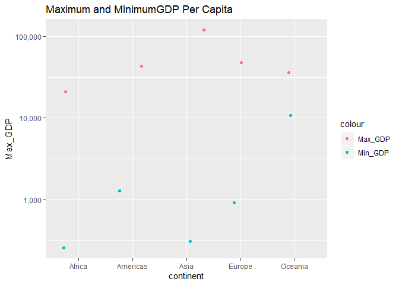
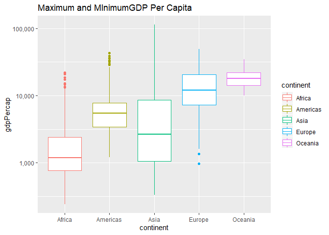

### Setup
Make sure `gapminder` and `tidyverse` packages are installed.
Load them with the following code:

```r
library(gapminder)
library(tidyverse)
```


### Task Option 1

Report the absolute and/or relative abundance of countries with low life expectancy over time by continent: how many countries on each continent have a life expectancy less than *27*, for each year.


```r
gapminder %>%
  select (lifeExp, year) %>%
  group_by(year) %>%
  arrange (year)
```

```
## # A tibble: 1,704 x 2
## # Groups:   year [12]
##    lifeExp  year
##      <dbl> <int>
##  1    28.8  1952
##  2    55.2  1952
##  3    43.1  1952
##  4    30.0  1952
##  5    62.5  1952
##  6    69.1  1952
##  7    66.8  1952
##  8    50.9  1952
##  9    37.5  1952
## 10    68    1952
## # ... with 1,694 more rows
```


### Task Option 2
Get the maximum and minimum of GDP per capita for all continents.

```r
GDP_summary <- gapminder %>%
  select (continent, gdpPercap) %>%
  group_by(continent) %>%
  summarise(Max_GDP=max(gdpPercap), Min_GDP=min(gdpPercap))
knitr::kable(GDP_summary, format = 'html', align ='c')
```

<table>
 <thead>
  <tr>
   <th style="text-align:center;"> continent </th>
   <th style="text-align:center;"> Max_GDP </th>
   <th style="text-align:center;"> Min_GDP </th>
  </tr>
 </thead>
<tbody>
  <tr>
   <td style="text-align:center;"> Africa </td>
   <td style="text-align:center;"> 21951.21 </td>
   <td style="text-align:center;"> 241.1659 </td>
  </tr>
  <tr>
   <td style="text-align:center;"> Americas </td>
   <td style="text-align:center;"> 42951.65 </td>
   <td style="text-align:center;"> 1201.6372 </td>
  </tr>
  <tr>
   <td style="text-align:center;"> Asia </td>
   <td style="text-align:center;"> 113523.13 </td>
   <td style="text-align:center;"> 331.0000 </td>
  </tr>
  <tr>
   <td style="text-align:center;"> Europe </td>
   <td style="text-align:center;"> 49357.19 </td>
   <td style="text-align:center;"> 973.5332 </td>
  </tr>
  <tr>
   <td style="text-align:center;"> Oceania </td>
   <td style="text-align:center;"> 34435.37 </td>
   <td style="text-align:center;"> 10039.5956 </td>
  </tr>
</tbody>
</table>

To obtain a simple figure that only show the Maximum and Minimum values:

```r
ggplot(GDP_summary, aes(x=continent)) + 
  geom_jitter(aes(y=Max_GDP, color="Max_GDP")) + 
  geom_jitter(aes(y=Min_GDP, color="Min_GDP"))+
  scale_y_log10(labels = scales::comma_format())+
  ggtitle("Maximum and MInimumGDP Per Capita") 
```

<!-- -->

Or can use the `geom_boxplot` to obtain a more comprehensive figure:
<!-- -->

### Task option 3
* Look at the spread of GDP per capita within the continents
Generate a table that summarise mean GDP per Cap for each continent:


```r
Mean_GDP <- gapminder %>%
  group_by(continent) %>%
  select(continent, gdpPercap)%>%
  summarise_all("mean")
knitr::kable(Mean_GDP, format = 'html', align ='c')
```

<table>
 <thead>
  <tr>
   <th style="text-align:center;"> continent </th>
   <th style="text-align:center;"> gdpPercap </th>
  </tr>
 </thead>
<tbody>
  <tr>
   <td style="text-align:center;"> Africa </td>
   <td style="text-align:center;"> 2193.755 </td>
  </tr>
  <tr>
   <td style="text-align:center;"> Americas </td>
   <td style="text-align:center;"> 7136.110 </td>
  </tr>
  <tr>
   <td style="text-align:center;"> Asia </td>
   <td style="text-align:center;"> 7902.150 </td>
  </tr>
  <tr>
   <td style="text-align:center;"> Europe </td>
   <td style="text-align:center;"> 14469.476 </td>
  </tr>
  <tr>
   <td style="text-align:center;"> Oceania </td>
   <td style="text-align:center;"> 18621.609 </td>
  </tr>
</tbody>
</table>

To zoom in to each continent by`subset`:
For example, Asia: 

```r
Asia_GDP <- subset.data.frame(gapminder, continent == 'Asia')
knitr::kable(Asia_GDP, format = 'html', align ='c')
```

<table>
 <thead>
  <tr>
   <th style="text-align:center;"> country </th>
   <th style="text-align:center;"> continent </th>
   <th style="text-align:center;"> year </th>
   <th style="text-align:center;"> lifeExp </th>
   <th style="text-align:center;"> pop </th>
   <th style="text-align:center;"> gdpPercap </th>
  </tr>
 </thead>
<tbody>
  <tr>
   <td style="text-align:center;"> Afghanistan </td>
   <td style="text-align:center;"> Asia </td>
   <td style="text-align:center;"> 1952 </td>
   <td style="text-align:center;"> 28.80100 </td>
   <td style="text-align:center;"> 8425333 </td>
   <td style="text-align:center;"> 779.4453 </td>
  </tr>
  <tr>
   <td style="text-align:center;"> Afghanistan </td>
   <td style="text-align:center;"> Asia </td>
   <td style="text-align:center;"> 1957 </td>
   <td style="text-align:center;"> 30.33200 </td>
   <td style="text-align:center;"> 9240934 </td>
   <td style="text-align:center;"> 820.8530 </td>
  </tr>
  <tr>
   <td style="text-align:center;"> Afghanistan </td>
   <td style="text-align:center;"> Asia </td>
   <td style="text-align:center;"> 1962 </td>
   <td style="text-align:center;"> 31.99700 </td>
   <td style="text-align:center;"> 10267083 </td>
   <td style="text-align:center;"> 853.1007 </td>
  </tr>
  <tr>
   <td style="text-align:center;"> Afghanistan </td>
   <td style="text-align:center;"> Asia </td>
   <td style="text-align:center;"> 1967 </td>
   <td style="text-align:center;"> 34.02000 </td>
   <td style="text-align:center;"> 11537966 </td>
   <td style="text-align:center;"> 836.1971 </td>
  </tr>
  <tr>
   <td style="text-align:center;"> Afghanistan </td>
   <td style="text-align:center;"> Asia </td>
   <td style="text-align:center;"> 1972 </td>
   <td style="text-align:center;"> 36.08800 </td>
   <td style="text-align:center;"> 13079460 </td>
   <td style="text-align:center;"> 739.9811 </td>
  </tr>
  <tr>
   <td style="text-align:center;"> Afghanistan </td>
   <td style="text-align:center;"> Asia </td>
   <td style="text-align:center;"> 1977 </td>
   <td style="text-align:center;"> 38.43800 </td>
   <td style="text-align:center;"> 14880372 </td>
   <td style="text-align:center;"> 786.1134 </td>
  </tr>
  <tr>
   <td style="text-align:center;"> Afghanistan </td>
   <td style="text-align:center;"> Asia </td>
   <td style="text-align:center;"> 1982 </td>
   <td style="text-align:center;"> 39.85400 </td>
   <td style="text-align:center;"> 12881816 </td>
   <td style="text-align:center;"> 978.0114 </td>
  </tr>
  <tr>
   <td style="text-align:center;"> Afghanistan </td>
   <td style="text-align:center;"> Asia </td>
   <td style="text-align:center;"> 1987 </td>
   <td style="text-align:center;"> 40.82200 </td>
   <td style="text-align:center;"> 13867957 </td>
   <td style="text-align:center;"> 852.3959 </td>
  </tr>
  <tr>
   <td style="text-align:center;"> Afghanistan </td>
   <td style="text-align:center;"> Asia </td>
   <td style="text-align:center;"> 1992 </td>
   <td style="text-align:center;"> 41.67400 </td>
   <td style="text-align:center;"> 16317921 </td>
   <td style="text-align:center;"> 649.3414 </td>
  </tr>
  <tr>
   <td style="text-align:center;"> Afghanistan </td>
   <td style="text-align:center;"> Asia </td>
   <td style="text-align:center;"> 1997 </td>
   <td style="text-align:center;"> 41.76300 </td>
   <td style="text-align:center;"> 22227415 </td>
   <td style="text-align:center;"> 635.3414 </td>
  </tr>
  <tr>
   <td style="text-align:center;"> Afghanistan </td>
   <td style="text-align:center;"> Asia </td>
   <td style="text-align:center;"> 2002 </td>
   <td style="text-align:center;"> 42.12900 </td>
   <td style="text-align:center;"> 25268405 </td>
   <td style="text-align:center;"> 726.7341 </td>
  </tr>
  <tr>
   <td style="text-align:center;"> Afghanistan </td>
   <td style="text-align:center;"> Asia </td>
   <td style="text-align:center;"> 2007 </td>
   <td style="text-align:center;"> 43.82800 </td>
   <td style="text-align:center;"> 31889923 </td>
   <td style="text-align:center;"> 974.5803 </td>
  </tr>
  <tr>
   <td style="text-align:center;"> Bahrain </td>
   <td style="text-align:center;"> Asia </td>
   <td style="text-align:center;"> 1952 </td>
   <td style="text-align:center;"> 50.93900 </td>
   <td style="text-align:center;"> 120447 </td>
   <td style="text-align:center;"> 9867.0848 </td>
  </tr>
  <tr>
   <td style="text-align:center;"> Bahrain </td>
   <td style="text-align:center;"> Asia </td>
   <td style="text-align:center;"> 1957 </td>
   <td style="text-align:center;"> 53.83200 </td>
   <td style="text-align:center;"> 138655 </td>
   <td style="text-align:center;"> 11635.7995 </td>
  </tr>
  <tr>
   <td style="text-align:center;"> Bahrain </td>
   <td style="text-align:center;"> Asia </td>
   <td style="text-align:center;"> 1962 </td>
   <td style="text-align:center;"> 56.92300 </td>
   <td style="text-align:center;"> 171863 </td>
   <td style="text-align:center;"> 12753.2751 </td>
  </tr>
  <tr>
   <td style="text-align:center;"> Bahrain </td>
   <td style="text-align:center;"> Asia </td>
   <td style="text-align:center;"> 1967 </td>
   <td style="text-align:center;"> 59.92300 </td>
   <td style="text-align:center;"> 202182 </td>
   <td style="text-align:center;"> 14804.6727 </td>
  </tr>
  <tr>
   <td style="text-align:center;"> Bahrain </td>
   <td style="text-align:center;"> Asia </td>
   <td style="text-align:center;"> 1972 </td>
   <td style="text-align:center;"> 63.30000 </td>
   <td style="text-align:center;"> 230800 </td>
   <td style="text-align:center;"> 18268.6584 </td>
  </tr>
  <tr>
   <td style="text-align:center;"> Bahrain </td>
   <td style="text-align:center;"> Asia </td>
   <td style="text-align:center;"> 1977 </td>
   <td style="text-align:center;"> 65.59300 </td>
   <td style="text-align:center;"> 297410 </td>
   <td style="text-align:center;"> 19340.1020 </td>
  </tr>
  <tr>
   <td style="text-align:center;"> Bahrain </td>
   <td style="text-align:center;"> Asia </td>
   <td style="text-align:center;"> 1982 </td>
   <td style="text-align:center;"> 69.05200 </td>
   <td style="text-align:center;"> 377967 </td>
   <td style="text-align:center;"> 19211.1473 </td>
  </tr>
  <tr>
   <td style="text-align:center;"> Bahrain </td>
   <td style="text-align:center;"> Asia </td>
   <td style="text-align:center;"> 1987 </td>
   <td style="text-align:center;"> 70.75000 </td>
   <td style="text-align:center;"> 454612 </td>
   <td style="text-align:center;"> 18524.0241 </td>
  </tr>
  <tr>
   <td style="text-align:center;"> Bahrain </td>
   <td style="text-align:center;"> Asia </td>
   <td style="text-align:center;"> 1992 </td>
   <td style="text-align:center;"> 72.60100 </td>
   <td style="text-align:center;"> 529491 </td>
   <td style="text-align:center;"> 19035.5792 </td>
  </tr>
  <tr>
   <td style="text-align:center;"> Bahrain </td>
   <td style="text-align:center;"> Asia </td>
   <td style="text-align:center;"> 1997 </td>
   <td style="text-align:center;"> 73.92500 </td>
   <td style="text-align:center;"> 598561 </td>
   <td style="text-align:center;"> 20292.0168 </td>
  </tr>
  <tr>
   <td style="text-align:center;"> Bahrain </td>
   <td style="text-align:center;"> Asia </td>
   <td style="text-align:center;"> 2002 </td>
   <td style="text-align:center;"> 74.79500 </td>
   <td style="text-align:center;"> 656397 </td>
   <td style="text-align:center;"> 23403.5593 </td>
  </tr>
  <tr>
   <td style="text-align:center;"> Bahrain </td>
   <td style="text-align:center;"> Asia </td>
   <td style="text-align:center;"> 2007 </td>
   <td style="text-align:center;"> 75.63500 </td>
   <td style="text-align:center;"> 708573 </td>
   <td style="text-align:center;"> 29796.0483 </td>
  </tr>
  <tr>
   <td style="text-align:center;"> Bangladesh </td>
   <td style="text-align:center;"> Asia </td>
   <td style="text-align:center;"> 1952 </td>
   <td style="text-align:center;"> 37.48400 </td>
   <td style="text-align:center;"> 46886859 </td>
   <td style="text-align:center;"> 684.2442 </td>
  </tr>
  <tr>
   <td style="text-align:center;"> Bangladesh </td>
   <td style="text-align:center;"> Asia </td>
   <td style="text-align:center;"> 1957 </td>
   <td style="text-align:center;"> 39.34800 </td>
   <td style="text-align:center;"> 51365468 </td>
   <td style="text-align:center;"> 661.6375 </td>
  </tr>
  <tr>
   <td style="text-align:center;"> Bangladesh </td>
   <td style="text-align:center;"> Asia </td>
   <td style="text-align:center;"> 1962 </td>
   <td style="text-align:center;"> 41.21600 </td>
   <td style="text-align:center;"> 56839289 </td>
   <td style="text-align:center;"> 686.3416 </td>
  </tr>
  <tr>
   <td style="text-align:center;"> Bangladesh </td>
   <td style="text-align:center;"> Asia </td>
   <td style="text-align:center;"> 1967 </td>
   <td style="text-align:center;"> 43.45300 </td>
   <td style="text-align:center;"> 62821884 </td>
   <td style="text-align:center;"> 721.1861 </td>
  </tr>
  <tr>
   <td style="text-align:center;"> Bangladesh </td>
   <td style="text-align:center;"> Asia </td>
   <td style="text-align:center;"> 1972 </td>
   <td style="text-align:center;"> 45.25200 </td>
   <td style="text-align:center;"> 70759295 </td>
   <td style="text-align:center;"> 630.2336 </td>
  </tr>
  <tr>
   <td style="text-align:center;"> Bangladesh </td>
   <td style="text-align:center;"> Asia </td>
   <td style="text-align:center;"> 1977 </td>
   <td style="text-align:center;"> 46.92300 </td>
   <td style="text-align:center;"> 80428306 </td>
   <td style="text-align:center;"> 659.8772 </td>
  </tr>
  <tr>
   <td style="text-align:center;"> Bangladesh </td>
   <td style="text-align:center;"> Asia </td>
   <td style="text-align:center;"> 1982 </td>
   <td style="text-align:center;"> 50.00900 </td>
   <td style="text-align:center;"> 93074406 </td>
   <td style="text-align:center;"> 676.9819 </td>
  </tr>
  <tr>
   <td style="text-align:center;"> Bangladesh </td>
   <td style="text-align:center;"> Asia </td>
   <td style="text-align:center;"> 1987 </td>
   <td style="text-align:center;"> 52.81900 </td>
   <td style="text-align:center;"> 103764241 </td>
   <td style="text-align:center;"> 751.9794 </td>
  </tr>
  <tr>
   <td style="text-align:center;"> Bangladesh </td>
   <td style="text-align:center;"> Asia </td>
   <td style="text-align:center;"> 1992 </td>
   <td style="text-align:center;"> 56.01800 </td>
   <td style="text-align:center;"> 113704579 </td>
   <td style="text-align:center;"> 837.8102 </td>
  </tr>
  <tr>
   <td style="text-align:center;"> Bangladesh </td>
   <td style="text-align:center;"> Asia </td>
   <td style="text-align:center;"> 1997 </td>
   <td style="text-align:center;"> 59.41200 </td>
   <td style="text-align:center;"> 123315288 </td>
   <td style="text-align:center;"> 972.7700 </td>
  </tr>
  <tr>
   <td style="text-align:center;"> Bangladesh </td>
   <td style="text-align:center;"> Asia </td>
   <td style="text-align:center;"> 2002 </td>
   <td style="text-align:center;"> 62.01300 </td>
   <td style="text-align:center;"> 135656790 </td>
   <td style="text-align:center;"> 1136.3904 </td>
  </tr>
  <tr>
   <td style="text-align:center;"> Bangladesh </td>
   <td style="text-align:center;"> Asia </td>
   <td style="text-align:center;"> 2007 </td>
   <td style="text-align:center;"> 64.06200 </td>
   <td style="text-align:center;"> 150448339 </td>
   <td style="text-align:center;"> 1391.2538 </td>
  </tr>
  <tr>
   <td style="text-align:center;"> Cambodia </td>
   <td style="text-align:center;"> Asia </td>
   <td style="text-align:center;"> 1952 </td>
   <td style="text-align:center;"> 39.41700 </td>
   <td style="text-align:center;"> 4693836 </td>
   <td style="text-align:center;"> 368.4693 </td>
  </tr>
  <tr>
   <td style="text-align:center;"> Cambodia </td>
   <td style="text-align:center;"> Asia </td>
   <td style="text-align:center;"> 1957 </td>
   <td style="text-align:center;"> 41.36600 </td>
   <td style="text-align:center;"> 5322536 </td>
   <td style="text-align:center;"> 434.0383 </td>
  </tr>
  <tr>
   <td style="text-align:center;"> Cambodia </td>
   <td style="text-align:center;"> Asia </td>
   <td style="text-align:center;"> 1962 </td>
   <td style="text-align:center;"> 43.41500 </td>
   <td style="text-align:center;"> 6083619 </td>
   <td style="text-align:center;"> 496.9136 </td>
  </tr>
  <tr>
   <td style="text-align:center;"> Cambodia </td>
   <td style="text-align:center;"> Asia </td>
   <td style="text-align:center;"> 1967 </td>
   <td style="text-align:center;"> 45.41500 </td>
   <td style="text-align:center;"> 6960067 </td>
   <td style="text-align:center;"> 523.4323 </td>
  </tr>
  <tr>
   <td style="text-align:center;"> Cambodia </td>
   <td style="text-align:center;"> Asia </td>
   <td style="text-align:center;"> 1972 </td>
   <td style="text-align:center;"> 40.31700 </td>
   <td style="text-align:center;"> 7450606 </td>
   <td style="text-align:center;"> 421.6240 </td>
  </tr>
  <tr>
   <td style="text-align:center;"> Cambodia </td>
   <td style="text-align:center;"> Asia </td>
   <td style="text-align:center;"> 1977 </td>
   <td style="text-align:center;"> 31.22000 </td>
   <td style="text-align:center;"> 6978607 </td>
   <td style="text-align:center;"> 524.9722 </td>
  </tr>
  <tr>
   <td style="text-align:center;"> Cambodia </td>
   <td style="text-align:center;"> Asia </td>
   <td style="text-align:center;"> 1982 </td>
   <td style="text-align:center;"> 50.95700 </td>
   <td style="text-align:center;"> 7272485 </td>
   <td style="text-align:center;"> 624.4755 </td>
  </tr>
  <tr>
   <td style="text-align:center;"> Cambodia </td>
   <td style="text-align:center;"> Asia </td>
   <td style="text-align:center;"> 1987 </td>
   <td style="text-align:center;"> 53.91400 </td>
   <td style="text-align:center;"> 8371791 </td>
   <td style="text-align:center;"> 683.8956 </td>
  </tr>
  <tr>
   <td style="text-align:center;"> Cambodia </td>
   <td style="text-align:center;"> Asia </td>
   <td style="text-align:center;"> 1992 </td>
   <td style="text-align:center;"> 55.80300 </td>
   <td style="text-align:center;"> 10150094 </td>
   <td style="text-align:center;"> 682.3032 </td>
  </tr>
  <tr>
   <td style="text-align:center;"> Cambodia </td>
   <td style="text-align:center;"> Asia </td>
   <td style="text-align:center;"> 1997 </td>
   <td style="text-align:center;"> 56.53400 </td>
   <td style="text-align:center;"> 11782962 </td>
   <td style="text-align:center;"> 734.2852 </td>
  </tr>
  <tr>
   <td style="text-align:center;"> Cambodia </td>
   <td style="text-align:center;"> Asia </td>
   <td style="text-align:center;"> 2002 </td>
   <td style="text-align:center;"> 56.75200 </td>
   <td style="text-align:center;"> 12926707 </td>
   <td style="text-align:center;"> 896.2260 </td>
  </tr>
  <tr>
   <td style="text-align:center;"> Cambodia </td>
   <td style="text-align:center;"> Asia </td>
   <td style="text-align:center;"> 2007 </td>
   <td style="text-align:center;"> 59.72300 </td>
   <td style="text-align:center;"> 14131858 </td>
   <td style="text-align:center;"> 1713.7787 </td>
  </tr>
  <tr>
   <td style="text-align:center;"> China </td>
   <td style="text-align:center;"> Asia </td>
   <td style="text-align:center;"> 1952 </td>
   <td style="text-align:center;"> 44.00000 </td>
   <td style="text-align:center;"> 556263527 </td>
   <td style="text-align:center;"> 400.4486 </td>
  </tr>
  <tr>
   <td style="text-align:center;"> China </td>
   <td style="text-align:center;"> Asia </td>
   <td style="text-align:center;"> 1957 </td>
   <td style="text-align:center;"> 50.54896 </td>
   <td style="text-align:center;"> 637408000 </td>
   <td style="text-align:center;"> 575.9870 </td>
  </tr>
  <tr>
   <td style="text-align:center;"> China </td>
   <td style="text-align:center;"> Asia </td>
   <td style="text-align:center;"> 1962 </td>
   <td style="text-align:center;"> 44.50136 </td>
   <td style="text-align:center;"> 665770000 </td>
   <td style="text-align:center;"> 487.6740 </td>
  </tr>
  <tr>
   <td style="text-align:center;"> China </td>
   <td style="text-align:center;"> Asia </td>
   <td style="text-align:center;"> 1967 </td>
   <td style="text-align:center;"> 58.38112 </td>
   <td style="text-align:center;"> 754550000 </td>
   <td style="text-align:center;"> 612.7057 </td>
  </tr>
  <tr>
   <td style="text-align:center;"> China </td>
   <td style="text-align:center;"> Asia </td>
   <td style="text-align:center;"> 1972 </td>
   <td style="text-align:center;"> 63.11888 </td>
   <td style="text-align:center;"> 862030000 </td>
   <td style="text-align:center;"> 676.9001 </td>
  </tr>
  <tr>
   <td style="text-align:center;"> China </td>
   <td style="text-align:center;"> Asia </td>
   <td style="text-align:center;"> 1977 </td>
   <td style="text-align:center;"> 63.96736 </td>
   <td style="text-align:center;"> 943455000 </td>
   <td style="text-align:center;"> 741.2375 </td>
  </tr>
  <tr>
   <td style="text-align:center;"> China </td>
   <td style="text-align:center;"> Asia </td>
   <td style="text-align:center;"> 1982 </td>
   <td style="text-align:center;"> 65.52500 </td>
   <td style="text-align:center;"> 1000281000 </td>
   <td style="text-align:center;"> 962.4214 </td>
  </tr>
  <tr>
   <td style="text-align:center;"> China </td>
   <td style="text-align:center;"> Asia </td>
   <td style="text-align:center;"> 1987 </td>
   <td style="text-align:center;"> 67.27400 </td>
   <td style="text-align:center;"> 1084035000 </td>
   <td style="text-align:center;"> 1378.9040 </td>
  </tr>
  <tr>
   <td style="text-align:center;"> China </td>
   <td style="text-align:center;"> Asia </td>
   <td style="text-align:center;"> 1992 </td>
   <td style="text-align:center;"> 68.69000 </td>
   <td style="text-align:center;"> 1164970000 </td>
   <td style="text-align:center;"> 1655.7842 </td>
  </tr>
  <tr>
   <td style="text-align:center;"> China </td>
   <td style="text-align:center;"> Asia </td>
   <td style="text-align:center;"> 1997 </td>
   <td style="text-align:center;"> 70.42600 </td>
   <td style="text-align:center;"> 1230075000 </td>
   <td style="text-align:center;"> 2289.2341 </td>
  </tr>
  <tr>
   <td style="text-align:center;"> China </td>
   <td style="text-align:center;"> Asia </td>
   <td style="text-align:center;"> 2002 </td>
   <td style="text-align:center;"> 72.02800 </td>
   <td style="text-align:center;"> 1280400000 </td>
   <td style="text-align:center;"> 3119.2809 </td>
  </tr>
  <tr>
   <td style="text-align:center;"> China </td>
   <td style="text-align:center;"> Asia </td>
   <td style="text-align:center;"> 2007 </td>
   <td style="text-align:center;"> 72.96100 </td>
   <td style="text-align:center;"> 1318683096 </td>
   <td style="text-align:center;"> 4959.1149 </td>
  </tr>
  <tr>
   <td style="text-align:center;"> Hong Kong, China </td>
   <td style="text-align:center;"> Asia </td>
   <td style="text-align:center;"> 1952 </td>
   <td style="text-align:center;"> 60.96000 </td>
   <td style="text-align:center;"> 2125900 </td>
   <td style="text-align:center;"> 3054.4212 </td>
  </tr>
  <tr>
   <td style="text-align:center;"> Hong Kong, China </td>
   <td style="text-align:center;"> Asia </td>
   <td style="text-align:center;"> 1957 </td>
   <td style="text-align:center;"> 64.75000 </td>
   <td style="text-align:center;"> 2736300 </td>
   <td style="text-align:center;"> 3629.0765 </td>
  </tr>
  <tr>
   <td style="text-align:center;"> Hong Kong, China </td>
   <td style="text-align:center;"> Asia </td>
   <td style="text-align:center;"> 1962 </td>
   <td style="text-align:center;"> 67.65000 </td>
   <td style="text-align:center;"> 3305200 </td>
   <td style="text-align:center;"> 4692.6483 </td>
  </tr>
  <tr>
   <td style="text-align:center;"> Hong Kong, China </td>
   <td style="text-align:center;"> Asia </td>
   <td style="text-align:center;"> 1967 </td>
   <td style="text-align:center;"> 70.00000 </td>
   <td style="text-align:center;"> 3722800 </td>
   <td style="text-align:center;"> 6197.9628 </td>
  </tr>
  <tr>
   <td style="text-align:center;"> Hong Kong, China </td>
   <td style="text-align:center;"> Asia </td>
   <td style="text-align:center;"> 1972 </td>
   <td style="text-align:center;"> 72.00000 </td>
   <td style="text-align:center;"> 4115700 </td>
   <td style="text-align:center;"> 8315.9281 </td>
  </tr>
  <tr>
   <td style="text-align:center;"> Hong Kong, China </td>
   <td style="text-align:center;"> Asia </td>
   <td style="text-align:center;"> 1977 </td>
   <td style="text-align:center;"> 73.60000 </td>
   <td style="text-align:center;"> 4583700 </td>
   <td style="text-align:center;"> 11186.1413 </td>
  </tr>
  <tr>
   <td style="text-align:center;"> Hong Kong, China </td>
   <td style="text-align:center;"> Asia </td>
   <td style="text-align:center;"> 1982 </td>
   <td style="text-align:center;"> 75.45000 </td>
   <td style="text-align:center;"> 5264500 </td>
   <td style="text-align:center;"> 14560.5305 </td>
  </tr>
  <tr>
   <td style="text-align:center;"> Hong Kong, China </td>
   <td style="text-align:center;"> Asia </td>
   <td style="text-align:center;"> 1987 </td>
   <td style="text-align:center;"> 76.20000 </td>
   <td style="text-align:center;"> 5584510 </td>
   <td style="text-align:center;"> 20038.4727 </td>
  </tr>
  <tr>
   <td style="text-align:center;"> Hong Kong, China </td>
   <td style="text-align:center;"> Asia </td>
   <td style="text-align:center;"> 1992 </td>
   <td style="text-align:center;"> 77.60100 </td>
   <td style="text-align:center;"> 5829696 </td>
   <td style="text-align:center;"> 24757.6030 </td>
  </tr>
  <tr>
   <td style="text-align:center;"> Hong Kong, China </td>
   <td style="text-align:center;"> Asia </td>
   <td style="text-align:center;"> 1997 </td>
   <td style="text-align:center;"> 80.00000 </td>
   <td style="text-align:center;"> 6495918 </td>
   <td style="text-align:center;"> 28377.6322 </td>
  </tr>
  <tr>
   <td style="text-align:center;"> Hong Kong, China </td>
   <td style="text-align:center;"> Asia </td>
   <td style="text-align:center;"> 2002 </td>
   <td style="text-align:center;"> 81.49500 </td>
   <td style="text-align:center;"> 6762476 </td>
   <td style="text-align:center;"> 30209.0152 </td>
  </tr>
  <tr>
   <td style="text-align:center;"> Hong Kong, China </td>
   <td style="text-align:center;"> Asia </td>
   <td style="text-align:center;"> 2007 </td>
   <td style="text-align:center;"> 82.20800 </td>
   <td style="text-align:center;"> 6980412 </td>
   <td style="text-align:center;"> 39724.9787 </td>
  </tr>
  <tr>
   <td style="text-align:center;"> India </td>
   <td style="text-align:center;"> Asia </td>
   <td style="text-align:center;"> 1952 </td>
   <td style="text-align:center;"> 37.37300 </td>
   <td style="text-align:center;"> 372000000 </td>
   <td style="text-align:center;"> 546.5657 </td>
  </tr>
  <tr>
   <td style="text-align:center;"> India </td>
   <td style="text-align:center;"> Asia </td>
   <td style="text-align:center;"> 1957 </td>
   <td style="text-align:center;"> 40.24900 </td>
   <td style="text-align:center;"> 409000000 </td>
   <td style="text-align:center;"> 590.0620 </td>
  </tr>
  <tr>
   <td style="text-align:center;"> India </td>
   <td style="text-align:center;"> Asia </td>
   <td style="text-align:center;"> 1962 </td>
   <td style="text-align:center;"> 43.60500 </td>
   <td style="text-align:center;"> 454000000 </td>
   <td style="text-align:center;"> 658.3472 </td>
  </tr>
  <tr>
   <td style="text-align:center;"> India </td>
   <td style="text-align:center;"> Asia </td>
   <td style="text-align:center;"> 1967 </td>
   <td style="text-align:center;"> 47.19300 </td>
   <td style="text-align:center;"> 506000000 </td>
   <td style="text-align:center;"> 700.7706 </td>
  </tr>
  <tr>
   <td style="text-align:center;"> India </td>
   <td style="text-align:center;"> Asia </td>
   <td style="text-align:center;"> 1972 </td>
   <td style="text-align:center;"> 50.65100 </td>
   <td style="text-align:center;"> 567000000 </td>
   <td style="text-align:center;"> 724.0325 </td>
  </tr>
  <tr>
   <td style="text-align:center;"> India </td>
   <td style="text-align:center;"> Asia </td>
   <td style="text-align:center;"> 1977 </td>
   <td style="text-align:center;"> 54.20800 </td>
   <td style="text-align:center;"> 634000000 </td>
   <td style="text-align:center;"> 813.3373 </td>
  </tr>
  <tr>
   <td style="text-align:center;"> India </td>
   <td style="text-align:center;"> Asia </td>
   <td style="text-align:center;"> 1982 </td>
   <td style="text-align:center;"> 56.59600 </td>
   <td style="text-align:center;"> 708000000 </td>
   <td style="text-align:center;"> 855.7235 </td>
  </tr>
  <tr>
   <td style="text-align:center;"> India </td>
   <td style="text-align:center;"> Asia </td>
   <td style="text-align:center;"> 1987 </td>
   <td style="text-align:center;"> 58.55300 </td>
   <td style="text-align:center;"> 788000000 </td>
   <td style="text-align:center;"> 976.5127 </td>
  </tr>
  <tr>
   <td style="text-align:center;"> India </td>
   <td style="text-align:center;"> Asia </td>
   <td style="text-align:center;"> 1992 </td>
   <td style="text-align:center;"> 60.22300 </td>
   <td style="text-align:center;"> 872000000 </td>
   <td style="text-align:center;"> 1164.4068 </td>
  </tr>
  <tr>
   <td style="text-align:center;"> India </td>
   <td style="text-align:center;"> Asia </td>
   <td style="text-align:center;"> 1997 </td>
   <td style="text-align:center;"> 61.76500 </td>
   <td style="text-align:center;"> 959000000 </td>
   <td style="text-align:center;"> 1458.8174 </td>
  </tr>
  <tr>
   <td style="text-align:center;"> India </td>
   <td style="text-align:center;"> Asia </td>
   <td style="text-align:center;"> 2002 </td>
   <td style="text-align:center;"> 62.87900 </td>
   <td style="text-align:center;"> 1034172547 </td>
   <td style="text-align:center;"> 1746.7695 </td>
  </tr>
  <tr>
   <td style="text-align:center;"> India </td>
   <td style="text-align:center;"> Asia </td>
   <td style="text-align:center;"> 2007 </td>
   <td style="text-align:center;"> 64.69800 </td>
   <td style="text-align:center;"> 1110396331 </td>
   <td style="text-align:center;"> 2452.2104 </td>
  </tr>
  <tr>
   <td style="text-align:center;"> Indonesia </td>
   <td style="text-align:center;"> Asia </td>
   <td style="text-align:center;"> 1952 </td>
   <td style="text-align:center;"> 37.46800 </td>
   <td style="text-align:center;"> 82052000 </td>
   <td style="text-align:center;"> 749.6817 </td>
  </tr>
  <tr>
   <td style="text-align:center;"> Indonesia </td>
   <td style="text-align:center;"> Asia </td>
   <td style="text-align:center;"> 1957 </td>
   <td style="text-align:center;"> 39.91800 </td>
   <td style="text-align:center;"> 90124000 </td>
   <td style="text-align:center;"> 858.9003 </td>
  </tr>
  <tr>
   <td style="text-align:center;"> Indonesia </td>
   <td style="text-align:center;"> Asia </td>
   <td style="text-align:center;"> 1962 </td>
   <td style="text-align:center;"> 42.51800 </td>
   <td style="text-align:center;"> 99028000 </td>
   <td style="text-align:center;"> 849.2898 </td>
  </tr>
  <tr>
   <td style="text-align:center;"> Indonesia </td>
   <td style="text-align:center;"> Asia </td>
   <td style="text-align:center;"> 1967 </td>
   <td style="text-align:center;"> 45.96400 </td>
   <td style="text-align:center;"> 109343000 </td>
   <td style="text-align:center;"> 762.4318 </td>
  </tr>
  <tr>
   <td style="text-align:center;"> Indonesia </td>
   <td style="text-align:center;"> Asia </td>
   <td style="text-align:center;"> 1972 </td>
   <td style="text-align:center;"> 49.20300 </td>
   <td style="text-align:center;"> 121282000 </td>
   <td style="text-align:center;"> 1111.1079 </td>
  </tr>
  <tr>
   <td style="text-align:center;"> Indonesia </td>
   <td style="text-align:center;"> Asia </td>
   <td style="text-align:center;"> 1977 </td>
   <td style="text-align:center;"> 52.70200 </td>
   <td style="text-align:center;"> 136725000 </td>
   <td style="text-align:center;"> 1382.7021 </td>
  </tr>
  <tr>
   <td style="text-align:center;"> Indonesia </td>
   <td style="text-align:center;"> Asia </td>
   <td style="text-align:center;"> 1982 </td>
   <td style="text-align:center;"> 56.15900 </td>
   <td style="text-align:center;"> 153343000 </td>
   <td style="text-align:center;"> 1516.8730 </td>
  </tr>
  <tr>
   <td style="text-align:center;"> Indonesia </td>
   <td style="text-align:center;"> Asia </td>
   <td style="text-align:center;"> 1987 </td>
   <td style="text-align:center;"> 60.13700 </td>
   <td style="text-align:center;"> 169276000 </td>
   <td style="text-align:center;"> 1748.3570 </td>
  </tr>
  <tr>
   <td style="text-align:center;"> Indonesia </td>
   <td style="text-align:center;"> Asia </td>
   <td style="text-align:center;"> 1992 </td>
   <td style="text-align:center;"> 62.68100 </td>
   <td style="text-align:center;"> 184816000 </td>
   <td style="text-align:center;"> 2383.1409 </td>
  </tr>
  <tr>
   <td style="text-align:center;"> Indonesia </td>
   <td style="text-align:center;"> Asia </td>
   <td style="text-align:center;"> 1997 </td>
   <td style="text-align:center;"> 66.04100 </td>
   <td style="text-align:center;"> 199278000 </td>
   <td style="text-align:center;"> 3119.3356 </td>
  </tr>
  <tr>
   <td style="text-align:center;"> Indonesia </td>
   <td style="text-align:center;"> Asia </td>
   <td style="text-align:center;"> 2002 </td>
   <td style="text-align:center;"> 68.58800 </td>
   <td style="text-align:center;"> 211060000 </td>
   <td style="text-align:center;"> 2873.9129 </td>
  </tr>
  <tr>
   <td style="text-align:center;"> Indonesia </td>
   <td style="text-align:center;"> Asia </td>
   <td style="text-align:center;"> 2007 </td>
   <td style="text-align:center;"> 70.65000 </td>
   <td style="text-align:center;"> 223547000 </td>
   <td style="text-align:center;"> 3540.6516 </td>
  </tr>
  <tr>
   <td style="text-align:center;"> Iran </td>
   <td style="text-align:center;"> Asia </td>
   <td style="text-align:center;"> 1952 </td>
   <td style="text-align:center;"> 44.86900 </td>
   <td style="text-align:center;"> 17272000 </td>
   <td style="text-align:center;"> 3035.3260 </td>
  </tr>
  <tr>
   <td style="text-align:center;"> Iran </td>
   <td style="text-align:center;"> Asia </td>
   <td style="text-align:center;"> 1957 </td>
   <td style="text-align:center;"> 47.18100 </td>
   <td style="text-align:center;"> 19792000 </td>
   <td style="text-align:center;"> 3290.2576 </td>
  </tr>
  <tr>
   <td style="text-align:center;"> Iran </td>
   <td style="text-align:center;"> Asia </td>
   <td style="text-align:center;"> 1962 </td>
   <td style="text-align:center;"> 49.32500 </td>
   <td style="text-align:center;"> 22874000 </td>
   <td style="text-align:center;"> 4187.3298 </td>
  </tr>
  <tr>
   <td style="text-align:center;"> Iran </td>
   <td style="text-align:center;"> Asia </td>
   <td style="text-align:center;"> 1967 </td>
   <td style="text-align:center;"> 52.46900 </td>
   <td style="text-align:center;"> 26538000 </td>
   <td style="text-align:center;"> 5906.7318 </td>
  </tr>
  <tr>
   <td style="text-align:center;"> Iran </td>
   <td style="text-align:center;"> Asia </td>
   <td style="text-align:center;"> 1972 </td>
   <td style="text-align:center;"> 55.23400 </td>
   <td style="text-align:center;"> 30614000 </td>
   <td style="text-align:center;"> 9613.8186 </td>
  </tr>
  <tr>
   <td style="text-align:center;"> Iran </td>
   <td style="text-align:center;"> Asia </td>
   <td style="text-align:center;"> 1977 </td>
   <td style="text-align:center;"> 57.70200 </td>
   <td style="text-align:center;"> 35480679 </td>
   <td style="text-align:center;"> 11888.5951 </td>
  </tr>
  <tr>
   <td style="text-align:center;"> Iran </td>
   <td style="text-align:center;"> Asia </td>
   <td style="text-align:center;"> 1982 </td>
   <td style="text-align:center;"> 59.62000 </td>
   <td style="text-align:center;"> 43072751 </td>
   <td style="text-align:center;"> 7608.3346 </td>
  </tr>
  <tr>
   <td style="text-align:center;"> Iran </td>
   <td style="text-align:center;"> Asia </td>
   <td style="text-align:center;"> 1987 </td>
   <td style="text-align:center;"> 63.04000 </td>
   <td style="text-align:center;"> 51889696 </td>
   <td style="text-align:center;"> 6642.8814 </td>
  </tr>
  <tr>
   <td style="text-align:center;"> Iran </td>
   <td style="text-align:center;"> Asia </td>
   <td style="text-align:center;"> 1992 </td>
   <td style="text-align:center;"> 65.74200 </td>
   <td style="text-align:center;"> 60397973 </td>
   <td style="text-align:center;"> 7235.6532 </td>
  </tr>
  <tr>
   <td style="text-align:center;"> Iran </td>
   <td style="text-align:center;"> Asia </td>
   <td style="text-align:center;"> 1997 </td>
   <td style="text-align:center;"> 68.04200 </td>
   <td style="text-align:center;"> 63327987 </td>
   <td style="text-align:center;"> 8263.5903 </td>
  </tr>
  <tr>
   <td style="text-align:center;"> Iran </td>
   <td style="text-align:center;"> Asia </td>
   <td style="text-align:center;"> 2002 </td>
   <td style="text-align:center;"> 69.45100 </td>
   <td style="text-align:center;"> 66907826 </td>
   <td style="text-align:center;"> 9240.7620 </td>
  </tr>
  <tr>
   <td style="text-align:center;"> Iran </td>
   <td style="text-align:center;"> Asia </td>
   <td style="text-align:center;"> 2007 </td>
   <td style="text-align:center;"> 70.96400 </td>
   <td style="text-align:center;"> 69453570 </td>
   <td style="text-align:center;"> 11605.7145 </td>
  </tr>
  <tr>
   <td style="text-align:center;"> Iraq </td>
   <td style="text-align:center;"> Asia </td>
   <td style="text-align:center;"> 1952 </td>
   <td style="text-align:center;"> 45.32000 </td>
   <td style="text-align:center;"> 5441766 </td>
   <td style="text-align:center;"> 4129.7661 </td>
  </tr>
  <tr>
   <td style="text-align:center;"> Iraq </td>
   <td style="text-align:center;"> Asia </td>
   <td style="text-align:center;"> 1957 </td>
   <td style="text-align:center;"> 48.43700 </td>
   <td style="text-align:center;"> 6248643 </td>
   <td style="text-align:center;"> 6229.3336 </td>
  </tr>
  <tr>
   <td style="text-align:center;"> Iraq </td>
   <td style="text-align:center;"> Asia </td>
   <td style="text-align:center;"> 1962 </td>
   <td style="text-align:center;"> 51.45700 </td>
   <td style="text-align:center;"> 7240260 </td>
   <td style="text-align:center;"> 8341.7378 </td>
  </tr>
  <tr>
   <td style="text-align:center;"> Iraq </td>
   <td style="text-align:center;"> Asia </td>
   <td style="text-align:center;"> 1967 </td>
   <td style="text-align:center;"> 54.45900 </td>
   <td style="text-align:center;"> 8519282 </td>
   <td style="text-align:center;"> 8931.4598 </td>
  </tr>
  <tr>
   <td style="text-align:center;"> Iraq </td>
   <td style="text-align:center;"> Asia </td>
   <td style="text-align:center;"> 1972 </td>
   <td style="text-align:center;"> 56.95000 </td>
   <td style="text-align:center;"> 10061506 </td>
   <td style="text-align:center;"> 9576.0376 </td>
  </tr>
  <tr>
   <td style="text-align:center;"> Iraq </td>
   <td style="text-align:center;"> Asia </td>
   <td style="text-align:center;"> 1977 </td>
   <td style="text-align:center;"> 60.41300 </td>
   <td style="text-align:center;"> 11882916 </td>
   <td style="text-align:center;"> 14688.2351 </td>
  </tr>
  <tr>
   <td style="text-align:center;"> Iraq </td>
   <td style="text-align:center;"> Asia </td>
   <td style="text-align:center;"> 1982 </td>
   <td style="text-align:center;"> 62.03800 </td>
   <td style="text-align:center;"> 14173318 </td>
   <td style="text-align:center;"> 14517.9071 </td>
  </tr>
  <tr>
   <td style="text-align:center;"> Iraq </td>
   <td style="text-align:center;"> Asia </td>
   <td style="text-align:center;"> 1987 </td>
   <td style="text-align:center;"> 65.04400 </td>
   <td style="text-align:center;"> 16543189 </td>
   <td style="text-align:center;"> 11643.5727 </td>
  </tr>
  <tr>
   <td style="text-align:center;"> Iraq </td>
   <td style="text-align:center;"> Asia </td>
   <td style="text-align:center;"> 1992 </td>
   <td style="text-align:center;"> 59.46100 </td>
   <td style="text-align:center;"> 17861905 </td>
   <td style="text-align:center;"> 3745.6407 </td>
  </tr>
  <tr>
   <td style="text-align:center;"> Iraq </td>
   <td style="text-align:center;"> Asia </td>
   <td style="text-align:center;"> 1997 </td>
   <td style="text-align:center;"> 58.81100 </td>
   <td style="text-align:center;"> 20775703 </td>
   <td style="text-align:center;"> 3076.2398 </td>
  </tr>
  <tr>
   <td style="text-align:center;"> Iraq </td>
   <td style="text-align:center;"> Asia </td>
   <td style="text-align:center;"> 2002 </td>
   <td style="text-align:center;"> 57.04600 </td>
   <td style="text-align:center;"> 24001816 </td>
   <td style="text-align:center;"> 4390.7173 </td>
  </tr>
  <tr>
   <td style="text-align:center;"> Iraq </td>
   <td style="text-align:center;"> Asia </td>
   <td style="text-align:center;"> 2007 </td>
   <td style="text-align:center;"> 59.54500 </td>
   <td style="text-align:center;"> 27499638 </td>
   <td style="text-align:center;"> 4471.0619 </td>
  </tr>
  <tr>
   <td style="text-align:center;"> Israel </td>
   <td style="text-align:center;"> Asia </td>
   <td style="text-align:center;"> 1952 </td>
   <td style="text-align:center;"> 65.39000 </td>
   <td style="text-align:center;"> 1620914 </td>
   <td style="text-align:center;"> 4086.5221 </td>
  </tr>
  <tr>
   <td style="text-align:center;"> Israel </td>
   <td style="text-align:center;"> Asia </td>
   <td style="text-align:center;"> 1957 </td>
   <td style="text-align:center;"> 67.84000 </td>
   <td style="text-align:center;"> 1944401 </td>
   <td style="text-align:center;"> 5385.2785 </td>
  </tr>
  <tr>
   <td style="text-align:center;"> Israel </td>
   <td style="text-align:center;"> Asia </td>
   <td style="text-align:center;"> 1962 </td>
   <td style="text-align:center;"> 69.39000 </td>
   <td style="text-align:center;"> 2310904 </td>
   <td style="text-align:center;"> 7105.6307 </td>
  </tr>
  <tr>
   <td style="text-align:center;"> Israel </td>
   <td style="text-align:center;"> Asia </td>
   <td style="text-align:center;"> 1967 </td>
   <td style="text-align:center;"> 70.75000 </td>
   <td style="text-align:center;"> 2693585 </td>
   <td style="text-align:center;"> 8393.7414 </td>
  </tr>
  <tr>
   <td style="text-align:center;"> Israel </td>
   <td style="text-align:center;"> Asia </td>
   <td style="text-align:center;"> 1972 </td>
   <td style="text-align:center;"> 71.63000 </td>
   <td style="text-align:center;"> 3095893 </td>
   <td style="text-align:center;"> 12786.9322 </td>
  </tr>
  <tr>
   <td style="text-align:center;"> Israel </td>
   <td style="text-align:center;"> Asia </td>
   <td style="text-align:center;"> 1977 </td>
   <td style="text-align:center;"> 73.06000 </td>
   <td style="text-align:center;"> 3495918 </td>
   <td style="text-align:center;"> 13306.6192 </td>
  </tr>
  <tr>
   <td style="text-align:center;"> Israel </td>
   <td style="text-align:center;"> Asia </td>
   <td style="text-align:center;"> 1982 </td>
   <td style="text-align:center;"> 74.45000 </td>
   <td style="text-align:center;"> 3858421 </td>
   <td style="text-align:center;"> 15367.0292 </td>
  </tr>
  <tr>
   <td style="text-align:center;"> Israel </td>
   <td style="text-align:center;"> Asia </td>
   <td style="text-align:center;"> 1987 </td>
   <td style="text-align:center;"> 75.60000 </td>
   <td style="text-align:center;"> 4203148 </td>
   <td style="text-align:center;"> 17122.4799 </td>
  </tr>
  <tr>
   <td style="text-align:center;"> Israel </td>
   <td style="text-align:center;"> Asia </td>
   <td style="text-align:center;"> 1992 </td>
   <td style="text-align:center;"> 76.93000 </td>
   <td style="text-align:center;"> 4936550 </td>
   <td style="text-align:center;"> 18051.5225 </td>
  </tr>
  <tr>
   <td style="text-align:center;"> Israel </td>
   <td style="text-align:center;"> Asia </td>
   <td style="text-align:center;"> 1997 </td>
   <td style="text-align:center;"> 78.26900 </td>
   <td style="text-align:center;"> 5531387 </td>
   <td style="text-align:center;"> 20896.6092 </td>
  </tr>
  <tr>
   <td style="text-align:center;"> Israel </td>
   <td style="text-align:center;"> Asia </td>
   <td style="text-align:center;"> 2002 </td>
   <td style="text-align:center;"> 79.69600 </td>
   <td style="text-align:center;"> 6029529 </td>
   <td style="text-align:center;"> 21905.5951 </td>
  </tr>
  <tr>
   <td style="text-align:center;"> Israel </td>
   <td style="text-align:center;"> Asia </td>
   <td style="text-align:center;"> 2007 </td>
   <td style="text-align:center;"> 80.74500 </td>
   <td style="text-align:center;"> 6426679 </td>
   <td style="text-align:center;"> 25523.2771 </td>
  </tr>
  <tr>
   <td style="text-align:center;"> Japan </td>
   <td style="text-align:center;"> Asia </td>
   <td style="text-align:center;"> 1952 </td>
   <td style="text-align:center;"> 63.03000 </td>
   <td style="text-align:center;"> 86459025 </td>
   <td style="text-align:center;"> 3216.9563 </td>
  </tr>
  <tr>
   <td style="text-align:center;"> Japan </td>
   <td style="text-align:center;"> Asia </td>
   <td style="text-align:center;"> 1957 </td>
   <td style="text-align:center;"> 65.50000 </td>
   <td style="text-align:center;"> 91563009 </td>
   <td style="text-align:center;"> 4317.6944 </td>
  </tr>
  <tr>
   <td style="text-align:center;"> Japan </td>
   <td style="text-align:center;"> Asia </td>
   <td style="text-align:center;"> 1962 </td>
   <td style="text-align:center;"> 68.73000 </td>
   <td style="text-align:center;"> 95831757 </td>
   <td style="text-align:center;"> 6576.6495 </td>
  </tr>
  <tr>
   <td style="text-align:center;"> Japan </td>
   <td style="text-align:center;"> Asia </td>
   <td style="text-align:center;"> 1967 </td>
   <td style="text-align:center;"> 71.43000 </td>
   <td style="text-align:center;"> 100825279 </td>
   <td style="text-align:center;"> 9847.7886 </td>
  </tr>
  <tr>
   <td style="text-align:center;"> Japan </td>
   <td style="text-align:center;"> Asia </td>
   <td style="text-align:center;"> 1972 </td>
   <td style="text-align:center;"> 73.42000 </td>
   <td style="text-align:center;"> 107188273 </td>
   <td style="text-align:center;"> 14778.7864 </td>
  </tr>
  <tr>
   <td style="text-align:center;"> Japan </td>
   <td style="text-align:center;"> Asia </td>
   <td style="text-align:center;"> 1977 </td>
   <td style="text-align:center;"> 75.38000 </td>
   <td style="text-align:center;"> 113872473 </td>
   <td style="text-align:center;"> 16610.3770 </td>
  </tr>
  <tr>
   <td style="text-align:center;"> Japan </td>
   <td style="text-align:center;"> Asia </td>
   <td style="text-align:center;"> 1982 </td>
   <td style="text-align:center;"> 77.11000 </td>
   <td style="text-align:center;"> 118454974 </td>
   <td style="text-align:center;"> 19384.1057 </td>
  </tr>
  <tr>
   <td style="text-align:center;"> Japan </td>
   <td style="text-align:center;"> Asia </td>
   <td style="text-align:center;"> 1987 </td>
   <td style="text-align:center;"> 78.67000 </td>
   <td style="text-align:center;"> 122091325 </td>
   <td style="text-align:center;"> 22375.9419 </td>
  </tr>
  <tr>
   <td style="text-align:center;"> Japan </td>
   <td style="text-align:center;"> Asia </td>
   <td style="text-align:center;"> 1992 </td>
   <td style="text-align:center;"> 79.36000 </td>
   <td style="text-align:center;"> 124329269 </td>
   <td style="text-align:center;"> 26824.8951 </td>
  </tr>
  <tr>
   <td style="text-align:center;"> Japan </td>
   <td style="text-align:center;"> Asia </td>
   <td style="text-align:center;"> 1997 </td>
   <td style="text-align:center;"> 80.69000 </td>
   <td style="text-align:center;"> 125956499 </td>
   <td style="text-align:center;"> 28816.5850 </td>
  </tr>
  <tr>
   <td style="text-align:center;"> Japan </td>
   <td style="text-align:center;"> Asia </td>
   <td style="text-align:center;"> 2002 </td>
   <td style="text-align:center;"> 82.00000 </td>
   <td style="text-align:center;"> 127065841 </td>
   <td style="text-align:center;"> 28604.5919 </td>
  </tr>
  <tr>
   <td style="text-align:center;"> Japan </td>
   <td style="text-align:center;"> Asia </td>
   <td style="text-align:center;"> 2007 </td>
   <td style="text-align:center;"> 82.60300 </td>
   <td style="text-align:center;"> 127467972 </td>
   <td style="text-align:center;"> 31656.0681 </td>
  </tr>
  <tr>
   <td style="text-align:center;"> Jordan </td>
   <td style="text-align:center;"> Asia </td>
   <td style="text-align:center;"> 1952 </td>
   <td style="text-align:center;"> 43.15800 </td>
   <td style="text-align:center;"> 607914 </td>
   <td style="text-align:center;"> 1546.9078 </td>
  </tr>
  <tr>
   <td style="text-align:center;"> Jordan </td>
   <td style="text-align:center;"> Asia </td>
   <td style="text-align:center;"> 1957 </td>
   <td style="text-align:center;"> 45.66900 </td>
   <td style="text-align:center;"> 746559 </td>
   <td style="text-align:center;"> 1886.0806 </td>
  </tr>
  <tr>
   <td style="text-align:center;"> Jordan </td>
   <td style="text-align:center;"> Asia </td>
   <td style="text-align:center;"> 1962 </td>
   <td style="text-align:center;"> 48.12600 </td>
   <td style="text-align:center;"> 933559 </td>
   <td style="text-align:center;"> 2348.0092 </td>
  </tr>
  <tr>
   <td style="text-align:center;"> Jordan </td>
   <td style="text-align:center;"> Asia </td>
   <td style="text-align:center;"> 1967 </td>
   <td style="text-align:center;"> 51.62900 </td>
   <td style="text-align:center;"> 1255058 </td>
   <td style="text-align:center;"> 2741.7963 </td>
  </tr>
  <tr>
   <td style="text-align:center;"> Jordan </td>
   <td style="text-align:center;"> Asia </td>
   <td style="text-align:center;"> 1972 </td>
   <td style="text-align:center;"> 56.52800 </td>
   <td style="text-align:center;"> 1613551 </td>
   <td style="text-align:center;"> 2110.8563 </td>
  </tr>
  <tr>
   <td style="text-align:center;"> Jordan </td>
   <td style="text-align:center;"> Asia </td>
   <td style="text-align:center;"> 1977 </td>
   <td style="text-align:center;"> 61.13400 </td>
   <td style="text-align:center;"> 1937652 </td>
   <td style="text-align:center;"> 2852.3516 </td>
  </tr>
  <tr>
   <td style="text-align:center;"> Jordan </td>
   <td style="text-align:center;"> Asia </td>
   <td style="text-align:center;"> 1982 </td>
   <td style="text-align:center;"> 63.73900 </td>
   <td style="text-align:center;"> 2347031 </td>
   <td style="text-align:center;"> 4161.4160 </td>
  </tr>
  <tr>
   <td style="text-align:center;"> Jordan </td>
   <td style="text-align:center;"> Asia </td>
   <td style="text-align:center;"> 1987 </td>
   <td style="text-align:center;"> 65.86900 </td>
   <td style="text-align:center;"> 2820042 </td>
   <td style="text-align:center;"> 4448.6799 </td>
  </tr>
  <tr>
   <td style="text-align:center;"> Jordan </td>
   <td style="text-align:center;"> Asia </td>
   <td style="text-align:center;"> 1992 </td>
   <td style="text-align:center;"> 68.01500 </td>
   <td style="text-align:center;"> 3867409 </td>
   <td style="text-align:center;"> 3431.5936 </td>
  </tr>
  <tr>
   <td style="text-align:center;"> Jordan </td>
   <td style="text-align:center;"> Asia </td>
   <td style="text-align:center;"> 1997 </td>
   <td style="text-align:center;"> 69.77200 </td>
   <td style="text-align:center;"> 4526235 </td>
   <td style="text-align:center;"> 3645.3796 </td>
  </tr>
  <tr>
   <td style="text-align:center;"> Jordan </td>
   <td style="text-align:center;"> Asia </td>
   <td style="text-align:center;"> 2002 </td>
   <td style="text-align:center;"> 71.26300 </td>
   <td style="text-align:center;"> 5307470 </td>
   <td style="text-align:center;"> 3844.9172 </td>
  </tr>
  <tr>
   <td style="text-align:center;"> Jordan </td>
   <td style="text-align:center;"> Asia </td>
   <td style="text-align:center;"> 2007 </td>
   <td style="text-align:center;"> 72.53500 </td>
   <td style="text-align:center;"> 6053193 </td>
   <td style="text-align:center;"> 4519.4612 </td>
  </tr>
  <tr>
   <td style="text-align:center;"> Korea, Dem. Rep. </td>
   <td style="text-align:center;"> Asia </td>
   <td style="text-align:center;"> 1952 </td>
   <td style="text-align:center;"> 50.05600 </td>
   <td style="text-align:center;"> 8865488 </td>
   <td style="text-align:center;"> 1088.2778 </td>
  </tr>
  <tr>
   <td style="text-align:center;"> Korea, Dem. Rep. </td>
   <td style="text-align:center;"> Asia </td>
   <td style="text-align:center;"> 1957 </td>
   <td style="text-align:center;"> 54.08100 </td>
   <td style="text-align:center;"> 9411381 </td>
   <td style="text-align:center;"> 1571.1347 </td>
  </tr>
  <tr>
   <td style="text-align:center;"> Korea, Dem. Rep. </td>
   <td style="text-align:center;"> Asia </td>
   <td style="text-align:center;"> 1962 </td>
   <td style="text-align:center;"> 56.65600 </td>
   <td style="text-align:center;"> 10917494 </td>
   <td style="text-align:center;"> 1621.6936 </td>
  </tr>
  <tr>
   <td style="text-align:center;"> Korea, Dem. Rep. </td>
   <td style="text-align:center;"> Asia </td>
   <td style="text-align:center;"> 1967 </td>
   <td style="text-align:center;"> 59.94200 </td>
   <td style="text-align:center;"> 12617009 </td>
   <td style="text-align:center;"> 2143.5406 </td>
  </tr>
  <tr>
   <td style="text-align:center;"> Korea, Dem. Rep. </td>
   <td style="text-align:center;"> Asia </td>
   <td style="text-align:center;"> 1972 </td>
   <td style="text-align:center;"> 63.98300 </td>
   <td style="text-align:center;"> 14781241 </td>
   <td style="text-align:center;"> 3701.6215 </td>
  </tr>
  <tr>
   <td style="text-align:center;"> Korea, Dem. Rep. </td>
   <td style="text-align:center;"> Asia </td>
   <td style="text-align:center;"> 1977 </td>
   <td style="text-align:center;"> 67.15900 </td>
   <td style="text-align:center;"> 16325320 </td>
   <td style="text-align:center;"> 4106.3012 </td>
  </tr>
  <tr>
   <td style="text-align:center;"> Korea, Dem. Rep. </td>
   <td style="text-align:center;"> Asia </td>
   <td style="text-align:center;"> 1982 </td>
   <td style="text-align:center;"> 69.10000 </td>
   <td style="text-align:center;"> 17647518 </td>
   <td style="text-align:center;"> 4106.5253 </td>
  </tr>
  <tr>
   <td style="text-align:center;"> Korea, Dem. Rep. </td>
   <td style="text-align:center;"> Asia </td>
   <td style="text-align:center;"> 1987 </td>
   <td style="text-align:center;"> 70.64700 </td>
   <td style="text-align:center;"> 19067554 </td>
   <td style="text-align:center;"> 4106.4923 </td>
  </tr>
  <tr>
   <td style="text-align:center;"> Korea, Dem. Rep. </td>
   <td style="text-align:center;"> Asia </td>
   <td style="text-align:center;"> 1992 </td>
   <td style="text-align:center;"> 69.97800 </td>
   <td style="text-align:center;"> 20711375 </td>
   <td style="text-align:center;"> 3726.0635 </td>
  </tr>
  <tr>
   <td style="text-align:center;"> Korea, Dem. Rep. </td>
   <td style="text-align:center;"> Asia </td>
   <td style="text-align:center;"> 1997 </td>
   <td style="text-align:center;"> 67.72700 </td>
   <td style="text-align:center;"> 21585105 </td>
   <td style="text-align:center;"> 1690.7568 </td>
  </tr>
  <tr>
   <td style="text-align:center;"> Korea, Dem. Rep. </td>
   <td style="text-align:center;"> Asia </td>
   <td style="text-align:center;"> 2002 </td>
   <td style="text-align:center;"> 66.66200 </td>
   <td style="text-align:center;"> 22215365 </td>
   <td style="text-align:center;"> 1646.7582 </td>
  </tr>
  <tr>
   <td style="text-align:center;"> Korea, Dem. Rep. </td>
   <td style="text-align:center;"> Asia </td>
   <td style="text-align:center;"> 2007 </td>
   <td style="text-align:center;"> 67.29700 </td>
   <td style="text-align:center;"> 23301725 </td>
   <td style="text-align:center;"> 1593.0655 </td>
  </tr>
  <tr>
   <td style="text-align:center;"> Korea, Rep. </td>
   <td style="text-align:center;"> Asia </td>
   <td style="text-align:center;"> 1952 </td>
   <td style="text-align:center;"> 47.45300 </td>
   <td style="text-align:center;"> 20947571 </td>
   <td style="text-align:center;"> 1030.5922 </td>
  </tr>
  <tr>
   <td style="text-align:center;"> Korea, Rep. </td>
   <td style="text-align:center;"> Asia </td>
   <td style="text-align:center;"> 1957 </td>
   <td style="text-align:center;"> 52.68100 </td>
   <td style="text-align:center;"> 22611552 </td>
   <td style="text-align:center;"> 1487.5935 </td>
  </tr>
  <tr>
   <td style="text-align:center;"> Korea, Rep. </td>
   <td style="text-align:center;"> Asia </td>
   <td style="text-align:center;"> 1962 </td>
   <td style="text-align:center;"> 55.29200 </td>
   <td style="text-align:center;"> 26420307 </td>
   <td style="text-align:center;"> 1536.3444 </td>
  </tr>
  <tr>
   <td style="text-align:center;"> Korea, Rep. </td>
   <td style="text-align:center;"> Asia </td>
   <td style="text-align:center;"> 1967 </td>
   <td style="text-align:center;"> 57.71600 </td>
   <td style="text-align:center;"> 30131000 </td>
   <td style="text-align:center;"> 2029.2281 </td>
  </tr>
  <tr>
   <td style="text-align:center;"> Korea, Rep. </td>
   <td style="text-align:center;"> Asia </td>
   <td style="text-align:center;"> 1972 </td>
   <td style="text-align:center;"> 62.61200 </td>
   <td style="text-align:center;"> 33505000 </td>
   <td style="text-align:center;"> 3030.8767 </td>
  </tr>
  <tr>
   <td style="text-align:center;"> Korea, Rep. </td>
   <td style="text-align:center;"> Asia </td>
   <td style="text-align:center;"> 1977 </td>
   <td style="text-align:center;"> 64.76600 </td>
   <td style="text-align:center;"> 36436000 </td>
   <td style="text-align:center;"> 4657.2210 </td>
  </tr>
  <tr>
   <td style="text-align:center;"> Korea, Rep. </td>
   <td style="text-align:center;"> Asia </td>
   <td style="text-align:center;"> 1982 </td>
   <td style="text-align:center;"> 67.12300 </td>
   <td style="text-align:center;"> 39326000 </td>
   <td style="text-align:center;"> 5622.9425 </td>
  </tr>
  <tr>
   <td style="text-align:center;"> Korea, Rep. </td>
   <td style="text-align:center;"> Asia </td>
   <td style="text-align:center;"> 1987 </td>
   <td style="text-align:center;"> 69.81000 </td>
   <td style="text-align:center;"> 41622000 </td>
   <td style="text-align:center;"> 8533.0888 </td>
  </tr>
  <tr>
   <td style="text-align:center;"> Korea, Rep. </td>
   <td style="text-align:center;"> Asia </td>
   <td style="text-align:center;"> 1992 </td>
   <td style="text-align:center;"> 72.24400 </td>
   <td style="text-align:center;"> 43805450 </td>
   <td style="text-align:center;"> 12104.2787 </td>
  </tr>
  <tr>
   <td style="text-align:center;"> Korea, Rep. </td>
   <td style="text-align:center;"> Asia </td>
   <td style="text-align:center;"> 1997 </td>
   <td style="text-align:center;"> 74.64700 </td>
   <td style="text-align:center;"> 46173816 </td>
   <td style="text-align:center;"> 15993.5280 </td>
  </tr>
  <tr>
   <td style="text-align:center;"> Korea, Rep. </td>
   <td style="text-align:center;"> Asia </td>
   <td style="text-align:center;"> 2002 </td>
   <td style="text-align:center;"> 77.04500 </td>
   <td style="text-align:center;"> 47969150 </td>
   <td style="text-align:center;"> 19233.9882 </td>
  </tr>
  <tr>
   <td style="text-align:center;"> Korea, Rep. </td>
   <td style="text-align:center;"> Asia </td>
   <td style="text-align:center;"> 2007 </td>
   <td style="text-align:center;"> 78.62300 </td>
   <td style="text-align:center;"> 49044790 </td>
   <td style="text-align:center;"> 23348.1397 </td>
  </tr>
  <tr>
   <td style="text-align:center;"> Kuwait </td>
   <td style="text-align:center;"> Asia </td>
   <td style="text-align:center;"> 1952 </td>
   <td style="text-align:center;"> 55.56500 </td>
   <td style="text-align:center;"> 160000 </td>
   <td style="text-align:center;"> 108382.3529 </td>
  </tr>
  <tr>
   <td style="text-align:center;"> Kuwait </td>
   <td style="text-align:center;"> Asia </td>
   <td style="text-align:center;"> 1957 </td>
   <td style="text-align:center;"> 58.03300 </td>
   <td style="text-align:center;"> 212846 </td>
   <td style="text-align:center;"> 113523.1329 </td>
  </tr>
  <tr>
   <td style="text-align:center;"> Kuwait </td>
   <td style="text-align:center;"> Asia </td>
   <td style="text-align:center;"> 1962 </td>
   <td style="text-align:center;"> 60.47000 </td>
   <td style="text-align:center;"> 358266 </td>
   <td style="text-align:center;"> 95458.1118 </td>
  </tr>
  <tr>
   <td style="text-align:center;"> Kuwait </td>
   <td style="text-align:center;"> Asia </td>
   <td style="text-align:center;"> 1967 </td>
   <td style="text-align:center;"> 64.62400 </td>
   <td style="text-align:center;"> 575003 </td>
   <td style="text-align:center;"> 80894.8833 </td>
  </tr>
  <tr>
   <td style="text-align:center;"> Kuwait </td>
   <td style="text-align:center;"> Asia </td>
   <td style="text-align:center;"> 1972 </td>
   <td style="text-align:center;"> 67.71200 </td>
   <td style="text-align:center;"> 841934 </td>
   <td style="text-align:center;"> 109347.8670 </td>
  </tr>
  <tr>
   <td style="text-align:center;"> Kuwait </td>
   <td style="text-align:center;"> Asia </td>
   <td style="text-align:center;"> 1977 </td>
   <td style="text-align:center;"> 69.34300 </td>
   <td style="text-align:center;"> 1140357 </td>
   <td style="text-align:center;"> 59265.4771 </td>
  </tr>
  <tr>
   <td style="text-align:center;"> Kuwait </td>
   <td style="text-align:center;"> Asia </td>
   <td style="text-align:center;"> 1982 </td>
   <td style="text-align:center;"> 71.30900 </td>
   <td style="text-align:center;"> 1497494 </td>
   <td style="text-align:center;"> 31354.0357 </td>
  </tr>
  <tr>
   <td style="text-align:center;"> Kuwait </td>
   <td style="text-align:center;"> Asia </td>
   <td style="text-align:center;"> 1987 </td>
   <td style="text-align:center;"> 74.17400 </td>
   <td style="text-align:center;"> 1891487 </td>
   <td style="text-align:center;"> 28118.4300 </td>
  </tr>
  <tr>
   <td style="text-align:center;"> Kuwait </td>
   <td style="text-align:center;"> Asia </td>
   <td style="text-align:center;"> 1992 </td>
   <td style="text-align:center;"> 75.19000 </td>
   <td style="text-align:center;"> 1418095 </td>
   <td style="text-align:center;"> 34932.9196 </td>
  </tr>
  <tr>
   <td style="text-align:center;"> Kuwait </td>
   <td style="text-align:center;"> Asia </td>
   <td style="text-align:center;"> 1997 </td>
   <td style="text-align:center;"> 76.15600 </td>
   <td style="text-align:center;"> 1765345 </td>
   <td style="text-align:center;"> 40300.6200 </td>
  </tr>
  <tr>
   <td style="text-align:center;"> Kuwait </td>
   <td style="text-align:center;"> Asia </td>
   <td style="text-align:center;"> 2002 </td>
   <td style="text-align:center;"> 76.90400 </td>
   <td style="text-align:center;"> 2111561 </td>
   <td style="text-align:center;"> 35110.1057 </td>
  </tr>
  <tr>
   <td style="text-align:center;"> Kuwait </td>
   <td style="text-align:center;"> Asia </td>
   <td style="text-align:center;"> 2007 </td>
   <td style="text-align:center;"> 77.58800 </td>
   <td style="text-align:center;"> 2505559 </td>
   <td style="text-align:center;"> 47306.9898 </td>
  </tr>
  <tr>
   <td style="text-align:center;"> Lebanon </td>
   <td style="text-align:center;"> Asia </td>
   <td style="text-align:center;"> 1952 </td>
   <td style="text-align:center;"> 55.92800 </td>
   <td style="text-align:center;"> 1439529 </td>
   <td style="text-align:center;"> 4834.8041 </td>
  </tr>
  <tr>
   <td style="text-align:center;"> Lebanon </td>
   <td style="text-align:center;"> Asia </td>
   <td style="text-align:center;"> 1957 </td>
   <td style="text-align:center;"> 59.48900 </td>
   <td style="text-align:center;"> 1647412 </td>
   <td style="text-align:center;"> 6089.7869 </td>
  </tr>
  <tr>
   <td style="text-align:center;"> Lebanon </td>
   <td style="text-align:center;"> Asia </td>
   <td style="text-align:center;"> 1962 </td>
   <td style="text-align:center;"> 62.09400 </td>
   <td style="text-align:center;"> 1886848 </td>
   <td style="text-align:center;"> 5714.5606 </td>
  </tr>
  <tr>
   <td style="text-align:center;"> Lebanon </td>
   <td style="text-align:center;"> Asia </td>
   <td style="text-align:center;"> 1967 </td>
   <td style="text-align:center;"> 63.87000 </td>
   <td style="text-align:center;"> 2186894 </td>
   <td style="text-align:center;"> 6006.9830 </td>
  </tr>
  <tr>
   <td style="text-align:center;"> Lebanon </td>
   <td style="text-align:center;"> Asia </td>
   <td style="text-align:center;"> 1972 </td>
   <td style="text-align:center;"> 65.42100 </td>
   <td style="text-align:center;"> 2680018 </td>
   <td style="text-align:center;"> 7486.3843 </td>
  </tr>
  <tr>
   <td style="text-align:center;"> Lebanon </td>
   <td style="text-align:center;"> Asia </td>
   <td style="text-align:center;"> 1977 </td>
   <td style="text-align:center;"> 66.09900 </td>
   <td style="text-align:center;"> 3115787 </td>
   <td style="text-align:center;"> 8659.6968 </td>
  </tr>
  <tr>
   <td style="text-align:center;"> Lebanon </td>
   <td style="text-align:center;"> Asia </td>
   <td style="text-align:center;"> 1982 </td>
   <td style="text-align:center;"> 66.98300 </td>
   <td style="text-align:center;"> 3086876 </td>
   <td style="text-align:center;"> 7640.5195 </td>
  </tr>
  <tr>
   <td style="text-align:center;"> Lebanon </td>
   <td style="text-align:center;"> Asia </td>
   <td style="text-align:center;"> 1987 </td>
   <td style="text-align:center;"> 67.92600 </td>
   <td style="text-align:center;"> 3089353 </td>
   <td style="text-align:center;"> 5377.0913 </td>
  </tr>
  <tr>
   <td style="text-align:center;"> Lebanon </td>
   <td style="text-align:center;"> Asia </td>
   <td style="text-align:center;"> 1992 </td>
   <td style="text-align:center;"> 69.29200 </td>
   <td style="text-align:center;"> 3219994 </td>
   <td style="text-align:center;"> 6890.8069 </td>
  </tr>
  <tr>
   <td style="text-align:center;"> Lebanon </td>
   <td style="text-align:center;"> Asia </td>
   <td style="text-align:center;"> 1997 </td>
   <td style="text-align:center;"> 70.26500 </td>
   <td style="text-align:center;"> 3430388 </td>
   <td style="text-align:center;"> 8754.9639 </td>
  </tr>
  <tr>
   <td style="text-align:center;"> Lebanon </td>
   <td style="text-align:center;"> Asia </td>
   <td style="text-align:center;"> 2002 </td>
   <td style="text-align:center;"> 71.02800 </td>
   <td style="text-align:center;"> 3677780 </td>
   <td style="text-align:center;"> 9313.9388 </td>
  </tr>
  <tr>
   <td style="text-align:center;"> Lebanon </td>
   <td style="text-align:center;"> Asia </td>
   <td style="text-align:center;"> 2007 </td>
   <td style="text-align:center;"> 71.99300 </td>
   <td style="text-align:center;"> 3921278 </td>
   <td style="text-align:center;"> 10461.0587 </td>
  </tr>
  <tr>
   <td style="text-align:center;"> Malaysia </td>
   <td style="text-align:center;"> Asia </td>
   <td style="text-align:center;"> 1952 </td>
   <td style="text-align:center;"> 48.46300 </td>
   <td style="text-align:center;"> 6748378 </td>
   <td style="text-align:center;"> 1831.1329 </td>
  </tr>
  <tr>
   <td style="text-align:center;"> Malaysia </td>
   <td style="text-align:center;"> Asia </td>
   <td style="text-align:center;"> 1957 </td>
   <td style="text-align:center;"> 52.10200 </td>
   <td style="text-align:center;"> 7739235 </td>
   <td style="text-align:center;"> 1810.0670 </td>
  </tr>
  <tr>
   <td style="text-align:center;"> Malaysia </td>
   <td style="text-align:center;"> Asia </td>
   <td style="text-align:center;"> 1962 </td>
   <td style="text-align:center;"> 55.73700 </td>
   <td style="text-align:center;"> 8906385 </td>
   <td style="text-align:center;"> 2036.8849 </td>
  </tr>
  <tr>
   <td style="text-align:center;"> Malaysia </td>
   <td style="text-align:center;"> Asia </td>
   <td style="text-align:center;"> 1967 </td>
   <td style="text-align:center;"> 59.37100 </td>
   <td style="text-align:center;"> 10154878 </td>
   <td style="text-align:center;"> 2277.7424 </td>
  </tr>
  <tr>
   <td style="text-align:center;"> Malaysia </td>
   <td style="text-align:center;"> Asia </td>
   <td style="text-align:center;"> 1972 </td>
   <td style="text-align:center;"> 63.01000 </td>
   <td style="text-align:center;"> 11441462 </td>
   <td style="text-align:center;"> 2849.0948 </td>
  </tr>
  <tr>
   <td style="text-align:center;"> Malaysia </td>
   <td style="text-align:center;"> Asia </td>
   <td style="text-align:center;"> 1977 </td>
   <td style="text-align:center;"> 65.25600 </td>
   <td style="text-align:center;"> 12845381 </td>
   <td style="text-align:center;"> 3827.9216 </td>
  </tr>
  <tr>
   <td style="text-align:center;"> Malaysia </td>
   <td style="text-align:center;"> Asia </td>
   <td style="text-align:center;"> 1982 </td>
   <td style="text-align:center;"> 68.00000 </td>
   <td style="text-align:center;"> 14441916 </td>
   <td style="text-align:center;"> 4920.3560 </td>
  </tr>
  <tr>
   <td style="text-align:center;"> Malaysia </td>
   <td style="text-align:center;"> Asia </td>
   <td style="text-align:center;"> 1987 </td>
   <td style="text-align:center;"> 69.50000 </td>
   <td style="text-align:center;"> 16331785 </td>
   <td style="text-align:center;"> 5249.8027 </td>
  </tr>
  <tr>
   <td style="text-align:center;"> Malaysia </td>
   <td style="text-align:center;"> Asia </td>
   <td style="text-align:center;"> 1992 </td>
   <td style="text-align:center;"> 70.69300 </td>
   <td style="text-align:center;"> 18319502 </td>
   <td style="text-align:center;"> 7277.9128 </td>
  </tr>
  <tr>
   <td style="text-align:center;"> Malaysia </td>
   <td style="text-align:center;"> Asia </td>
   <td style="text-align:center;"> 1997 </td>
   <td style="text-align:center;"> 71.93800 </td>
   <td style="text-align:center;"> 20476091 </td>
   <td style="text-align:center;"> 10132.9096 </td>
  </tr>
  <tr>
   <td style="text-align:center;"> Malaysia </td>
   <td style="text-align:center;"> Asia </td>
   <td style="text-align:center;"> 2002 </td>
   <td style="text-align:center;"> 73.04400 </td>
   <td style="text-align:center;"> 22662365 </td>
   <td style="text-align:center;"> 10206.9779 </td>
  </tr>
  <tr>
   <td style="text-align:center;"> Malaysia </td>
   <td style="text-align:center;"> Asia </td>
   <td style="text-align:center;"> 2007 </td>
   <td style="text-align:center;"> 74.24100 </td>
   <td style="text-align:center;"> 24821286 </td>
   <td style="text-align:center;"> 12451.6558 </td>
  </tr>
  <tr>
   <td style="text-align:center;"> Mongolia </td>
   <td style="text-align:center;"> Asia </td>
   <td style="text-align:center;"> 1952 </td>
   <td style="text-align:center;"> 42.24400 </td>
   <td style="text-align:center;"> 800663 </td>
   <td style="text-align:center;"> 786.5669 </td>
  </tr>
  <tr>
   <td style="text-align:center;"> Mongolia </td>
   <td style="text-align:center;"> Asia </td>
   <td style="text-align:center;"> 1957 </td>
   <td style="text-align:center;"> 45.24800 </td>
   <td style="text-align:center;"> 882134 </td>
   <td style="text-align:center;"> 912.6626 </td>
  </tr>
  <tr>
   <td style="text-align:center;"> Mongolia </td>
   <td style="text-align:center;"> Asia </td>
   <td style="text-align:center;"> 1962 </td>
   <td style="text-align:center;"> 48.25100 </td>
   <td style="text-align:center;"> 1010280 </td>
   <td style="text-align:center;"> 1056.3540 </td>
  </tr>
  <tr>
   <td style="text-align:center;"> Mongolia </td>
   <td style="text-align:center;"> Asia </td>
   <td style="text-align:center;"> 1967 </td>
   <td style="text-align:center;"> 51.25300 </td>
   <td style="text-align:center;"> 1149500 </td>
   <td style="text-align:center;"> 1226.0411 </td>
  </tr>
  <tr>
   <td style="text-align:center;"> Mongolia </td>
   <td style="text-align:center;"> Asia </td>
   <td style="text-align:center;"> 1972 </td>
   <td style="text-align:center;"> 53.75400 </td>
   <td style="text-align:center;"> 1320500 </td>
   <td style="text-align:center;"> 1421.7420 </td>
  </tr>
  <tr>
   <td style="text-align:center;"> Mongolia </td>
   <td style="text-align:center;"> Asia </td>
   <td style="text-align:center;"> 1977 </td>
   <td style="text-align:center;"> 55.49100 </td>
   <td style="text-align:center;"> 1528000 </td>
   <td style="text-align:center;"> 1647.5117 </td>
  </tr>
  <tr>
   <td style="text-align:center;"> Mongolia </td>
   <td style="text-align:center;"> Asia </td>
   <td style="text-align:center;"> 1982 </td>
   <td style="text-align:center;"> 57.48900 </td>
   <td style="text-align:center;"> 1756032 </td>
   <td style="text-align:center;"> 2000.6031 </td>
  </tr>
  <tr>
   <td style="text-align:center;"> Mongolia </td>
   <td style="text-align:center;"> Asia </td>
   <td style="text-align:center;"> 1987 </td>
   <td style="text-align:center;"> 60.22200 </td>
   <td style="text-align:center;"> 2015133 </td>
   <td style="text-align:center;"> 2338.0083 </td>
  </tr>
  <tr>
   <td style="text-align:center;"> Mongolia </td>
   <td style="text-align:center;"> Asia </td>
   <td style="text-align:center;"> 1992 </td>
   <td style="text-align:center;"> 61.27100 </td>
   <td style="text-align:center;"> 2312802 </td>
   <td style="text-align:center;"> 1785.4020 </td>
  </tr>
  <tr>
   <td style="text-align:center;"> Mongolia </td>
   <td style="text-align:center;"> Asia </td>
   <td style="text-align:center;"> 1997 </td>
   <td style="text-align:center;"> 63.62500 </td>
   <td style="text-align:center;"> 2494803 </td>
   <td style="text-align:center;"> 1902.2521 </td>
  </tr>
  <tr>
   <td style="text-align:center;"> Mongolia </td>
   <td style="text-align:center;"> Asia </td>
   <td style="text-align:center;"> 2002 </td>
   <td style="text-align:center;"> 65.03300 </td>
   <td style="text-align:center;"> 2674234 </td>
   <td style="text-align:center;"> 2140.7393 </td>
  </tr>
  <tr>
   <td style="text-align:center;"> Mongolia </td>
   <td style="text-align:center;"> Asia </td>
   <td style="text-align:center;"> 2007 </td>
   <td style="text-align:center;"> 66.80300 </td>
   <td style="text-align:center;"> 2874127 </td>
   <td style="text-align:center;"> 3095.7723 </td>
  </tr>
  <tr>
   <td style="text-align:center;"> Myanmar </td>
   <td style="text-align:center;"> Asia </td>
   <td style="text-align:center;"> 1952 </td>
   <td style="text-align:center;"> 36.31900 </td>
   <td style="text-align:center;"> 20092996 </td>
   <td style="text-align:center;"> 331.0000 </td>
  </tr>
  <tr>
   <td style="text-align:center;"> Myanmar </td>
   <td style="text-align:center;"> Asia </td>
   <td style="text-align:center;"> 1957 </td>
   <td style="text-align:center;"> 41.90500 </td>
   <td style="text-align:center;"> 21731844 </td>
   <td style="text-align:center;"> 350.0000 </td>
  </tr>
  <tr>
   <td style="text-align:center;"> Myanmar </td>
   <td style="text-align:center;"> Asia </td>
   <td style="text-align:center;"> 1962 </td>
   <td style="text-align:center;"> 45.10800 </td>
   <td style="text-align:center;"> 23634436 </td>
   <td style="text-align:center;"> 388.0000 </td>
  </tr>
  <tr>
   <td style="text-align:center;"> Myanmar </td>
   <td style="text-align:center;"> Asia </td>
   <td style="text-align:center;"> 1967 </td>
   <td style="text-align:center;"> 49.37900 </td>
   <td style="text-align:center;"> 25870271 </td>
   <td style="text-align:center;"> 349.0000 </td>
  </tr>
  <tr>
   <td style="text-align:center;"> Myanmar </td>
   <td style="text-align:center;"> Asia </td>
   <td style="text-align:center;"> 1972 </td>
   <td style="text-align:center;"> 53.07000 </td>
   <td style="text-align:center;"> 28466390 </td>
   <td style="text-align:center;"> 357.0000 </td>
  </tr>
  <tr>
   <td style="text-align:center;"> Myanmar </td>
   <td style="text-align:center;"> Asia </td>
   <td style="text-align:center;"> 1977 </td>
   <td style="text-align:center;"> 56.05900 </td>
   <td style="text-align:center;"> 31528087 </td>
   <td style="text-align:center;"> 371.0000 </td>
  </tr>
  <tr>
   <td style="text-align:center;"> Myanmar </td>
   <td style="text-align:center;"> Asia </td>
   <td style="text-align:center;"> 1982 </td>
   <td style="text-align:center;"> 58.05600 </td>
   <td style="text-align:center;"> 34680442 </td>
   <td style="text-align:center;"> 424.0000 </td>
  </tr>
  <tr>
   <td style="text-align:center;"> Myanmar </td>
   <td style="text-align:center;"> Asia </td>
   <td style="text-align:center;"> 1987 </td>
   <td style="text-align:center;"> 58.33900 </td>
   <td style="text-align:center;"> 38028578 </td>
   <td style="text-align:center;"> 385.0000 </td>
  </tr>
  <tr>
   <td style="text-align:center;"> Myanmar </td>
   <td style="text-align:center;"> Asia </td>
   <td style="text-align:center;"> 1992 </td>
   <td style="text-align:center;"> 59.32000 </td>
   <td style="text-align:center;"> 40546538 </td>
   <td style="text-align:center;"> 347.0000 </td>
  </tr>
  <tr>
   <td style="text-align:center;"> Myanmar </td>
   <td style="text-align:center;"> Asia </td>
   <td style="text-align:center;"> 1997 </td>
   <td style="text-align:center;"> 60.32800 </td>
   <td style="text-align:center;"> 43247867 </td>
   <td style="text-align:center;"> 415.0000 </td>
  </tr>
  <tr>
   <td style="text-align:center;"> Myanmar </td>
   <td style="text-align:center;"> Asia </td>
   <td style="text-align:center;"> 2002 </td>
   <td style="text-align:center;"> 59.90800 </td>
   <td style="text-align:center;"> 45598081 </td>
   <td style="text-align:center;"> 611.0000 </td>
  </tr>
  <tr>
   <td style="text-align:center;"> Myanmar </td>
   <td style="text-align:center;"> Asia </td>
   <td style="text-align:center;"> 2007 </td>
   <td style="text-align:center;"> 62.06900 </td>
   <td style="text-align:center;"> 47761980 </td>
   <td style="text-align:center;"> 944.0000 </td>
  </tr>
  <tr>
   <td style="text-align:center;"> Nepal </td>
   <td style="text-align:center;"> Asia </td>
   <td style="text-align:center;"> 1952 </td>
   <td style="text-align:center;"> 36.15700 </td>
   <td style="text-align:center;"> 9182536 </td>
   <td style="text-align:center;"> 545.8657 </td>
  </tr>
  <tr>
   <td style="text-align:center;"> Nepal </td>
   <td style="text-align:center;"> Asia </td>
   <td style="text-align:center;"> 1957 </td>
   <td style="text-align:center;"> 37.68600 </td>
   <td style="text-align:center;"> 9682338 </td>
   <td style="text-align:center;"> 597.9364 </td>
  </tr>
  <tr>
   <td style="text-align:center;"> Nepal </td>
   <td style="text-align:center;"> Asia </td>
   <td style="text-align:center;"> 1962 </td>
   <td style="text-align:center;"> 39.39300 </td>
   <td style="text-align:center;"> 10332057 </td>
   <td style="text-align:center;"> 652.3969 </td>
  </tr>
  <tr>
   <td style="text-align:center;"> Nepal </td>
   <td style="text-align:center;"> Asia </td>
   <td style="text-align:center;"> 1967 </td>
   <td style="text-align:center;"> 41.47200 </td>
   <td style="text-align:center;"> 11261690 </td>
   <td style="text-align:center;"> 676.4422 </td>
  </tr>
  <tr>
   <td style="text-align:center;"> Nepal </td>
   <td style="text-align:center;"> Asia </td>
   <td style="text-align:center;"> 1972 </td>
   <td style="text-align:center;"> 43.97100 </td>
   <td style="text-align:center;"> 12412593 </td>
   <td style="text-align:center;"> 674.7881 </td>
  </tr>
  <tr>
   <td style="text-align:center;"> Nepal </td>
   <td style="text-align:center;"> Asia </td>
   <td style="text-align:center;"> 1977 </td>
   <td style="text-align:center;"> 46.74800 </td>
   <td style="text-align:center;"> 13933198 </td>
   <td style="text-align:center;"> 694.1124 </td>
  </tr>
  <tr>
   <td style="text-align:center;"> Nepal </td>
   <td style="text-align:center;"> Asia </td>
   <td style="text-align:center;"> 1982 </td>
   <td style="text-align:center;"> 49.59400 </td>
   <td style="text-align:center;"> 15796314 </td>
   <td style="text-align:center;"> 718.3731 </td>
  </tr>
  <tr>
   <td style="text-align:center;"> Nepal </td>
   <td style="text-align:center;"> Asia </td>
   <td style="text-align:center;"> 1987 </td>
   <td style="text-align:center;"> 52.53700 </td>
   <td style="text-align:center;"> 17917180 </td>
   <td style="text-align:center;"> 775.6325 </td>
  </tr>
  <tr>
   <td style="text-align:center;"> Nepal </td>
   <td style="text-align:center;"> Asia </td>
   <td style="text-align:center;"> 1992 </td>
   <td style="text-align:center;"> 55.72700 </td>
   <td style="text-align:center;"> 20326209 </td>
   <td style="text-align:center;"> 897.7404 </td>
  </tr>
  <tr>
   <td style="text-align:center;"> Nepal </td>
   <td style="text-align:center;"> Asia </td>
   <td style="text-align:center;"> 1997 </td>
   <td style="text-align:center;"> 59.42600 </td>
   <td style="text-align:center;"> 23001113 </td>
   <td style="text-align:center;"> 1010.8921 </td>
  </tr>
  <tr>
   <td style="text-align:center;"> Nepal </td>
   <td style="text-align:center;"> Asia </td>
   <td style="text-align:center;"> 2002 </td>
   <td style="text-align:center;"> 61.34000 </td>
   <td style="text-align:center;"> 25873917 </td>
   <td style="text-align:center;"> 1057.2063 </td>
  </tr>
  <tr>
   <td style="text-align:center;"> Nepal </td>
   <td style="text-align:center;"> Asia </td>
   <td style="text-align:center;"> 2007 </td>
   <td style="text-align:center;"> 63.78500 </td>
   <td style="text-align:center;"> 28901790 </td>
   <td style="text-align:center;"> 1091.3598 </td>
  </tr>
  <tr>
   <td style="text-align:center;"> Oman </td>
   <td style="text-align:center;"> Asia </td>
   <td style="text-align:center;"> 1952 </td>
   <td style="text-align:center;"> 37.57800 </td>
   <td style="text-align:center;"> 507833 </td>
   <td style="text-align:center;"> 1828.2303 </td>
  </tr>
  <tr>
   <td style="text-align:center;"> Oman </td>
   <td style="text-align:center;"> Asia </td>
   <td style="text-align:center;"> 1957 </td>
   <td style="text-align:center;"> 40.08000 </td>
   <td style="text-align:center;"> 561977 </td>
   <td style="text-align:center;"> 2242.7466 </td>
  </tr>
  <tr>
   <td style="text-align:center;"> Oman </td>
   <td style="text-align:center;"> Asia </td>
   <td style="text-align:center;"> 1962 </td>
   <td style="text-align:center;"> 43.16500 </td>
   <td style="text-align:center;"> 628164 </td>
   <td style="text-align:center;"> 2924.6381 </td>
  </tr>
  <tr>
   <td style="text-align:center;"> Oman </td>
   <td style="text-align:center;"> Asia </td>
   <td style="text-align:center;"> 1967 </td>
   <td style="text-align:center;"> 46.98800 </td>
   <td style="text-align:center;"> 714775 </td>
   <td style="text-align:center;"> 4720.9427 </td>
  </tr>
  <tr>
   <td style="text-align:center;"> Oman </td>
   <td style="text-align:center;"> Asia </td>
   <td style="text-align:center;"> 1972 </td>
   <td style="text-align:center;"> 52.14300 </td>
   <td style="text-align:center;"> 829050 </td>
   <td style="text-align:center;"> 10618.0385 </td>
  </tr>
  <tr>
   <td style="text-align:center;"> Oman </td>
   <td style="text-align:center;"> Asia </td>
   <td style="text-align:center;"> 1977 </td>
   <td style="text-align:center;"> 57.36700 </td>
   <td style="text-align:center;"> 1004533 </td>
   <td style="text-align:center;"> 11848.3439 </td>
  </tr>
  <tr>
   <td style="text-align:center;"> Oman </td>
   <td style="text-align:center;"> Asia </td>
   <td style="text-align:center;"> 1982 </td>
   <td style="text-align:center;"> 62.72800 </td>
   <td style="text-align:center;"> 1301048 </td>
   <td style="text-align:center;"> 12954.7910 </td>
  </tr>
  <tr>
   <td style="text-align:center;"> Oman </td>
   <td style="text-align:center;"> Asia </td>
   <td style="text-align:center;"> 1987 </td>
   <td style="text-align:center;"> 67.73400 </td>
   <td style="text-align:center;"> 1593882 </td>
   <td style="text-align:center;"> 18115.2231 </td>
  </tr>
  <tr>
   <td style="text-align:center;"> Oman </td>
   <td style="text-align:center;"> Asia </td>
   <td style="text-align:center;"> 1992 </td>
   <td style="text-align:center;"> 71.19700 </td>
   <td style="text-align:center;"> 1915208 </td>
   <td style="text-align:center;"> 18616.7069 </td>
  </tr>
  <tr>
   <td style="text-align:center;"> Oman </td>
   <td style="text-align:center;"> Asia </td>
   <td style="text-align:center;"> 1997 </td>
   <td style="text-align:center;"> 72.49900 </td>
   <td style="text-align:center;"> 2283635 </td>
   <td style="text-align:center;"> 19702.0558 </td>
  </tr>
  <tr>
   <td style="text-align:center;"> Oman </td>
   <td style="text-align:center;"> Asia </td>
   <td style="text-align:center;"> 2002 </td>
   <td style="text-align:center;"> 74.19300 </td>
   <td style="text-align:center;"> 2713462 </td>
   <td style="text-align:center;"> 19774.8369 </td>
  </tr>
  <tr>
   <td style="text-align:center;"> Oman </td>
   <td style="text-align:center;"> Asia </td>
   <td style="text-align:center;"> 2007 </td>
   <td style="text-align:center;"> 75.64000 </td>
   <td style="text-align:center;"> 3204897 </td>
   <td style="text-align:center;"> 22316.1929 </td>
  </tr>
  <tr>
   <td style="text-align:center;"> Pakistan </td>
   <td style="text-align:center;"> Asia </td>
   <td style="text-align:center;"> 1952 </td>
   <td style="text-align:center;"> 43.43600 </td>
   <td style="text-align:center;"> 41346560 </td>
   <td style="text-align:center;"> 684.5971 </td>
  </tr>
  <tr>
   <td style="text-align:center;"> Pakistan </td>
   <td style="text-align:center;"> Asia </td>
   <td style="text-align:center;"> 1957 </td>
   <td style="text-align:center;"> 45.55700 </td>
   <td style="text-align:center;"> 46679944 </td>
   <td style="text-align:center;"> 747.0835 </td>
  </tr>
  <tr>
   <td style="text-align:center;"> Pakistan </td>
   <td style="text-align:center;"> Asia </td>
   <td style="text-align:center;"> 1962 </td>
   <td style="text-align:center;"> 47.67000 </td>
   <td style="text-align:center;"> 53100671 </td>
   <td style="text-align:center;"> 803.3427 </td>
  </tr>
  <tr>
   <td style="text-align:center;"> Pakistan </td>
   <td style="text-align:center;"> Asia </td>
   <td style="text-align:center;"> 1967 </td>
   <td style="text-align:center;"> 49.80000 </td>
   <td style="text-align:center;"> 60641899 </td>
   <td style="text-align:center;"> 942.4083 </td>
  </tr>
  <tr>
   <td style="text-align:center;"> Pakistan </td>
   <td style="text-align:center;"> Asia </td>
   <td style="text-align:center;"> 1972 </td>
   <td style="text-align:center;"> 51.92900 </td>
   <td style="text-align:center;"> 69325921 </td>
   <td style="text-align:center;"> 1049.9390 </td>
  </tr>
  <tr>
   <td style="text-align:center;"> Pakistan </td>
   <td style="text-align:center;"> Asia </td>
   <td style="text-align:center;"> 1977 </td>
   <td style="text-align:center;"> 54.04300 </td>
   <td style="text-align:center;"> 78152686 </td>
   <td style="text-align:center;"> 1175.9212 </td>
  </tr>
  <tr>
   <td style="text-align:center;"> Pakistan </td>
   <td style="text-align:center;"> Asia </td>
   <td style="text-align:center;"> 1982 </td>
   <td style="text-align:center;"> 56.15800 </td>
   <td style="text-align:center;"> 91462088 </td>
   <td style="text-align:center;"> 1443.4298 </td>
  </tr>
  <tr>
   <td style="text-align:center;"> Pakistan </td>
   <td style="text-align:center;"> Asia </td>
   <td style="text-align:center;"> 1987 </td>
   <td style="text-align:center;"> 58.24500 </td>
   <td style="text-align:center;"> 105186881 </td>
   <td style="text-align:center;"> 1704.6866 </td>
  </tr>
  <tr>
   <td style="text-align:center;"> Pakistan </td>
   <td style="text-align:center;"> Asia </td>
   <td style="text-align:center;"> 1992 </td>
   <td style="text-align:center;"> 60.83800 </td>
   <td style="text-align:center;"> 120065004 </td>
   <td style="text-align:center;"> 1971.8295 </td>
  </tr>
  <tr>
   <td style="text-align:center;"> Pakistan </td>
   <td style="text-align:center;"> Asia </td>
   <td style="text-align:center;"> 1997 </td>
   <td style="text-align:center;"> 61.81800 </td>
   <td style="text-align:center;"> 135564834 </td>
   <td style="text-align:center;"> 2049.3505 </td>
  </tr>
  <tr>
   <td style="text-align:center;"> Pakistan </td>
   <td style="text-align:center;"> Asia </td>
   <td style="text-align:center;"> 2002 </td>
   <td style="text-align:center;"> 63.61000 </td>
   <td style="text-align:center;"> 153403524 </td>
   <td style="text-align:center;"> 2092.7124 </td>
  </tr>
  <tr>
   <td style="text-align:center;"> Pakistan </td>
   <td style="text-align:center;"> Asia </td>
   <td style="text-align:center;"> 2007 </td>
   <td style="text-align:center;"> 65.48300 </td>
   <td style="text-align:center;"> 169270617 </td>
   <td style="text-align:center;"> 2605.9476 </td>
  </tr>
  <tr>
   <td style="text-align:center;"> Philippines </td>
   <td style="text-align:center;"> Asia </td>
   <td style="text-align:center;"> 1952 </td>
   <td style="text-align:center;"> 47.75200 </td>
   <td style="text-align:center;"> 22438691 </td>
   <td style="text-align:center;"> 1272.8810 </td>
  </tr>
  <tr>
   <td style="text-align:center;"> Philippines </td>
   <td style="text-align:center;"> Asia </td>
   <td style="text-align:center;"> 1957 </td>
   <td style="text-align:center;"> 51.33400 </td>
   <td style="text-align:center;"> 26072194 </td>
   <td style="text-align:center;"> 1547.9448 </td>
  </tr>
  <tr>
   <td style="text-align:center;"> Philippines </td>
   <td style="text-align:center;"> Asia </td>
   <td style="text-align:center;"> 1962 </td>
   <td style="text-align:center;"> 54.75700 </td>
   <td style="text-align:center;"> 30325264 </td>
   <td style="text-align:center;"> 1649.5522 </td>
  </tr>
  <tr>
   <td style="text-align:center;"> Philippines </td>
   <td style="text-align:center;"> Asia </td>
   <td style="text-align:center;"> 1967 </td>
   <td style="text-align:center;"> 56.39300 </td>
   <td style="text-align:center;"> 35356600 </td>
   <td style="text-align:center;"> 1814.1274 </td>
  </tr>
  <tr>
   <td style="text-align:center;"> Philippines </td>
   <td style="text-align:center;"> Asia </td>
   <td style="text-align:center;"> 1972 </td>
   <td style="text-align:center;"> 58.06500 </td>
   <td style="text-align:center;"> 40850141 </td>
   <td style="text-align:center;"> 1989.3741 </td>
  </tr>
  <tr>
   <td style="text-align:center;"> Philippines </td>
   <td style="text-align:center;"> Asia </td>
   <td style="text-align:center;"> 1977 </td>
   <td style="text-align:center;"> 60.06000 </td>
   <td style="text-align:center;"> 46850962 </td>
   <td style="text-align:center;"> 2373.2043 </td>
  </tr>
  <tr>
   <td style="text-align:center;"> Philippines </td>
   <td style="text-align:center;"> Asia </td>
   <td style="text-align:center;"> 1982 </td>
   <td style="text-align:center;"> 62.08200 </td>
   <td style="text-align:center;"> 53456774 </td>
   <td style="text-align:center;"> 2603.2738 </td>
  </tr>
  <tr>
   <td style="text-align:center;"> Philippines </td>
   <td style="text-align:center;"> Asia </td>
   <td style="text-align:center;"> 1987 </td>
   <td style="text-align:center;"> 64.15100 </td>
   <td style="text-align:center;"> 60017788 </td>
   <td style="text-align:center;"> 2189.6350 </td>
  </tr>
  <tr>
   <td style="text-align:center;"> Philippines </td>
   <td style="text-align:center;"> Asia </td>
   <td style="text-align:center;"> 1992 </td>
   <td style="text-align:center;"> 66.45800 </td>
   <td style="text-align:center;"> 67185766 </td>
   <td style="text-align:center;"> 2279.3240 </td>
  </tr>
  <tr>
   <td style="text-align:center;"> Philippines </td>
   <td style="text-align:center;"> Asia </td>
   <td style="text-align:center;"> 1997 </td>
   <td style="text-align:center;"> 68.56400 </td>
   <td style="text-align:center;"> 75012988 </td>
   <td style="text-align:center;"> 2536.5349 </td>
  </tr>
  <tr>
   <td style="text-align:center;"> Philippines </td>
   <td style="text-align:center;"> Asia </td>
   <td style="text-align:center;"> 2002 </td>
   <td style="text-align:center;"> 70.30300 </td>
   <td style="text-align:center;"> 82995088 </td>
   <td style="text-align:center;"> 2650.9211 </td>
  </tr>
  <tr>
   <td style="text-align:center;"> Philippines </td>
   <td style="text-align:center;"> Asia </td>
   <td style="text-align:center;"> 2007 </td>
   <td style="text-align:center;"> 71.68800 </td>
   <td style="text-align:center;"> 91077287 </td>
   <td style="text-align:center;"> 3190.4810 </td>
  </tr>
  <tr>
   <td style="text-align:center;"> Saudi Arabia </td>
   <td style="text-align:center;"> Asia </td>
   <td style="text-align:center;"> 1952 </td>
   <td style="text-align:center;"> 39.87500 </td>
   <td style="text-align:center;"> 4005677 </td>
   <td style="text-align:center;"> 6459.5548 </td>
  </tr>
  <tr>
   <td style="text-align:center;"> Saudi Arabia </td>
   <td style="text-align:center;"> Asia </td>
   <td style="text-align:center;"> 1957 </td>
   <td style="text-align:center;"> 42.86800 </td>
   <td style="text-align:center;"> 4419650 </td>
   <td style="text-align:center;"> 8157.5912 </td>
  </tr>
  <tr>
   <td style="text-align:center;"> Saudi Arabia </td>
   <td style="text-align:center;"> Asia </td>
   <td style="text-align:center;"> 1962 </td>
   <td style="text-align:center;"> 45.91400 </td>
   <td style="text-align:center;"> 4943029 </td>
   <td style="text-align:center;"> 11626.4197 </td>
  </tr>
  <tr>
   <td style="text-align:center;"> Saudi Arabia </td>
   <td style="text-align:center;"> Asia </td>
   <td style="text-align:center;"> 1967 </td>
   <td style="text-align:center;"> 49.90100 </td>
   <td style="text-align:center;"> 5618198 </td>
   <td style="text-align:center;"> 16903.0489 </td>
  </tr>
  <tr>
   <td style="text-align:center;"> Saudi Arabia </td>
   <td style="text-align:center;"> Asia </td>
   <td style="text-align:center;"> 1972 </td>
   <td style="text-align:center;"> 53.88600 </td>
   <td style="text-align:center;"> 6472756 </td>
   <td style="text-align:center;"> 24837.4287 </td>
  </tr>
  <tr>
   <td style="text-align:center;"> Saudi Arabia </td>
   <td style="text-align:center;"> Asia </td>
   <td style="text-align:center;"> 1977 </td>
   <td style="text-align:center;"> 58.69000 </td>
   <td style="text-align:center;"> 8128505 </td>
   <td style="text-align:center;"> 34167.7626 </td>
  </tr>
  <tr>
   <td style="text-align:center;"> Saudi Arabia </td>
   <td style="text-align:center;"> Asia </td>
   <td style="text-align:center;"> 1982 </td>
   <td style="text-align:center;"> 63.01200 </td>
   <td style="text-align:center;"> 11254672 </td>
   <td style="text-align:center;"> 33693.1753 </td>
  </tr>
  <tr>
   <td style="text-align:center;"> Saudi Arabia </td>
   <td style="text-align:center;"> Asia </td>
   <td style="text-align:center;"> 1987 </td>
   <td style="text-align:center;"> 66.29500 </td>
   <td style="text-align:center;"> 14619745 </td>
   <td style="text-align:center;"> 21198.2614 </td>
  </tr>
  <tr>
   <td style="text-align:center;"> Saudi Arabia </td>
   <td style="text-align:center;"> Asia </td>
   <td style="text-align:center;"> 1992 </td>
   <td style="text-align:center;"> 68.76800 </td>
   <td style="text-align:center;"> 16945857 </td>
   <td style="text-align:center;"> 24841.6178 </td>
  </tr>
  <tr>
   <td style="text-align:center;"> Saudi Arabia </td>
   <td style="text-align:center;"> Asia </td>
   <td style="text-align:center;"> 1997 </td>
   <td style="text-align:center;"> 70.53300 </td>
   <td style="text-align:center;"> 21229759 </td>
   <td style="text-align:center;"> 20586.6902 </td>
  </tr>
  <tr>
   <td style="text-align:center;"> Saudi Arabia </td>
   <td style="text-align:center;"> Asia </td>
   <td style="text-align:center;"> 2002 </td>
   <td style="text-align:center;"> 71.62600 </td>
   <td style="text-align:center;"> 24501530 </td>
   <td style="text-align:center;"> 19014.5412 </td>
  </tr>
  <tr>
   <td style="text-align:center;"> Saudi Arabia </td>
   <td style="text-align:center;"> Asia </td>
   <td style="text-align:center;"> 2007 </td>
   <td style="text-align:center;"> 72.77700 </td>
   <td style="text-align:center;"> 27601038 </td>
   <td style="text-align:center;"> 21654.8319 </td>
  </tr>
  <tr>
   <td style="text-align:center;"> Singapore </td>
   <td style="text-align:center;"> Asia </td>
   <td style="text-align:center;"> 1952 </td>
   <td style="text-align:center;"> 60.39600 </td>
   <td style="text-align:center;"> 1127000 </td>
   <td style="text-align:center;"> 2315.1382 </td>
  </tr>
  <tr>
   <td style="text-align:center;"> Singapore </td>
   <td style="text-align:center;"> Asia </td>
   <td style="text-align:center;"> 1957 </td>
   <td style="text-align:center;"> 63.17900 </td>
   <td style="text-align:center;"> 1445929 </td>
   <td style="text-align:center;"> 2843.1044 </td>
  </tr>
  <tr>
   <td style="text-align:center;"> Singapore </td>
   <td style="text-align:center;"> Asia </td>
   <td style="text-align:center;"> 1962 </td>
   <td style="text-align:center;"> 65.79800 </td>
   <td style="text-align:center;"> 1750200 </td>
   <td style="text-align:center;"> 3674.7356 </td>
  </tr>
  <tr>
   <td style="text-align:center;"> Singapore </td>
   <td style="text-align:center;"> Asia </td>
   <td style="text-align:center;"> 1967 </td>
   <td style="text-align:center;"> 67.94600 </td>
   <td style="text-align:center;"> 1977600 </td>
   <td style="text-align:center;"> 4977.4185 </td>
  </tr>
  <tr>
   <td style="text-align:center;"> Singapore </td>
   <td style="text-align:center;"> Asia </td>
   <td style="text-align:center;"> 1972 </td>
   <td style="text-align:center;"> 69.52100 </td>
   <td style="text-align:center;"> 2152400 </td>
   <td style="text-align:center;"> 8597.7562 </td>
  </tr>
  <tr>
   <td style="text-align:center;"> Singapore </td>
   <td style="text-align:center;"> Asia </td>
   <td style="text-align:center;"> 1977 </td>
   <td style="text-align:center;"> 70.79500 </td>
   <td style="text-align:center;"> 2325300 </td>
   <td style="text-align:center;"> 11210.0895 </td>
  </tr>
  <tr>
   <td style="text-align:center;"> Singapore </td>
   <td style="text-align:center;"> Asia </td>
   <td style="text-align:center;"> 1982 </td>
   <td style="text-align:center;"> 71.76000 </td>
   <td style="text-align:center;"> 2651869 </td>
   <td style="text-align:center;"> 15169.1611 </td>
  </tr>
  <tr>
   <td style="text-align:center;"> Singapore </td>
   <td style="text-align:center;"> Asia </td>
   <td style="text-align:center;"> 1987 </td>
   <td style="text-align:center;"> 73.56000 </td>
   <td style="text-align:center;"> 2794552 </td>
   <td style="text-align:center;"> 18861.5308 </td>
  </tr>
  <tr>
   <td style="text-align:center;"> Singapore </td>
   <td style="text-align:center;"> Asia </td>
   <td style="text-align:center;"> 1992 </td>
   <td style="text-align:center;"> 75.78800 </td>
   <td style="text-align:center;"> 3235865 </td>
   <td style="text-align:center;"> 24769.8912 </td>
  </tr>
  <tr>
   <td style="text-align:center;"> Singapore </td>
   <td style="text-align:center;"> Asia </td>
   <td style="text-align:center;"> 1997 </td>
   <td style="text-align:center;"> 77.15800 </td>
   <td style="text-align:center;"> 3802309 </td>
   <td style="text-align:center;"> 33519.4766 </td>
  </tr>
  <tr>
   <td style="text-align:center;"> Singapore </td>
   <td style="text-align:center;"> Asia </td>
   <td style="text-align:center;"> 2002 </td>
   <td style="text-align:center;"> 78.77000 </td>
   <td style="text-align:center;"> 4197776 </td>
   <td style="text-align:center;"> 36023.1054 </td>
  </tr>
  <tr>
   <td style="text-align:center;"> Singapore </td>
   <td style="text-align:center;"> Asia </td>
   <td style="text-align:center;"> 2007 </td>
   <td style="text-align:center;"> 79.97200 </td>
   <td style="text-align:center;"> 4553009 </td>
   <td style="text-align:center;"> 47143.1796 </td>
  </tr>
  <tr>
   <td style="text-align:center;"> Sri Lanka </td>
   <td style="text-align:center;"> Asia </td>
   <td style="text-align:center;"> 1952 </td>
   <td style="text-align:center;"> 57.59300 </td>
   <td style="text-align:center;"> 7982342 </td>
   <td style="text-align:center;"> 1083.5320 </td>
  </tr>
  <tr>
   <td style="text-align:center;"> Sri Lanka </td>
   <td style="text-align:center;"> Asia </td>
   <td style="text-align:center;"> 1957 </td>
   <td style="text-align:center;"> 61.45600 </td>
   <td style="text-align:center;"> 9128546 </td>
   <td style="text-align:center;"> 1072.5466 </td>
  </tr>
  <tr>
   <td style="text-align:center;"> Sri Lanka </td>
   <td style="text-align:center;"> Asia </td>
   <td style="text-align:center;"> 1962 </td>
   <td style="text-align:center;"> 62.19200 </td>
   <td style="text-align:center;"> 10421936 </td>
   <td style="text-align:center;"> 1074.4720 </td>
  </tr>
  <tr>
   <td style="text-align:center;"> Sri Lanka </td>
   <td style="text-align:center;"> Asia </td>
   <td style="text-align:center;"> 1967 </td>
   <td style="text-align:center;"> 64.26600 </td>
   <td style="text-align:center;"> 11737396 </td>
   <td style="text-align:center;"> 1135.5143 </td>
  </tr>
  <tr>
   <td style="text-align:center;"> Sri Lanka </td>
   <td style="text-align:center;"> Asia </td>
   <td style="text-align:center;"> 1972 </td>
   <td style="text-align:center;"> 65.04200 </td>
   <td style="text-align:center;"> 13016733 </td>
   <td style="text-align:center;"> 1213.3955 </td>
  </tr>
  <tr>
   <td style="text-align:center;"> Sri Lanka </td>
   <td style="text-align:center;"> Asia </td>
   <td style="text-align:center;"> 1977 </td>
   <td style="text-align:center;"> 65.94900 </td>
   <td style="text-align:center;"> 14116836 </td>
   <td style="text-align:center;"> 1348.7757 </td>
  </tr>
  <tr>
   <td style="text-align:center;"> Sri Lanka </td>
   <td style="text-align:center;"> Asia </td>
   <td style="text-align:center;"> 1982 </td>
   <td style="text-align:center;"> 68.75700 </td>
   <td style="text-align:center;"> 15410151 </td>
   <td style="text-align:center;"> 1648.0798 </td>
  </tr>
  <tr>
   <td style="text-align:center;"> Sri Lanka </td>
   <td style="text-align:center;"> Asia </td>
   <td style="text-align:center;"> 1987 </td>
   <td style="text-align:center;"> 69.01100 </td>
   <td style="text-align:center;"> 16495304 </td>
   <td style="text-align:center;"> 1876.7668 </td>
  </tr>
  <tr>
   <td style="text-align:center;"> Sri Lanka </td>
   <td style="text-align:center;"> Asia </td>
   <td style="text-align:center;"> 1992 </td>
   <td style="text-align:center;"> 70.37900 </td>
   <td style="text-align:center;"> 17587060 </td>
   <td style="text-align:center;"> 2153.7392 </td>
  </tr>
  <tr>
   <td style="text-align:center;"> Sri Lanka </td>
   <td style="text-align:center;"> Asia </td>
   <td style="text-align:center;"> 1997 </td>
   <td style="text-align:center;"> 70.45700 </td>
   <td style="text-align:center;"> 18698655 </td>
   <td style="text-align:center;"> 2664.4773 </td>
  </tr>
  <tr>
   <td style="text-align:center;"> Sri Lanka </td>
   <td style="text-align:center;"> Asia </td>
   <td style="text-align:center;"> 2002 </td>
   <td style="text-align:center;"> 70.81500 </td>
   <td style="text-align:center;"> 19576783 </td>
   <td style="text-align:center;"> 3015.3788 </td>
  </tr>
  <tr>
   <td style="text-align:center;"> Sri Lanka </td>
   <td style="text-align:center;"> Asia </td>
   <td style="text-align:center;"> 2007 </td>
   <td style="text-align:center;"> 72.39600 </td>
   <td style="text-align:center;"> 20378239 </td>
   <td style="text-align:center;"> 3970.0954 </td>
  </tr>
  <tr>
   <td style="text-align:center;"> Syria </td>
   <td style="text-align:center;"> Asia </td>
   <td style="text-align:center;"> 1952 </td>
   <td style="text-align:center;"> 45.88300 </td>
   <td style="text-align:center;"> 3661549 </td>
   <td style="text-align:center;"> 1643.4854 </td>
  </tr>
  <tr>
   <td style="text-align:center;"> Syria </td>
   <td style="text-align:center;"> Asia </td>
   <td style="text-align:center;"> 1957 </td>
   <td style="text-align:center;"> 48.28400 </td>
   <td style="text-align:center;"> 4149908 </td>
   <td style="text-align:center;"> 2117.2349 </td>
  </tr>
  <tr>
   <td style="text-align:center;"> Syria </td>
   <td style="text-align:center;"> Asia </td>
   <td style="text-align:center;"> 1962 </td>
   <td style="text-align:center;"> 50.30500 </td>
   <td style="text-align:center;"> 4834621 </td>
   <td style="text-align:center;"> 2193.0371 </td>
  </tr>
  <tr>
   <td style="text-align:center;"> Syria </td>
   <td style="text-align:center;"> Asia </td>
   <td style="text-align:center;"> 1967 </td>
   <td style="text-align:center;"> 53.65500 </td>
   <td style="text-align:center;"> 5680812 </td>
   <td style="text-align:center;"> 1881.9236 </td>
  </tr>
  <tr>
   <td style="text-align:center;"> Syria </td>
   <td style="text-align:center;"> Asia </td>
   <td style="text-align:center;"> 1972 </td>
   <td style="text-align:center;"> 57.29600 </td>
   <td style="text-align:center;"> 6701172 </td>
   <td style="text-align:center;"> 2571.4230 </td>
  </tr>
  <tr>
   <td style="text-align:center;"> Syria </td>
   <td style="text-align:center;"> Asia </td>
   <td style="text-align:center;"> 1977 </td>
   <td style="text-align:center;"> 61.19500 </td>
   <td style="text-align:center;"> 7932503 </td>
   <td style="text-align:center;"> 3195.4846 </td>
  </tr>
  <tr>
   <td style="text-align:center;"> Syria </td>
   <td style="text-align:center;"> Asia </td>
   <td style="text-align:center;"> 1982 </td>
   <td style="text-align:center;"> 64.59000 </td>
   <td style="text-align:center;"> 9410494 </td>
   <td style="text-align:center;"> 3761.8377 </td>
  </tr>
  <tr>
   <td style="text-align:center;"> Syria </td>
   <td style="text-align:center;"> Asia </td>
   <td style="text-align:center;"> 1987 </td>
   <td style="text-align:center;"> 66.97400 </td>
   <td style="text-align:center;"> 11242847 </td>
   <td style="text-align:center;"> 3116.7743 </td>
  </tr>
  <tr>
   <td style="text-align:center;"> Syria </td>
   <td style="text-align:center;"> Asia </td>
   <td style="text-align:center;"> 1992 </td>
   <td style="text-align:center;"> 69.24900 </td>
   <td style="text-align:center;"> 13219062 </td>
   <td style="text-align:center;"> 3340.5428 </td>
  </tr>
  <tr>
   <td style="text-align:center;"> Syria </td>
   <td style="text-align:center;"> Asia </td>
   <td style="text-align:center;"> 1997 </td>
   <td style="text-align:center;"> 71.52700 </td>
   <td style="text-align:center;"> 15081016 </td>
   <td style="text-align:center;"> 4014.2390 </td>
  </tr>
  <tr>
   <td style="text-align:center;"> Syria </td>
   <td style="text-align:center;"> Asia </td>
   <td style="text-align:center;"> 2002 </td>
   <td style="text-align:center;"> 73.05300 </td>
   <td style="text-align:center;"> 17155814 </td>
   <td style="text-align:center;"> 4090.9253 </td>
  </tr>
  <tr>
   <td style="text-align:center;"> Syria </td>
   <td style="text-align:center;"> Asia </td>
   <td style="text-align:center;"> 2007 </td>
   <td style="text-align:center;"> 74.14300 </td>
   <td style="text-align:center;"> 19314747 </td>
   <td style="text-align:center;"> 4184.5481 </td>
  </tr>
  <tr>
   <td style="text-align:center;"> Taiwan </td>
   <td style="text-align:center;"> Asia </td>
   <td style="text-align:center;"> 1952 </td>
   <td style="text-align:center;"> 58.50000 </td>
   <td style="text-align:center;"> 8550362 </td>
   <td style="text-align:center;"> 1206.9479 </td>
  </tr>
  <tr>
   <td style="text-align:center;"> Taiwan </td>
   <td style="text-align:center;"> Asia </td>
   <td style="text-align:center;"> 1957 </td>
   <td style="text-align:center;"> 62.40000 </td>
   <td style="text-align:center;"> 10164215 </td>
   <td style="text-align:center;"> 1507.8613 </td>
  </tr>
  <tr>
   <td style="text-align:center;"> Taiwan </td>
   <td style="text-align:center;"> Asia </td>
   <td style="text-align:center;"> 1962 </td>
   <td style="text-align:center;"> 65.20000 </td>
   <td style="text-align:center;"> 11918938 </td>
   <td style="text-align:center;"> 1822.8790 </td>
  </tr>
  <tr>
   <td style="text-align:center;"> Taiwan </td>
   <td style="text-align:center;"> Asia </td>
   <td style="text-align:center;"> 1967 </td>
   <td style="text-align:center;"> 67.50000 </td>
   <td style="text-align:center;"> 13648692 </td>
   <td style="text-align:center;"> 2643.8587 </td>
  </tr>
  <tr>
   <td style="text-align:center;"> Taiwan </td>
   <td style="text-align:center;"> Asia </td>
   <td style="text-align:center;"> 1972 </td>
   <td style="text-align:center;"> 69.39000 </td>
   <td style="text-align:center;"> 15226039 </td>
   <td style="text-align:center;"> 4062.5239 </td>
  </tr>
  <tr>
   <td style="text-align:center;"> Taiwan </td>
   <td style="text-align:center;"> Asia </td>
   <td style="text-align:center;"> 1977 </td>
   <td style="text-align:center;"> 70.59000 </td>
   <td style="text-align:center;"> 16785196 </td>
   <td style="text-align:center;"> 5596.5198 </td>
  </tr>
  <tr>
   <td style="text-align:center;"> Taiwan </td>
   <td style="text-align:center;"> Asia </td>
   <td style="text-align:center;"> 1982 </td>
   <td style="text-align:center;"> 72.16000 </td>
   <td style="text-align:center;"> 18501390 </td>
   <td style="text-align:center;"> 7426.3548 </td>
  </tr>
  <tr>
   <td style="text-align:center;"> Taiwan </td>
   <td style="text-align:center;"> Asia </td>
   <td style="text-align:center;"> 1987 </td>
   <td style="text-align:center;"> 73.40000 </td>
   <td style="text-align:center;"> 19757799 </td>
   <td style="text-align:center;"> 11054.5618 </td>
  </tr>
  <tr>
   <td style="text-align:center;"> Taiwan </td>
   <td style="text-align:center;"> Asia </td>
   <td style="text-align:center;"> 1992 </td>
   <td style="text-align:center;"> 74.26000 </td>
   <td style="text-align:center;"> 20686918 </td>
   <td style="text-align:center;"> 15215.6579 </td>
  </tr>
  <tr>
   <td style="text-align:center;"> Taiwan </td>
   <td style="text-align:center;"> Asia </td>
   <td style="text-align:center;"> 1997 </td>
   <td style="text-align:center;"> 75.25000 </td>
   <td style="text-align:center;"> 21628605 </td>
   <td style="text-align:center;"> 20206.8210 </td>
  </tr>
  <tr>
   <td style="text-align:center;"> Taiwan </td>
   <td style="text-align:center;"> Asia </td>
   <td style="text-align:center;"> 2002 </td>
   <td style="text-align:center;"> 76.99000 </td>
   <td style="text-align:center;"> 22454239 </td>
   <td style="text-align:center;"> 23235.4233 </td>
  </tr>
  <tr>
   <td style="text-align:center;"> Taiwan </td>
   <td style="text-align:center;"> Asia </td>
   <td style="text-align:center;"> 2007 </td>
   <td style="text-align:center;"> 78.40000 </td>
   <td style="text-align:center;"> 23174294 </td>
   <td style="text-align:center;"> 28718.2768 </td>
  </tr>
  <tr>
   <td style="text-align:center;"> Thailand </td>
   <td style="text-align:center;"> Asia </td>
   <td style="text-align:center;"> 1952 </td>
   <td style="text-align:center;"> 50.84800 </td>
   <td style="text-align:center;"> 21289402 </td>
   <td style="text-align:center;"> 757.7974 </td>
  </tr>
  <tr>
   <td style="text-align:center;"> Thailand </td>
   <td style="text-align:center;"> Asia </td>
   <td style="text-align:center;"> 1957 </td>
   <td style="text-align:center;"> 53.63000 </td>
   <td style="text-align:center;"> 25041917 </td>
   <td style="text-align:center;"> 793.5774 </td>
  </tr>
  <tr>
   <td style="text-align:center;"> Thailand </td>
   <td style="text-align:center;"> Asia </td>
   <td style="text-align:center;"> 1962 </td>
   <td style="text-align:center;"> 56.06100 </td>
   <td style="text-align:center;"> 29263397 </td>
   <td style="text-align:center;"> 1002.1992 </td>
  </tr>
  <tr>
   <td style="text-align:center;"> Thailand </td>
   <td style="text-align:center;"> Asia </td>
   <td style="text-align:center;"> 1967 </td>
   <td style="text-align:center;"> 58.28500 </td>
   <td style="text-align:center;"> 34024249 </td>
   <td style="text-align:center;"> 1295.4607 </td>
  </tr>
  <tr>
   <td style="text-align:center;"> Thailand </td>
   <td style="text-align:center;"> Asia </td>
   <td style="text-align:center;"> 1972 </td>
   <td style="text-align:center;"> 60.40500 </td>
   <td style="text-align:center;"> 39276153 </td>
   <td style="text-align:center;"> 1524.3589 </td>
  </tr>
  <tr>
   <td style="text-align:center;"> Thailand </td>
   <td style="text-align:center;"> Asia </td>
   <td style="text-align:center;"> 1977 </td>
   <td style="text-align:center;"> 62.49400 </td>
   <td style="text-align:center;"> 44148285 </td>
   <td style="text-align:center;"> 1961.2246 </td>
  </tr>
  <tr>
   <td style="text-align:center;"> Thailand </td>
   <td style="text-align:center;"> Asia </td>
   <td style="text-align:center;"> 1982 </td>
   <td style="text-align:center;"> 64.59700 </td>
   <td style="text-align:center;"> 48827160 </td>
   <td style="text-align:center;"> 2393.2198 </td>
  </tr>
  <tr>
   <td style="text-align:center;"> Thailand </td>
   <td style="text-align:center;"> Asia </td>
   <td style="text-align:center;"> 1987 </td>
   <td style="text-align:center;"> 66.08400 </td>
   <td style="text-align:center;"> 52910342 </td>
   <td style="text-align:center;"> 2982.6538 </td>
  </tr>
  <tr>
   <td style="text-align:center;"> Thailand </td>
   <td style="text-align:center;"> Asia </td>
   <td style="text-align:center;"> 1992 </td>
   <td style="text-align:center;"> 67.29800 </td>
   <td style="text-align:center;"> 56667095 </td>
   <td style="text-align:center;"> 4616.8965 </td>
  </tr>
  <tr>
   <td style="text-align:center;"> Thailand </td>
   <td style="text-align:center;"> Asia </td>
   <td style="text-align:center;"> 1997 </td>
   <td style="text-align:center;"> 67.52100 </td>
   <td style="text-align:center;"> 60216677 </td>
   <td style="text-align:center;"> 5852.6255 </td>
  </tr>
  <tr>
   <td style="text-align:center;"> Thailand </td>
   <td style="text-align:center;"> Asia </td>
   <td style="text-align:center;"> 2002 </td>
   <td style="text-align:center;"> 68.56400 </td>
   <td style="text-align:center;"> 62806748 </td>
   <td style="text-align:center;"> 5913.1875 </td>
  </tr>
  <tr>
   <td style="text-align:center;"> Thailand </td>
   <td style="text-align:center;"> Asia </td>
   <td style="text-align:center;"> 2007 </td>
   <td style="text-align:center;"> 70.61600 </td>
   <td style="text-align:center;"> 65068149 </td>
   <td style="text-align:center;"> 7458.3963 </td>
  </tr>
  <tr>
   <td style="text-align:center;"> Vietnam </td>
   <td style="text-align:center;"> Asia </td>
   <td style="text-align:center;"> 1952 </td>
   <td style="text-align:center;"> 40.41200 </td>
   <td style="text-align:center;"> 26246839 </td>
   <td style="text-align:center;"> 605.0665 </td>
  </tr>
  <tr>
   <td style="text-align:center;"> Vietnam </td>
   <td style="text-align:center;"> Asia </td>
   <td style="text-align:center;"> 1957 </td>
   <td style="text-align:center;"> 42.88700 </td>
   <td style="text-align:center;"> 28998543 </td>
   <td style="text-align:center;"> 676.2854 </td>
  </tr>
  <tr>
   <td style="text-align:center;"> Vietnam </td>
   <td style="text-align:center;"> Asia </td>
   <td style="text-align:center;"> 1962 </td>
   <td style="text-align:center;"> 45.36300 </td>
   <td style="text-align:center;"> 33796140 </td>
   <td style="text-align:center;"> 772.0492 </td>
  </tr>
  <tr>
   <td style="text-align:center;"> Vietnam </td>
   <td style="text-align:center;"> Asia </td>
   <td style="text-align:center;"> 1967 </td>
   <td style="text-align:center;"> 47.83800 </td>
   <td style="text-align:center;"> 39463910 </td>
   <td style="text-align:center;"> 637.1233 </td>
  </tr>
  <tr>
   <td style="text-align:center;"> Vietnam </td>
   <td style="text-align:center;"> Asia </td>
   <td style="text-align:center;"> 1972 </td>
   <td style="text-align:center;"> 50.25400 </td>
   <td style="text-align:center;"> 44655014 </td>
   <td style="text-align:center;"> 699.5016 </td>
  </tr>
  <tr>
   <td style="text-align:center;"> Vietnam </td>
   <td style="text-align:center;"> Asia </td>
   <td style="text-align:center;"> 1977 </td>
   <td style="text-align:center;"> 55.76400 </td>
   <td style="text-align:center;"> 50533506 </td>
   <td style="text-align:center;"> 713.5371 </td>
  </tr>
  <tr>
   <td style="text-align:center;"> Vietnam </td>
   <td style="text-align:center;"> Asia </td>
   <td style="text-align:center;"> 1982 </td>
   <td style="text-align:center;"> 58.81600 </td>
   <td style="text-align:center;"> 56142181 </td>
   <td style="text-align:center;"> 707.2358 </td>
  </tr>
  <tr>
   <td style="text-align:center;"> Vietnam </td>
   <td style="text-align:center;"> Asia </td>
   <td style="text-align:center;"> 1987 </td>
   <td style="text-align:center;"> 62.82000 </td>
   <td style="text-align:center;"> 62826491 </td>
   <td style="text-align:center;"> 820.7994 </td>
  </tr>
  <tr>
   <td style="text-align:center;"> Vietnam </td>
   <td style="text-align:center;"> Asia </td>
   <td style="text-align:center;"> 1992 </td>
   <td style="text-align:center;"> 67.66200 </td>
   <td style="text-align:center;"> 69940728 </td>
   <td style="text-align:center;"> 989.0231 </td>
  </tr>
  <tr>
   <td style="text-align:center;"> Vietnam </td>
   <td style="text-align:center;"> Asia </td>
   <td style="text-align:center;"> 1997 </td>
   <td style="text-align:center;"> 70.67200 </td>
   <td style="text-align:center;"> 76048996 </td>
   <td style="text-align:center;"> 1385.8968 </td>
  </tr>
  <tr>
   <td style="text-align:center;"> Vietnam </td>
   <td style="text-align:center;"> Asia </td>
   <td style="text-align:center;"> 2002 </td>
   <td style="text-align:center;"> 73.01700 </td>
   <td style="text-align:center;"> 80908147 </td>
   <td style="text-align:center;"> 1764.4567 </td>
  </tr>
  <tr>
   <td style="text-align:center;"> Vietnam </td>
   <td style="text-align:center;"> Asia </td>
   <td style="text-align:center;"> 2007 </td>
   <td style="text-align:center;"> 74.24900 </td>
   <td style="text-align:center;"> 85262356 </td>
   <td style="text-align:center;"> 2441.5764 </td>
  </tr>
  <tr>
   <td style="text-align:center;"> West Bank and Gaza </td>
   <td style="text-align:center;"> Asia </td>
   <td style="text-align:center;"> 1952 </td>
   <td style="text-align:center;"> 43.16000 </td>
   <td style="text-align:center;"> 1030585 </td>
   <td style="text-align:center;"> 1515.5923 </td>
  </tr>
  <tr>
   <td style="text-align:center;"> West Bank and Gaza </td>
   <td style="text-align:center;"> Asia </td>
   <td style="text-align:center;"> 1957 </td>
   <td style="text-align:center;"> 45.67100 </td>
   <td style="text-align:center;"> 1070439 </td>
   <td style="text-align:center;"> 1827.0677 </td>
  </tr>
  <tr>
   <td style="text-align:center;"> West Bank and Gaza </td>
   <td style="text-align:center;"> Asia </td>
   <td style="text-align:center;"> 1962 </td>
   <td style="text-align:center;"> 48.12700 </td>
   <td style="text-align:center;"> 1133134 </td>
   <td style="text-align:center;"> 2198.9563 </td>
  </tr>
  <tr>
   <td style="text-align:center;"> West Bank and Gaza </td>
   <td style="text-align:center;"> Asia </td>
   <td style="text-align:center;"> 1967 </td>
   <td style="text-align:center;"> 51.63100 </td>
   <td style="text-align:center;"> 1142636 </td>
   <td style="text-align:center;"> 2649.7150 </td>
  </tr>
  <tr>
   <td style="text-align:center;"> West Bank and Gaza </td>
   <td style="text-align:center;"> Asia </td>
   <td style="text-align:center;"> 1972 </td>
   <td style="text-align:center;"> 56.53200 </td>
   <td style="text-align:center;"> 1089572 </td>
   <td style="text-align:center;"> 3133.4093 </td>
  </tr>
  <tr>
   <td style="text-align:center;"> West Bank and Gaza </td>
   <td style="text-align:center;"> Asia </td>
   <td style="text-align:center;"> 1977 </td>
   <td style="text-align:center;"> 60.76500 </td>
   <td style="text-align:center;"> 1261091 </td>
   <td style="text-align:center;"> 3682.8315 </td>
  </tr>
  <tr>
   <td style="text-align:center;"> West Bank and Gaza </td>
   <td style="text-align:center;"> Asia </td>
   <td style="text-align:center;"> 1982 </td>
   <td style="text-align:center;"> 64.40600 </td>
   <td style="text-align:center;"> 1425876 </td>
   <td style="text-align:center;"> 4336.0321 </td>
  </tr>
  <tr>
   <td style="text-align:center;"> West Bank and Gaza </td>
   <td style="text-align:center;"> Asia </td>
   <td style="text-align:center;"> 1987 </td>
   <td style="text-align:center;"> 67.04600 </td>
   <td style="text-align:center;"> 1691210 </td>
   <td style="text-align:center;"> 5107.1974 </td>
  </tr>
  <tr>
   <td style="text-align:center;"> West Bank and Gaza </td>
   <td style="text-align:center;"> Asia </td>
   <td style="text-align:center;"> 1992 </td>
   <td style="text-align:center;"> 69.71800 </td>
   <td style="text-align:center;"> 2104779 </td>
   <td style="text-align:center;"> 6017.6548 </td>
  </tr>
  <tr>
   <td style="text-align:center;"> West Bank and Gaza </td>
   <td style="text-align:center;"> Asia </td>
   <td style="text-align:center;"> 1997 </td>
   <td style="text-align:center;"> 71.09600 </td>
   <td style="text-align:center;"> 2826046 </td>
   <td style="text-align:center;"> 7110.6676 </td>
  </tr>
  <tr>
   <td style="text-align:center;"> West Bank and Gaza </td>
   <td style="text-align:center;"> Asia </td>
   <td style="text-align:center;"> 2002 </td>
   <td style="text-align:center;"> 72.37000 </td>
   <td style="text-align:center;"> 3389578 </td>
   <td style="text-align:center;"> 4515.4876 </td>
  </tr>
  <tr>
   <td style="text-align:center;"> West Bank and Gaza </td>
   <td style="text-align:center;"> Asia </td>
   <td style="text-align:center;"> 2007 </td>
   <td style="text-align:center;"> 73.42200 </td>
   <td style="text-align:center;"> 4018332 </td>
   <td style="text-align:center;"> 3025.3498 </td>
  </tr>
  <tr>
   <td style="text-align:center;"> Yemen, Rep. </td>
   <td style="text-align:center;"> Asia </td>
   <td style="text-align:center;"> 1952 </td>
   <td style="text-align:center;"> 32.54800 </td>
   <td style="text-align:center;"> 4963829 </td>
   <td style="text-align:center;"> 781.7176 </td>
  </tr>
  <tr>
   <td style="text-align:center;"> Yemen, Rep. </td>
   <td style="text-align:center;"> Asia </td>
   <td style="text-align:center;"> 1957 </td>
   <td style="text-align:center;"> 33.97000 </td>
   <td style="text-align:center;"> 5498090 </td>
   <td style="text-align:center;"> 804.8305 </td>
  </tr>
  <tr>
   <td style="text-align:center;"> Yemen, Rep. </td>
   <td style="text-align:center;"> Asia </td>
   <td style="text-align:center;"> 1962 </td>
   <td style="text-align:center;"> 35.18000 </td>
   <td style="text-align:center;"> 6120081 </td>
   <td style="text-align:center;"> 825.6232 </td>
  </tr>
  <tr>
   <td style="text-align:center;"> Yemen, Rep. </td>
   <td style="text-align:center;"> Asia </td>
   <td style="text-align:center;"> 1967 </td>
   <td style="text-align:center;"> 36.98400 </td>
   <td style="text-align:center;"> 6740785 </td>
   <td style="text-align:center;"> 862.4421 </td>
  </tr>
  <tr>
   <td style="text-align:center;"> Yemen, Rep. </td>
   <td style="text-align:center;"> Asia </td>
   <td style="text-align:center;"> 1972 </td>
   <td style="text-align:center;"> 39.84800 </td>
   <td style="text-align:center;"> 7407075 </td>
   <td style="text-align:center;"> 1265.0470 </td>
  </tr>
  <tr>
   <td style="text-align:center;"> Yemen, Rep. </td>
   <td style="text-align:center;"> Asia </td>
   <td style="text-align:center;"> 1977 </td>
   <td style="text-align:center;"> 44.17500 </td>
   <td style="text-align:center;"> 8403990 </td>
   <td style="text-align:center;"> 1829.7652 </td>
  </tr>
  <tr>
   <td style="text-align:center;"> Yemen, Rep. </td>
   <td style="text-align:center;"> Asia </td>
   <td style="text-align:center;"> 1982 </td>
   <td style="text-align:center;"> 49.11300 </td>
   <td style="text-align:center;"> 9657618 </td>
   <td style="text-align:center;"> 1977.5570 </td>
  </tr>
  <tr>
   <td style="text-align:center;"> Yemen, Rep. </td>
   <td style="text-align:center;"> Asia </td>
   <td style="text-align:center;"> 1987 </td>
   <td style="text-align:center;"> 52.92200 </td>
   <td style="text-align:center;"> 11219340 </td>
   <td style="text-align:center;"> 1971.7415 </td>
  </tr>
  <tr>
   <td style="text-align:center;"> Yemen, Rep. </td>
   <td style="text-align:center;"> Asia </td>
   <td style="text-align:center;"> 1992 </td>
   <td style="text-align:center;"> 55.59900 </td>
   <td style="text-align:center;"> 13367997 </td>
   <td style="text-align:center;"> 1879.4967 </td>
  </tr>
  <tr>
   <td style="text-align:center;"> Yemen, Rep. </td>
   <td style="text-align:center;"> Asia </td>
   <td style="text-align:center;"> 1997 </td>
   <td style="text-align:center;"> 58.02000 </td>
   <td style="text-align:center;"> 15826497 </td>
   <td style="text-align:center;"> 2117.4845 </td>
  </tr>
  <tr>
   <td style="text-align:center;"> Yemen, Rep. </td>
   <td style="text-align:center;"> Asia </td>
   <td style="text-align:center;"> 2002 </td>
   <td style="text-align:center;"> 60.30800 </td>
   <td style="text-align:center;"> 18701257 </td>
   <td style="text-align:center;"> 2234.8208 </td>
  </tr>
  <tr>
   <td style="text-align:center;"> Yemen, Rep. </td>
   <td style="text-align:center;"> Asia </td>
   <td style="text-align:center;"> 2007 </td>
   <td style="text-align:center;"> 62.69800 </td>
   <td style="text-align:center;"> 22211743 </td>
   <td style="text-align:center;"> 2280.7699 </td>
  </tr>
</tbody>
</table>

