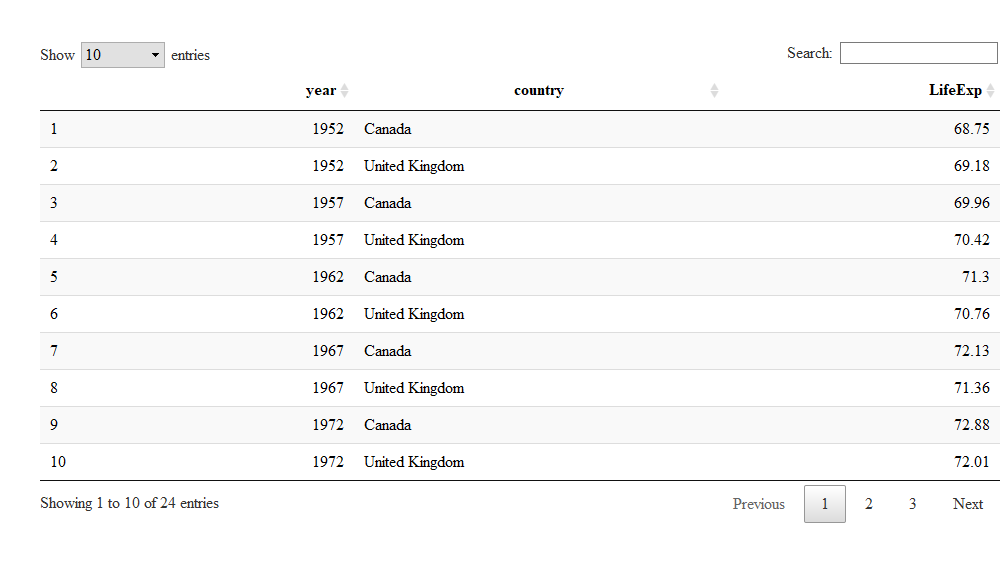
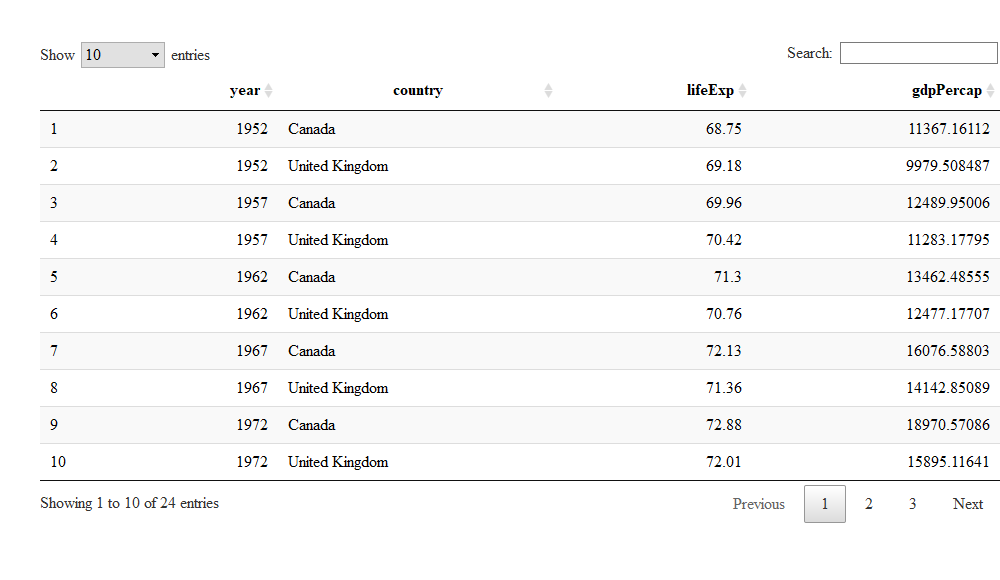
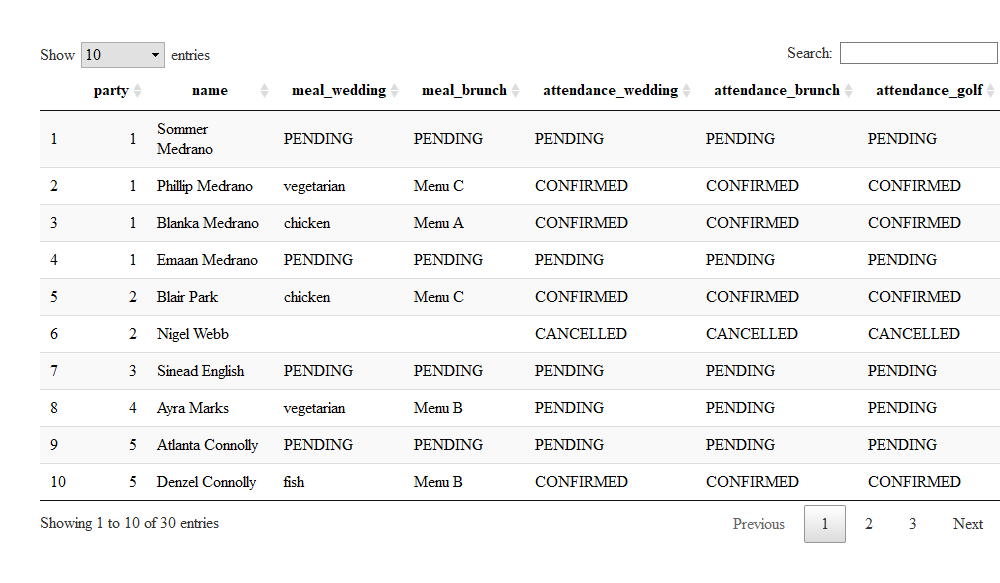
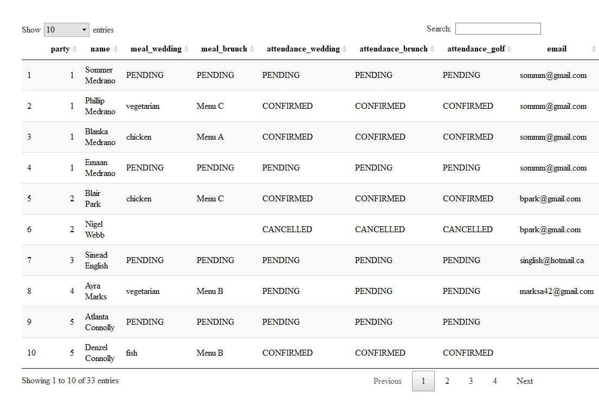

hw\_04:Tidy data and joins
================
SL\_Ivy

  - [Goal](#goal)
  - [Setup the working environment for the data
    analysis](#setup-the-working-environment-for-the-data-analysis)
  - [Exercise 1: Univariate Data
    Reshaping](#exercise-1-univariate-data-reshaping)
  - [Exercise 2: Multivariate Data
    Reshaping](#exercise-2-multivariate-data-reshaping)
  - [Exercise 3: Table Joins](#exercise-3-table-joins)

## Goal

The goal of this homework is to solidify the data wrangling skills by
working some realistic problems in the grey area between data
aggregation and data reshaping. `gapminder` data frame will be used to
practice the data reshaping and table joins.

## Setup the working environment for the data analysis

Make sure `gapminder`, `tidyverse`, and `DT` packages are installed.
Load them with the following code:

``` r
library(gapminder)
library(tidyverse)
library(DT)
```

## Exercise 1: Univariate Data Reshaping

The Exercise 1 and 2 need to use the date frame `gapminder`. It would be
better to check the structure of this data frame before we get start.

``` r
gapminder
```

    ## # A tibble: 1,704 x 6
    ##    country     continent  year lifeExp      pop gdpPercap
    ##    <fct>       <fct>     <int>   <dbl>    <int>     <dbl>
    ##  1 Afghanistan Asia       1952    28.8  8425333      779.
    ##  2 Afghanistan Asia       1957    30.3  9240934      821.
    ##  3 Afghanistan Asia       1962    32.0 10267083      853.
    ##  4 Afghanistan Asia       1967    34.0 11537966      836.
    ##  5 Afghanistan Asia       1972    36.1 13079460      740.
    ##  6 Afghanistan Asia       1977    38.4 14880372      786.
    ##  7 Afghanistan Asia       1982    39.9 12881816      978.
    ##  8 Afghanistan Asia       1987    40.8 13867957      852.
    ##  9 Afghanistan Asia       1992    41.7 16317921      649.
    ## 10 Afghanistan Asia       1997    41.8 22227415      635.
    ## # ... with 1,694 more rows

#### Exercise 1.1: Make a tibble with one row per **year**, and columns for **life expectancy** and **GDP per capita** for *Canada* and *United Kingdom*.

``` r
gap_wider <- gapminder %>%
  filter(year, country=='Canada' | country =="United Kingdom")%>%
  pivot_wider(id_cols     = year, 
              names_from  = country, 
              values_from = lifeExp) %>%
  as_tibble()
print(gap_wider)
```

    ## # A tibble: 12 x 3
    ##     year Canada `United Kingdom`
    ##    <int>  <dbl>            <dbl>
    ##  1  1952   68.8             69.2
    ##  2  1957   70.0             70.4
    ##  3  1962   71.3             70.8
    ##  4  1967   72.1             71.4
    ##  5  1972   72.9             72.0
    ##  6  1977   74.2             72.8
    ##  7  1982   75.8             74.0
    ##  8  1987   76.9             75.0
    ##  9  1992   78.0             76.4
    ## 10  1997   78.6             77.2
    ## 11  2002   79.8             78.5
    ## 12  2007   80.7             79.4

#### Exercise 1.2 Producing a scatterplot of life expectancy for *Canada* against that of *United Kingdom*.

``` r
gap_wider %>% 
  ggplot(aes(x=Canada, y=`United Kingdom`)) +
  geom_point(size=2, color='blue') +
  xlab("Canada Life Expectancy (years)") +
  ylab("Mexico Life Expectancy (years)" ) +
  ggtitle("Life Expectancy of Canada vs. United Kingdom")+
  theme_bw()
```

<!-- -->

#### Exercise 1.3 Re-length the data

``` r
gap_wider %>% 
  pivot_longer(cols = c(-year), names_to  = "country", values_to = "LifeExp") %>%
  DT::datatable()
```

<!-- -->

## Exercise 2: Multivariate Data Reshaping

#### Exercise 2.1: Make a tibble with one row per **year**, and columns for **life expectancy** and **GDP per capita** for *Canada* and *United Kingdom*.

``` r
gap_multiwider <- gapminder %>%
  filter(year, country=='Canada' | country =="United Kingdom")%>%
  pivot_wider(id_cols     = year,
              names_from  = country,
              names_sep = " in ",
              values_from = c(lifeExp, gdpPercap)) %>%
  as_tibble()
print(gap_multiwider)
```

    ## # A tibble: 12 x 5
    ##     year `lifeExp in Can~ `lifeExp in Uni~ `gdpPercap in C~
    ##    <int>            <dbl>            <dbl>            <dbl>
    ##  1  1952             68.8             69.2           11367.
    ##  2  1957             70.0             70.4           12490.
    ##  3  1962             71.3             70.8           13462.
    ##  4  1967             72.1             71.4           16077.
    ##  5  1972             72.9             72.0           18971.
    ##  6  1977             74.2             72.8           22091.
    ##  7  1982             75.8             74.0           22899.
    ##  8  1987             76.9             75.0           26627.
    ##  9  1992             78.0             76.4           26343.
    ## 10  1997             78.6             77.2           28955.
    ## 11  2002             79.8             78.5           33329.
    ## 12  2007             80.7             79.4           36319.
    ## # ... with 1 more variable: `gdpPercap in United Kingdom` <dbl>

#### Exercise 2.2 Re-length the data

``` r
gap_multiwider %>% 
  pivot_longer(cols = -year, names_to  = c(".value",  "country"), names_sep = ' in ') %>%
  DT::datatable()
```

<!-- -->

## Exercise 3: Table Joins

  - First, we need to load the data for this practice session. Read in
    the made-up wedding guestlist and email addresses using the
    following lines:

<!-- end list -->

``` r
guest <- read_csv("https://raw.githubusercontent.com/STAT545-UBC/Classroom/master/data/wedding/attend.csv")
```

    ## Parsed with column specification:
    ## cols(
    ##   party = col_double(),
    ##   name = col_character(),
    ##   meal_wedding = col_character(),
    ##   meal_brunch = col_character(),
    ##   attendance_wedding = col_character(),
    ##   attendance_brunch = col_character(),
    ##   attendance_golf = col_character()
    ## )

``` r
email <- read_csv("https://raw.githubusercontent.com/STAT545-UBC/Classroom/master/data/wedding/emails.csv")
```

    ## Parsed with column specification:
    ## cols(
    ##   guest = col_character(),
    ##   email = col_character()
    ## )

After load the data, we can check the data by calling their assigned
name. \* The guest

``` r
guest
```

    ## # A tibble: 30 x 7
    ##    party name  meal_wedding meal_brunch attendance_wedd~ attendance_brun~
    ##    <dbl> <chr> <chr>        <chr>       <chr>            <chr>           
    ##  1     1 Somm~ PENDING      PENDING     PENDING          PENDING         
    ##  2     1 Phil~ vegetarian   Menu C      CONFIRMED        CONFIRMED       
    ##  3     1 Blan~ chicken      Menu A      CONFIRMED        CONFIRMED       
    ##  4     1 Emaa~ PENDING      PENDING     PENDING          PENDING         
    ##  5     2 Blai~ chicken      Menu C      CONFIRMED        CONFIRMED       
    ##  6     2 Nige~ <NA>         <NA>        CANCELLED        CANCELLED       
    ##  7     3 Sine~ PENDING      PENDING     PENDING          PENDING         
    ##  8     4 Ayra~ vegetarian   Menu B      PENDING          PENDING         
    ##  9     5 Atla~ PENDING      PENDING     PENDING          PENDING         
    ## 10     5 Denz~ fish         Menu B      CONFIRMED        CONFIRMED       
    ## # ... with 20 more rows, and 1 more variable: attendance_golf <chr>

The email

``` r
email
```

    ## # A tibble: 14 x 2
    ##    guest                                             email                 
    ##    <chr>                                             <chr>                 
    ##  1 Sommer Medrano, Phillip Medrano, Blanka Medrano,~ sommm@gmail.com       
    ##  2 Blair Park, Nigel Webb                            bpark@gmail.com       
    ##  3 Sinead English                                    singlish@hotmail.ca   
    ##  4 Ayra Marks                                        marksa42@gmail.com    
    ##  5 Jolene Welsh, Hayley Booker                       jw1987@hotmail.com    
    ##  6 Amayah Sanford, Erika Foley                       erikaaaaaa@gmail.com  
    ##  7 Ciaron Acosta                                     shining_ciaron@gmail.~
    ##  8 Diana Stuart                                      doodledianastu@gmail.~
    ##  9 Daisy-May Caldwell, Martin Caldwell, Violet Cald~ caldwellfamily5212@gm~
    ## 10 Rosanna Bird, Kurtis Frost                        rosy1987b@gmail.com   
    ## 11 Huma Stokes, Samuel Rutledge                      humastokes@gmail.com  
    ## 12 Eddison Collier, Stewart Nicholls                 eddison.collier@gmail~
    ## 13 Turner Jones                                      tjjones12@hotmail.ca  
    ## 14 Albert Marshall, Vivian Marshall                  themarshallfamily1234~

#### Exercise 3.1: For each guest in the guestlist (guest tibble), add a column for email address, which can be found in the email tibble.

It can be found that the in the `email` tibble, there are mutiple guest
sharing one email address, but all the other guests’ information stored
in the guest tibble are based on the individual guest. Also, the column
name in `email` that stores the guests’ name is called *guest* other
than *name* in the `guest`. In order to join two tibbles, the variables
in the `email` tibble need to be reshaped and renamed to match the
`guest` tibble. Each name in the same row is separated by “,”, so we can
split one row based on this \`sep=“,”. **Pay attention to the space
after the comma**

``` r
email_shaped <- email %>% 
  separate_rows(guest, sep = ", ") %>%
  rename(name = guest)%>%
  as_tibble()
```

To add the email for each guest in the `guest` tibble

``` r
guest  %>%
  left_join(email_shaped, by = "name")
```

    ## # A tibble: 30 x 8
    ##    party name  meal_wedding meal_brunch attendance_wedd~ attendance_brun~
    ##    <dbl> <chr> <chr>        <chr>       <chr>            <chr>           
    ##  1     1 Somm~ PENDING      PENDING     PENDING          PENDING         
    ##  2     1 Phil~ vegetarian   Menu C      CONFIRMED        CONFIRMED       
    ##  3     1 Blan~ chicken      Menu A      CONFIRMED        CONFIRMED       
    ##  4     1 Emaa~ PENDING      PENDING     PENDING          PENDING         
    ##  5     2 Blai~ chicken      Menu C      CONFIRMED        CONFIRMED       
    ##  6     2 Nige~ <NA>         <NA>        CANCELLED        CANCELLED       
    ##  7     3 Sine~ PENDING      PENDING     PENDING          PENDING         
    ##  8     4 Ayra~ vegetarian   Menu B      PENDING          PENDING         
    ##  9     5 Atla~ PENDING      PENDING     PENDING          PENDING         
    ## 10     5 Denz~ fish         Menu B      CONFIRMED        CONFIRMED       
    ## # ... with 20 more rows, and 2 more variables: attendance_golf <chr>,
    ## #   email <chr>

``` r
DT::datatable(guest)
```

<!-- -->

#### Exercise 3.2: To figure out the guests that appears in the `email` tibble but no in the guestlist, or say `guest` tibble.

``` r
email_shaped %>%
  anti_join(guest, by = "name")
```

    ## # A tibble: 3 x 2
    ##   name            email                          
    ##   <chr>           <chr>                          
    ## 1 Turner Jones    tjjones12@hotmail.ca           
    ## 2 Albert Marshall themarshallfamily1234@gmail.com
    ## 3 Vivian Marshall themarshallfamily1234@gmail.com

Those are the three guests that somehow haven’t been added to the
guestlist.

#### Exercise 3.3: Make a guestlist that includes everyone we have emails for (in addition to those on the original guestlist).

``` r
guest_new <-guest %>%
  full_join(email_shaped, by = "name")
DT::datatable(guest_new)
```

<!-- -->

Here are the new guestlist that contains everyone we have emails for.
