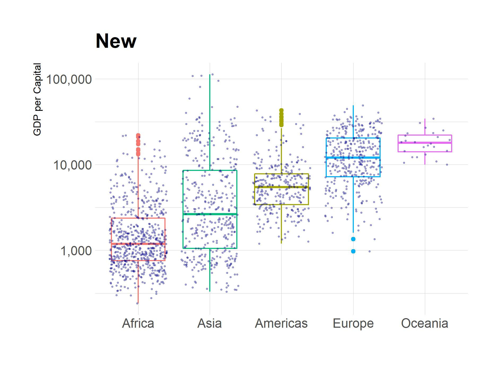

```{r, echo=FALSE}
knitr::opts_chunk$set(error = TRUE)
```
## Goal

The goal of this homework is to get expand the thinking about data portability, collaboration, and dissemination. In this assignment, we will also learn to import and export the datasets and practice effective plotting principles.

## Setup the working environment for the data analysis
Make sure `gapminder`, `tidyverse`, and `DT` packages are installed.
Load them with the following code:
```{r, warning = FALSE, message = FALSE}
library(gapminder)
library(tidyverse)
library(DT)
library (here)
```


## Exercise 1: Explain the value of the here::here package
The `here` package provide a simpler way to create and find the files. The `here()` function in this package works in a platform-independent way, which means that the same code works on both __Mac OS__  and __Windows__ operating systems without needing any modification. It uses “, “ to separate each subdirectory instead of “/” in Mac OS  or “\ ” in Windows. For example, it can build a path to something in a subdirectory and use it by the code like: `here("User", "Ivy", “STAT 545”,  "test.txt")`. This is very useful for document/file sharing between different operating system. 
Besides,  it is particularly useful when we work with the R Markdown. Because R Markdown documents always knit assuming the location of the .Rmd file is the working directory. When the R Markdown file is saved in a sub-directory, it wouldn’t be able to access the file by using a relative path from the root directory. We have to specific everything from top-to-bottom of the pathway, which cannot avoid using either “/” or “\ ”. 
All of those confusions can be avoid by using `here ()` function, like `here (“subfolder”, “test.txt”)`, which uses a reasonable heuristics to find the project's files. 
Generally, `here` package provides a simple and robust way for people to open/create files, share code across different operating platforms.


## Exercise 2: Factor management
Dataset: `gapminder`
Variable: `continent`

Task 1: Drop factor
Before we drop any factor, let's see all the possible factors in `continent`:
```{r}
levels(gapminder$continent)
```

* Filter the Gapminder data to remove observations associated with the continent of  __Asia__:
```{r}
without_Asia <- filter(gapminder, continent != 'Asia') %>% 
  droplevels()
```
* Provide concrete information on the data before and after removing __Asia__: 
The `str()` function can be use to see the overall changes for each variable after the removal.
```{r}
str(without_Asia) #new dataset#
```

```{r}
str(gapminder)#original dataset
```
It can be found that 396 observations that associated with Asia were dropped.
There is 5 levels of the continent in the original dataset, `gapminder`, and 4 levels of the continent in the new dataset, `without_Asia`.
Besides, the levels of country variable was also changed from 142 to 109.
The total observations was dropped from 1704 to 1308.

If the information above seems little bit overwhelming, there is an alternative way to figure out the changes one by one via the `nlevels()` function:

To check the level changes of the country:
```{r}
nlevels(gapminder$country)
nlevels(without_Asia$country)
```

Same code with the continent:

```{r}
nlevels(gapminder$continent) #number of levels of continent in the origianl dataset
levels(gapminder$continent)  #what are the possile values of the variable
nlevels(without_Asia$continent) #number of levels of continent in the new dataset
levels(without_Asia$continent)#what are the possible values of the variable
```
To address the changes of the observations:
```{r}
count(gapminder)
```
```{r}
count(without_Asia)
```

* Address the number of rows of the affected factors.
```{r}
nrow(gapminder)
nrow(without_Asia)

```
Task 2: Reorder the levels of continent

To reorder the contient by the maximum of population in an ascending order. 
```{r}
reo_continent<-fct_reorder(gapminder$continent, gapminder$pop, max)
levels(reo_continent)
```
It can be found that Asia has the largest population size and Oceania has the smallest population size.

```{r fig1, fig.align='center', fig.height=5, fig.width= 7}
gapminder %>%
  ggplot() +
  geom_col(aes(reo_continent, pop, fill= reo_continent), width = 0.5) +
  coord_flip()+   # flip x and y
  theme_bw() +
  ylab("Population") + xlab("Continent")+ggtitle('Reordered by the max pop')
```
```{r fig2, fig.align='center', fig.height=5, fig.width= 7}
gapminder %>%
  ggplot() +
  geom_col(aes(continent, pop), width = 0.5) +
  coord_flip()+   # flip x and y
  theme_bw() +
  ylab("Population") + xlab("Continent")+ggtitle('Original order')

```


## Exercise 3: File input/output
Step 1: Create something new
For example, we are going to further explore the GDP per Capital in Americas, we will need to filter the data and save them into a new file.
```{r}
Americas_data <- gapminder %>%
  filter (continent == "Americas") %>%
  select (continent, country, year, gdpPercap)
```
Step 2: Create a new file to store this data:
```{r}
write_csv(Americas_data, here::here('hw05','Americas_data.csv'))
```
Step 3: Reload it back
```{r}
reload_Am <-read_csv(here::here('hw05','Americas_data.csv'))
reload_Am
```

With the imported data, play around with factor levels and use factors to order your data with one of your factors (i.e. non-alphabetically). 
To check the levels for the factors including in this file
```{r}
str(reload_Am)
```
To reorder it by the max of GDP per Capital for each country:
```{r}
reo_Am<-fct_reorder(reload_Am$country, reload_Am$gdpPercap, max)
levels(reo_Am)

```

To visualize the trend:
```{r}
reload_Am %>% ggplot(aes(reo_Am, gdpPercap, colour = country))+
      geom_boxplot()+
      scale_y_log10(labels=scales::comma) +
      theme(axis.text.x = element_text(angle = 90))+ylab("GDP per Capital") + xlab("Countries in Americas")
```


For the I/O method(s) you chose, comment on whether or not your newly created file survived the round trip of writing to file then reading back in.

Run the code to check if the exported and imported data are identical
```{r}
summary(Americas_data.csv == reload_Am)
```


Based on the obeservation of the above session, it can be found that newly created file, *Amricas_data* was correctly export and stored in the designed file.Then it was able to be properly imported back. By using the `write_csv()/read_csv()` and `here::here(), the file can be easily addressed.

## Exercise 4: Visualization design
Go back through your previous assignments and class participation activities and find figures you created prior to the last week of the course. Recreate at least one figure in light of something you learned in the recent class meetings about visualization design and color.

I choose a plot that I did for my assigment 3, task option 2, which is shown in below:
```{r, fig.width=5, fig.height=5}
GDP_summary <- gapminder %>%
  select (continent, gdpPercap) %>%
  group_by(continent) %>%
  summarise(Max_GDP=max(gdpPercap), Min_GDP=min(gdpPercap))
knitr::kable(GDP_summary, format = 'html', align ='c')

old_figure <- ggplot(GDP_summary, aes(x=continent)) + 
  geom_point(aes(y=Max_GDP, color="Max_GDP")) + 
  geom_point(aes(y=Min_GDP, color="Min_GDP"))+
  scale_y_log10(labels = scales::comma_format())+
  ggtitle("Old")
```

I think it would be better to change the plot type and reorder it by the average of GDP per Capital, and add individual observations:
```{r, message=FALSE, warning=FALSE, fig.width=15, fig.height=6}
library(hrbrthemes)
library(viridis)
library(grid)
library(gridExtra)
new_order <- fct_reorder(gapminder$continent, gapminder$gdpPercap, mean)
new_figure <- ggplot(gapminder, aes(new_order, gdpPercap, group = continent, colour = continent)) +
  geom_boxplot() +
  scale_y_log10(labels = scales::comma_format()) +
  ggtitle("New")+
  scale_fill_viridis(discrete = TRUE, alpha=0.6) +
    geom_jitter(color="dark blue", size=0.4, alpha=0.3) +
    theme_ipsum() +
    theme(
      legend.position="none")+xlab("")+ylab("GDP per Capital")
grid.arrange(old_figure, new_figure, nrow=1)
```

## Exercise 5: Writing figures to file
Use ggsave() to explicitly save a plot to file. Include the exported plot as part of your repository and assignment.

To save the improved figure chosen from the assigment 2 as `new_figure`:
```{r, message = FALSE, warning=FALSE}
ggsave("new_figure.jpg",
       plot =new_figure, #this in important, see the explaintion below the code chunk#
       width = 16, height =12, units = "cm")
```

Whithout speficication, `ggsave()` always save the last created plot. In this case, it won't preduce any different result, but it's a good practice to specify the exact plot for the future review (even the author can forget the details without proper reminder).

And then to check if the plot was properly saved by reloading it here:



Or access as a web page. 
See the [new figure](new_figure.jpg) on a new window,